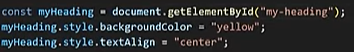
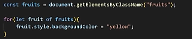
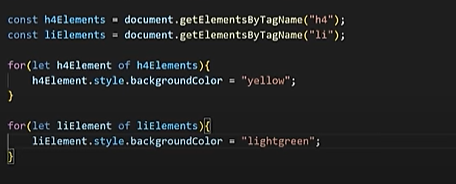
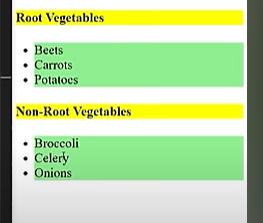
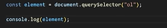
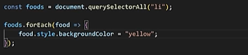

element selectors:

-  Methods used to target and manipukate HTML elements
- they allow you to select one or multiple HTML elements from the DOM 
(Document Object Model)

1. document.getElementsById()  //   ELEMENT OR NULL
2. document.getElementsByClassName() // HTML COLLECTION
3. document.getElementsByTagName()  // HTML COLLECTION
4. document.querySelector()  // ELEMENT OR NULL
5. document.querySelectorAll() // NODELIST

 

