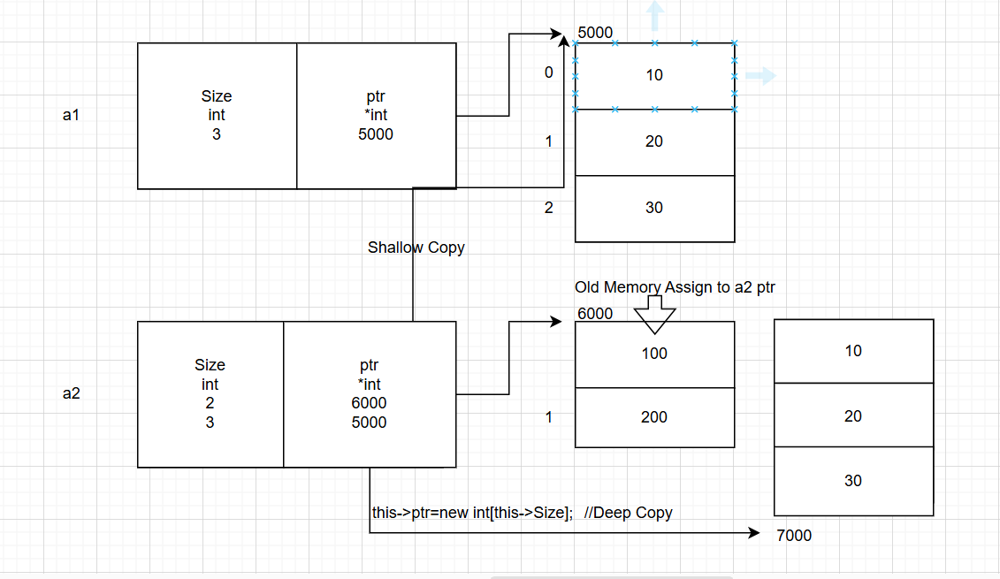
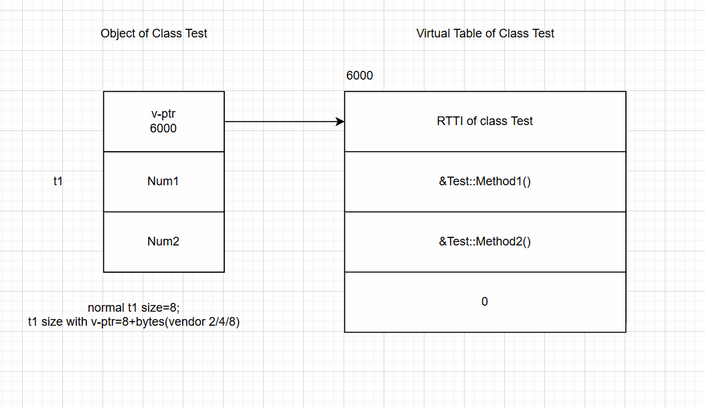
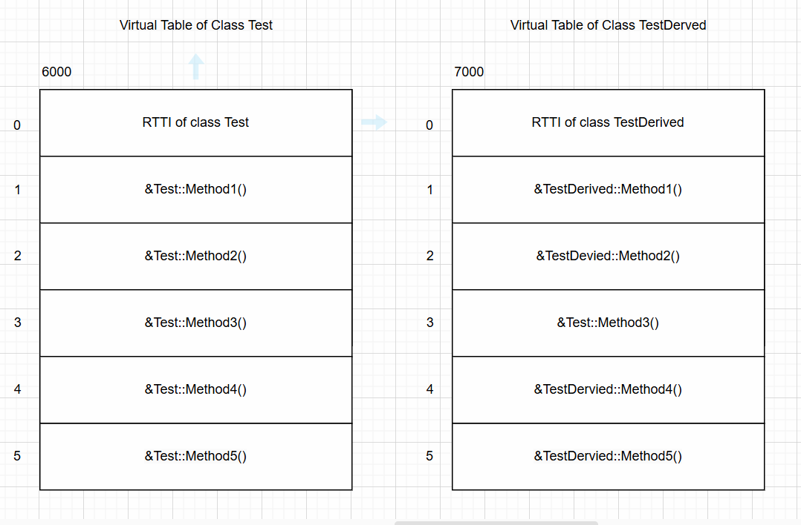

## Object-Oriented Programming using C++
### C++ Notes Day-10 Date: 18-12-2024
#### Lets Revise
- Static Member
- Static member function
- Anonymous Class
- Operator Overloading
    - Implementation using member function as well as non member function
    - Limitations of operator overloading
    - Relational Operator overloading
    - pre increment and post increment operator overloading
    - Insertion and extraction operator overloading
#### Operator Overloading in C++
- Assignment operator overloading
- Example 1:
```C++
int num1 = 10; //Initialization
int num2 = num1; //Initialization
```
- Process of storing value during declaration of variable is called as initialization.
- Example 2:
```C++
Test t1( 10, 20 ); //on t2 parameterized constructor will call
Test t2 = t1; //on t2 copy constructor will call.
Test t3( t1 ); //on t3 copy constructor will call.
```
- If we "initialize" object from another object of same class the copy constructor gets called.
- Syntax:
```C++
 class ClassName{
 public:
 ClassName( const ClassName &other ){
 //TODO: Shallow / Deep Copy
 }
 }
```
- Example 3:
```C++
int num1 = 10;
int num2;
num2 = num1; //Assignment
```
- Process of storing value after declaration of variable is called as assignment.
- Example 4:
```C++
Test t1( 10, 20 ); //on t2 parameterized constructor will call
Test t2; //on t2 parameterless constructor will call.
t2 = t1; //t2.operator=( t1 );
```
- If we assign object to another object of same class the assignment operator function gets called.
- If we do not define assignment operator function for the class then compiler generates one assignment operator function for the class by default, it is called as default assignment operator
function.
- Default copy constructor and default assignment operator function by default creates shallow copy.
- Example 5:use "-fno-elide-constructors" compiler option
```C++
Test t1( 10, 20 ); //on t2 parameterized constructor will call
Test t2; //on t2 parameterless constructor will call.
Test t3; //on t3 parameterless constructor will call.
t3 = t2 = t1; //t2.operator=( t2.operator=( t1 ), t2 );
```
-Syntax:
```C++
 class ClassName{
 public:
 ClassName& operator=( const ClassName &other ){
 //TODO: Shallow / Deep Copy
 return (*this);
 }
 }
```
- We get following functions for any class by default:
    - Constructor
    - Destructor
    - Copy constructor
    - Assignment operator function
- Example:
```C++
#include <iostream>
using namespace std;
#include<iostream>
using namespace std;
class Test{
	private:
	 int Num1;
	 int Num2;
	public:
	 Test( void ){
	 this->Num1 = 0;
	 this->Num2 = 0;
	 }
	 Test(int Num1, int Num2)
	 {
		 cout<<"Parameter Cons"<<endl;
		 this->Num1=Num1;
		 this->Num2=Num2;
	 }
	 Test(Test &other)
	 {
		 cout<<"Test(Test &other)"<<endl;
		 this->Num1=other.Num1;
		 this->Num2=other.Num2;
	 }
	 friend ostream& operator<<( ostream &cout, Test &other ){
	 cout << "Num1 Number : " << other.Num1 << endl;
	 cout << "Num2 Number : " << other.Num2 << endl;
	 return cout;
	 }
	 Test& operator=(Test &other)
	 {
		 cout<<"Operator=(Test &other)"<<endl;
		 this->Num1=other.Num1;
		 this->Num2=other.Num2;
		 return (*this);
	 }
};
int main( void ){
	 Test t2;
	 Test t1(100,200);
	 Test t3;
	 t3=t2=t1;				//t3.operator(&t3,t2.operator=(&t2,t1));
	 cout<<t2<<t3;
	 return 0;
}
```
- Index / Subscript operator overloading
    - Array
        - Definition: It is linear / sequential data structure / collection in which we can store multiple elements of same type in continuous memory location.
        - Types:
            - Single dimensional array
            - Multi dimensional array
        - To access elements of array, we should use integer index. Array index always begins with 0.
        - We can create array statically as well as dynamically.
```C++
int arr[ 3 ]; //Static memory allocation
int *ptr = new int[ 3 ]; //Dynamic memory allocation
```
- Advnatage of Array over linked
    - We can access elements of array randomly.
- Limitations of Array
    - It requires continous memory
    - We can not resize array
    - Element insertion and deletion is time consuming task
    - Using assignment operator we can not copy elements of array into another array.
- We can overcome limitations of array using 2 ways:
    - Use LinkedList instead of Array.
    - Encapsulate( declare variable as a data meber/member function) array inside class. Create object of the class and consider that object as a array.
    - If we want to consider object as a array then we should overload subscript / index operator.
    - If we want to use subscript operator with object at R.H.S of assignment operator then expression should return value.

- Example: Encapsulated Array Class
```C++
#include <iostream>
using namespace std;
class Array
{
private:
	int Size;
	int *ptr;
public:
	Array()
	{
		this->Size=0;
		this->ptr=nullptr;
	}
	Array(int Size)
	{
		this->Size=Size;
		this->ptr=new int[this->Size];
	}
	friend istream& operator>>(istream &cin, Array &other)
	{
		for(int i=0;i<other.Size;i++)
		{
			cout<<"Enter Element:	";
			cin>>other.ptr[i];
		}
		cout<<endl;
		return cin;
	}
	friend ostream& operator<<(ostream &cout, Array &other)
	{
		for(int i=0;i<other.Size;i++)
		{
			cout<<other.ptr[i]<<"\t";
		}
		cout<<endl;
		return cout;
	}
	Array& operator=(Array &other)
	{
		this->Size=other.Size;
		this->~Array();			//Calling destructor explicitly
		this->ptr=new int[other.Size];      //Creating Deep Copy
		for(int i=0;i<this->Size;i++)
		{
			this->ptr[i]=other.ptr[i];
		}
		return (*this);
	}
	int& operator[](int Index)      //Overloading Array Subscript Operator
	{
		return this->ptr[Index];
	}
	~Array()
	{
		if(ptr!=nullptr)
		delete[] ptr;
		ptr=nullptr;
	}
};
int main()
{
	Array a1(3);
	cin>>a1;
	a1[2]=40;
	int element=a1[2];		//a1.operator[](&a1,2);
	cout<<"Element:	"<<element<<endl;
	return 0;
}
int main1()
{
	Array a1(3);
	Array a2(2);
	cin>>a1;
	a2=a1;
	cout<<a1;
	cout<<a2;
	return 0;
}
```
- Example:
```C++
 int main( void ){
 Array a1( 3 );
 cin >> a1; //operator>>( cin, a1 )
 int element = a1[ 2 ];
 //int element = a1.operator[ ]( 2 );
 cout << "Element : " << element << endl;
 cout << a1; //operator<<( cour, a1 )
 return 0;
 }
```
- If we want to use subscript operator with object at L.H.S of assignment operator then expression should not return value. Rather it should return pointer/reference of the memory location.
- Example:
```C++
int main( void ){
 Array a1( 3 );
 cin >> a1; //operator>>( cin, a1 )
 a1[ 2 ] = 300;
 //a1.operator[ ]( 2 ) = 300;
 cout << a1; //operator<<( cour, a1 )
 return 0;
}
```
- Call operator / function call operator overloading
    - If we want to consider object as a function then we should overload call/function call operator.
    - If we consider object as a function then such object is called as function object / functor.
- Example:
```C++
class Test{
private:
 int Num1;
 int Num2;
public:
 Test( void ) : Num1( 0 ), Num2( 0 ){
 }
 void operator()( int Num1, int Num2 ) {
 this->Num1 = Num1;
 this->Num2 = Num2;
 }
 friend ostream& operator<<( ostream &cout, const Test &other ){
 cout << "Num1 Number : "<< other.Num1 <<endl;
 cout << "Num2 Number : "<< other.Num2 <<endl;
 return cout;
 }
};
int main( void ){
 Test t1;
 t1( 10, 20 ); //t1. operator()( 10, 20 );
 cout << t1; //operator<<( cout, t1 );
 return 0;
}
```
#### Virtual Function, Virtual Function Table & Virtual Function Pointer
#### Virtual function
- In case of upcasting, if we want to call member funtion, depending on type of object rather than type of pointer then we should declare member function in base class virtual.
- If class contains at least one virtual function then such class is called as polymorphic class.
- If signature of base class member function and derived class member function is same and if function in base class is virtual then derived class member function will be considered as virtual.
- Process of redefining virtual member function of base, class inside derived class, with same signature is called as function overriding and virtual function redefined in derived class is called as overrided
function.
- For function overriding:
    - Function must be exist in base class and derived class
    - Signature of functions ( including return type ) must be same.
    - Function in base class must be virtual
- Definition:
    - In case of upcasting, A member function, which gets called depending on type of object rather that type of pointer is called as virtual funtion.
    - In case of upcasting, A member function of derived class which is deisigned to call using pointer/reference of base class is called as virtual function.
    - It means that virtual functions are not designed to call on object / class rather it is designed to call on base class pointer or base class reference.
- Can we declare static member function virtual?
    - Virtual member function is designed to call on base class pointer / reference.
    - Static member function is designed to call on class name.
    - Since static member function is not designed to call on base class pointer / referece, we can not declare static member function virtual.
    - Since we can not declare static member function virtual, we can not override it inside derived class.
- What is runtime polymorphism:
    - Process of calling member function derived class on pointer / reference of base class is called as runtime polymorphism.
```C++
class Demo1
{
    public:
    virtual void Show()
    {
        cout<<"Am Show of Demo1"<<endl;
    }
};
class Demo2
{
    public:
    virtual void Show()
    {
        cout<<"Am Show of Demo2"<<endl;
    }
};
class Demo3
{
    public:
    virtual void Show()
    {
        cout<<"Am Show of Demo3"<<end;
    }
};
int main()
{
    Demo1 *ptr=new Demo2();     //Object of Demo2 to the pointer of Demo1
    ptr->Show();                //Show of Demo2 will be called, Runtime Polymorphism
    ptr=new Demo3();            //Object of Demo3 to the pointer of Demo1
    ptr->Show();                //Show of Demo3 will be called, Runtime Polymorphism
    return 0;
}

```
#### Early Binding and Late Binding
- If call to the function gets resolved at compile time then it is called as early binding. In other words, if binding between function and object gets resolved at compile time then it is called as early binding.
- If call to the function gets resolved at runtime then it is called as late binding. In other words, if binding between function and object gets resolved at run time then it is called as late binding.
- If we call virtual or non virtual function on object then it is considered as early binding. This call always gets resolved at compile time.
- If we call non virtual function on pointer/reference then it is considered as early binding. This call always gets resolved at compile time.
- If we call virtual function on pointer/reference then it is considered as late binding. This call always gets resolved at run time. Consider below code:
- Example:
```C++
 class A{
 private:
 int num1;
 int num2;
 public:
 A( void ){
 this->num1 = 10;
 this->num2 = 20;
 }
 virtual void f1( void ){
 cout << "A::f1" << endl;
 }
 virtual void f2( void ){
 cout << "A::f2" << endl;
 }
 virtual void f3( void ){
 cout << "A::f3" << endl;
 }
 void f4( void ){
 cout << "A::f4" << endl;
 }
 void f5( void ){
 cout << "A::f5" << endl;
 }
 };
 class B : public A{
 private:
 int num3;
 public:
 B( void ){
 this->num3 = 30;
 }
 virtual void f1( void ){
 cout << "B::f1" << endl;
 }
 void f2( void ){
 cout << "B::f2" << endl;
 }
 void f4( void ){
 cout << "B::f4" << endl;
 }
 virtual void f5( void ){
 cout << "B::f5" << endl;
 }
 virtual void f6( void ){
 cout << "B::f6" << endl;
 }
 };
 int main( void ){
 A a; //OK
 a.f1( ); //OK: A::f1 -> Early Binding
 a.f2( ); //OK: A::f2 -> Early Binding
 a.f3( ); //OK: A::f3 -> Early Binding
 a.f4( ); //OK: A::f4 -> Early Binding
 a.f5( ); //OK: A::f5 -> Early Binding
 a.f6( ); //Not OK: f6 is not a member of class A
 return 0;
 }
```C++
- If we call any member function on object then it is considered as early binding
```C++
 int main( void ){
 A *ptr = new A( ); //OK
 ptr->f1( ); //OK: A::f1 -> Late Binding
 ptr->f2( ); //OK: A::f2 -> Late Binding
 ptr->f3( ); //OK: A::f3 -> Late Binding
 ptr->f4( ); //OK: A::f4 -> Early Binding
 ptr->f5( ); //OK: A::f5 -> Early Binding
 ptr->f6( ); //Not OK: f6 is not a member of class A
 return 0;
 }
```
- If we call virtual function on pointer then it is considered as late binding.
- If we call non virtual function on pointer then it is considered as early binding.
```C++
 int main( void ){
 A *ptr = new B( ); //OK: Upcasting
 ptr->f1( ); //OK: B::f1 -> Late Binding
 ptr->f2( ); //OK: B::f2 -> Late Binding
 ptr->f3( ); //OK: A::f3 -> Late Binding
 ptr->f4( ); //OK: A::f4 -> Early Binding
 ptr->f5( ); //OK: A::f5 -> Early Binding
 ptr->f6( ); //Not OK: f6 is not a member of class A
 return 0;
 }
```
```C++
 int main( void ){
 B *ptr = new B( );
 ptr->f1( ); //OK: B::f1 -> Late Binding
 ptr->f2( ); //OK: B::f2 -> Late Binding
 ptr->f3( ); //OK: A::f3 -> Late Binding
 ptr->f4( ); //OK: B::f4 -> Early Binding
 ptr->f5( ); //OK: B::f5 -> Late Binding
 ptr->f6( ); //OK: B::f6 -> Late Binding
 return 0;
 }
```
```C++
 int main( void ){
 B *ptr = new A( ); //NOT OK
 ptr->f1( );
 ptr->f2( );
 ptr->f3( );
 ptr->f4( );
 ptr->f5( );
 ptr->f6( );
 return 0;
 }
```
- Members of Base class inherit into Derived class. Hence we can consider Derived class object as Base class object.
- Also Base class pointer can contain address of derived class object.
- Members of Derived class do not inherit into Base class. Hence we can not consider Base class object as Derived class object.
- Also Derived class pointer can not contain address of Base class object.
```C++
 int main( void ){
 B b; //OK
 b.f1( ); //OK: B::f1 -> Early Binding
 b.f2( ); //OK: B::f2 -> Early Binding
 b.f3( ); //OK: A::f3 -> Early Binding
 b.f4( ); //OK: B::f4 -> Early Binding
 b.f5( ); //OK: B::f5 -> Early Binding
 b.f6( ); //OK: B::f6 -> Early Binding
 return 0;
 }
```
#### Virtual Function Table and Virtual Function Pointer.
- In case of upcasting, using base class pointer, if we want to call member function of derived class then we should declare function in base class virtual.
- If class contains at least one virtual function then compiler implicitly generate one table to store address of that virtual function(s). Such table( which can be array/strucrure depending on compiler
vendor) is called as virtual function table / vf-table/v-table.
- In short, a table which contains address of virtual function is called as v-table.
- At the time of creation of V-Table for derived class, compiler simply copy Base class V-Table and make necessary changes.
- Compiler generate v-table per class. It gets generated at compile time.
- To store address of virtual function table, compiler implicitly declare pointer as a data meber inside class. Such pointer is called as virtual function pointer/vf-pointer/v-ptr.
- In short, a pointer which contain address of virtual function table is called as v-ptr.
- Consider V-Table and V-Ptr for the class Test.

- Consider V-Table and V-Ptr for the class TestDerived.

- Compiler generates V-Table and V-Ptr at compile time.
- New definition of size of object:
    - sum of all the non static data members declared in base and derived class + (2/4/8) bytes depending on the compiler.
- Address of V-Table come into V-Ptr inside constructor. It means that V-ptr gets initialized after calling constructor.
- Can we declare constructor virtual? Why?
    - In C++, we can not declare constructor virtual
    - Reason 1:
        - Virtual functions are designed to call on base class pointer/reference only.
        - In C++, We can not call constructor on object, pointer or reference explicitly.
        - Since constructor is not designed to call on pointer or reference explicitly, we can not declare constructor virtual.
    - Reason 2:
        - To call any virtual function, compiler need to access value of vptr then it can do indexing into V-Table.
        - But V-Ptr gets initialized after calling constructor. Hence we can not declare constructor virtual.
- Can we declare destructor virtual? Why?
    - We can not declare constructor virtual but we can declare destructor virtual.
    - In Case of upcasting, constructor of Base class and Derived class gets call properly. But when we use delete operator on Base class pointer then only Base class destructor gets called.
    - To get call to destructor of Derived class first, we need to declare destructor in Base class virtual.
- Example:
```C++
class Base{
private:
 int *ptr;
public:
 Base( void ){
 this->ptr = new int[ 3 ];
 }
 virtual ~Base( void ){
 delete[] this->ptr;
 }
};
class Derived : public Base{
private:
 int *ptr;
public:
 Derived( void ){
 this->ptr = new int[ 5 ];
 }
 ~Derived( void ){
 delete[] this->ptr;
 }
};
int main( void ){
 Base *ptr = new Derived( );
 //TODO
 delete ptr;
 return 0;
}
```
- What is the difference between Function Overloading and Function Overriding?
    - We achieve compile time polymorphism using function overloading and run time polymorphism using function overriding.
    - In case of function overloading functions must be exist in same scope but in case function overriding functions must be exist in base class and derived class.
    - In case of function overloading signature of functions must be different but In case of function overriding signature of function must be same.
    - Return type is not considered in function overloading but return type is considered in function overriding.
    - Function overloading is based on mangled name whereas function overriding is based on V-Table and V-ptr
    - Function overloading do not require any keyword but for function overriding, function in base class must be virtual.
- How to get size of object in C++:
```C++
int main( void ){
 Test t1;
 size_t size = sizeof( t1 );
 cout<<size<<endl;
 return 0;
}
```
- size_t is a alias for unsigned long.
- How to get type of object in C++:
```C++
 #include<iostream>
 #include<typeinfo>
 using namespace std;
 int main( void ){
 int number;
 const type_info &type = typeid( number );
 string typeName = type.name( );
 cout << "Type Name : " << typeName << endl;
 return 0;
 }
```
- typeid is a operator which return reference of constant object of type_info class.
- type_info class is declared in std namespace and it is available int typeinfo header file.
- Consider declaration of type_info class
```C++
namespace std {
 class type_info{
 public:
 const char* name() const noexcept;
 bool operator==(const type_info& rhs) const noexcept;
 bool operator!=(const type_info& rhs) const noexcept;
 virtual ~type_info();
 private:
 type_info(const type_info& rhs);
 type_info& operator=(const type_info& rhs);
 };
}
```
- Process of getting type of object at runtime is called as Runtime Type Identification / Information.
- In case of upcasting, if we want to find out true type of object then we should use RTTI.
- Example:
```C++
 #include<iostream>
 #include<typeinfo>
 using namespace std;
 class Base{
 int num1;
 public:
 Base( void ){
 this->num1 = 10;
 }
 void print( void ){
 cout << "Num1 : " << this->num1 << endl;
 }
 };
 class Derived : public Base{
 int num2;
 public:
 Derived( void ){
 this->num2 = 20;
 }
 void print( void ){
 Base::print( );
 cout << "Num2 : " << this->num2 << endl;
 }
 };
 int main( void ){
 Base *ptrBase = new Derived( ); //Upcasting
 cout << typeid( ptrBase ).name( ) << endl; //P4Base
 cout << typeid( *ptrBase ).name( ) << endl; //4Base
 return 0;
 }
 int main4( void ){
 Derived *ptrDerived = new Derived( );
 cout << typeid( ptrDerived ).name( ) << endl; //P7Derived
 cout << typeid( *ptrDerived ).name( ) << endl; //7Derived
 return 0;
 }
 int main3( void ){
 Derived derived;
 cout << typeid( derived ).name( ) << endl; //7Derived
 return 0;
 }
 int main2( void ){
 Base *ptrBase = new Base( );
 cout << typeid( ptrBase ).name( ) << endl; //P4Base
 cout << typeid( *ptrBase ).name( ) << endl; //4Base
 return 0;
 }
 int main1( void ){
 Base base;
 cout << typeid( base ).name( ) << endl; //4Base
 return 0;
 }
```
- In case of upcasting, using RTTI, to get true type of object, Base class must be polymorphic.
```C++
class Base{
 int num1;
public:
 Base( void ){
 this->num1 = 10;
 }
 virtual void print( void ){
 cout << "Num1 : " << this->num1 << endl;
 }
};
class Derived : public Base{
 int num2;
public:
 Derived( void ){
 this->num2 = 20;
 }
 void print( void ){
 Base::print( );
 cout << "Num2 : " << this->num2 << endl;
 }
};
int main( void ){
 Base *ptrBase = new Derived( ); //Upcasting
 cout << typeid( ptrBase ).name( ) << endl; //P4Base
 cout << typeid( *ptrBase ).name( ) << endl; //7Derived
 return 0;
}
```
- Using Null pointer, if we try to find out true type of object then typeid operator throws bad_typeid exception.
```C++
int main( void ){
 try{
 Base *ptrBase = NULL; //Upcasting
 cout << typeid( ptrBase ).name( ) << endl; //P4Base
 cout << typeid( *ptrBase ).name( ) << endl; //7Derived
 }catch( bad_typeid &ex ){
 cout << ex.what() << endl;
 }
 return 0;
}
```
#### Advanced Type Casting Operators
    - static_cast
    - dynamic_cast
    - const_cast
    - reinterpret_cast
- reinterpret_cast operator
    - We can access private data members of the class inside non member function using:
        - Member functions e.g. getter and setter
        - Friend function
        - Pointer
- If we want to convert pointer of any type into pointer of any other type then we should use reinterpret_cast operator
- Example:
```C++
#include<iostream>
using namespace std;
class Test{
private:
 int Num1;
 int Num2;
public:
 Test( void ){
 this->Num1 = 10;
 this->Num2 = 20;
 }
 friend ostream& operator<<( ostream &cout, Test &other ){
 cout << "Num1 Number : " << other.Num1 << endl;
 cout << "Num2 Number : " << other.Num2 << endl;
 return cout;
 }
};
int main( void ){
 Test t1;
 cout << t1 << endl;
 //int *ptr = (int*)(&t1); //C-Style
 int *ptr = reinterpret_cast<int*>( &t1 ); //C++ Style
 *ptr = 50;
 ptr = ptr + 1;
 *ptr = 60;
 cout << t1 << endl;
 return 0;
}
```
- const_cast operator
    - If we want to convert pointer to constant object into pointer to non constant object or reference to constant object into reference to non constant object then we should use const_cast operator.
- Example:
```C++
 #include<iostream>
 using namespace std;
 class Test{
 int number;
 public:
 //Test *const this
 Test( void ){
 this->number = 10;
 }
 //Test *const this
 void showRecord( void ){
 cout << "Number : "<<this->number << endl;
 }
 //const Test *const this
 void displayRecord( void ) const{
 //Test *const ptr = ( Test *const)this; //C-Style
 Test *const ptr = const_cast<Test *const>( this ); //C++ Style
 ptr->showRecord( );
 }
 };
 int main( void ){
 const Test t;
 t.displayRecord( );
 return 0;
 }
```
- static_cast operator
    - If we want to do type conversion between compatible types then we should use static_cast operator.
- Example:
```C++
int main( void ){
 double num1 = 10.5;
 //int num2 = ( int )num1; //C-Style
 int num2 = static_cast< int >( num1 ) ; //C++ -Style
 cout << "Num2 : " << num2 << endl;
 return 0;
}
```
- In case of non polymorphic type, if we want to do downcasting the we should use static_cast operator.
- static_cast operator do not check whether type consversion is valid or invalid. it only checks inheritance relationship at compile time.
- dynamic_cast operator
    - In case of polymorphic type, if we want to do downcasting the we should use dynamic_cast operator.
    - If we want to check whether, type conversion is valid or invalid then we should use dynamic_cast operator.
    - dynamic_cast operator checks inheritance relationship at runtime.
    - In case of pointer, if dynamic_cast operator fail to do conversion then it returns NULL.
    - In case of reference, if dynamic_cast operator fail to do conversion then it throws bad_cast excetion.
- Example:
```C++
int main( void ){
 Base *ptrBase = new Derived( ); //OK: Upcasting
 ptrBase->setNum1( 10 ); //OK
 ptrBase->setNum2( 20 ); //OK
 Derived *ptrDerived = dynamic_cast< Derived*>( ptrBase );
//Downcasting: C++ -Style
 if( ptrDerived != NULL ){
 ptrDerived->setNum3( 30 );
 ptrDerived->Base::print( );
 ptrDerived->Derived::print( );
 delete ptrBase;
 }
 return 0;
}
```
#### Standard Template Library (STL) in C++
- Vector in C++ STL
    - Definition of Vector
        - A vector in C++ is a dynamic array provided by the Standard Template Library (STL).
        - Unlike a static array, a vector can grow or shrink dynamically as per the need. - It stores elements in contiguous memory locations and supports random access.
        - Vectors are part of the <vector> header file.
- Syntax: Declaration of Vector
```C++
#include <vector>
using namespace std;
vector<datatype> vectorName;
```
- Example: Declaring a vector of Student class
```C++
vector<Student> students;
```
- Student Class Implementation: We will define a Student class with data members RollNo, Name, Fees, and Age:
```C++
#include <iostream>
#include <vector>
#include <algorithm> // For sorting
#include <string>
using namespace std;
class Student {
public:
    int RollNo;
    string Name;
    double Fees;
    int Age;

    // Constructor
    Student(int RollNo, string Name, double Fees, int Age) : RollNo(RollNo), Name(Name), Fees(Fees), Age(Age) {}

    // Display Function
    void display() const {
        cout << "RollNo: " << RollNo << ", Name: " << Name 
             << ", Fees: " << Fees << ", Age: " << Age << endl;
    }
};
```
- Operations on Vector
- Insertion of Records
    - You can use methods like push_back(), insert(), and emplace_back() to insert records.
    - push_back(): Adds an element to the end of the vector.
    - emplace_back(): Constructs the object in-place to avoid unnecessary copies.
- Example: Inserting Student Records
```C++
vector<Student> students;
// Adding students using push_back
students.push_back(Student(101, "John", 1500.50, 20));
students.push_back(Student(102, "Alice", 1600.75, 21));

// Adding students using emplace_back
students.emplace_back(103, "Bob", 1700.80, 22);
students.emplace_back(104, "Emma", 1800.60, 19);

// Displaying all records
cout << "Student Records After Insertion:\n";
for (const auto& student : students) {
    student.display();
}
```
- Advantages of Using Vectors
    - Dynamic Size: Vectors can grow and shrink automatically.
    - Random Access: Provides constant time access to any element using the index.
    - Flexible Operations: Supports insertion, deletion, and traversal using built-in methods.
    - Performance: Better performance than linked lists for accessing elements.
    - Compatibility: Integrates with STL algorithms like sort(), find_if(), and remove_if().
- Limitations of Vectors
    - Memory Overhead: Allocates more memory than required to optimize dynamic growth.
    - Slow Insert/Delete at Middle: Operations other than at the end require shifting of elements.
    - Not Suitable for Large Data Manipulation: If frequent insertions/deletions occur at random positions, linked lists may be a better choice.
    - Contiguous Storage: If memory fragmentation occurs, allocating large vectors may fail.
- Conclusion
    - Vectors are a powerful container in C++ STL that provide dynamic memory management and efficient data manipulation.
    - They are ideal when random access and dynamic resizing are needed, but they can be less efficient for frequent insertions/deletions in the middle of the collection.
- list<> STL in C++
    - A list in C++ STL is a doubly linked list.
    - It allows dynamic insertion and deletion of elements from both ends and at any position efficiently.
    - Unlike vectors, lists do not require contiguous memory locations.
    - It is part of the <list> header file.
- Syntax: Declaration of List
```C++
#include <list>
using namespace std;
list<datatype> listName;
```
- Example: Declaring a list of Student class
```C++
list<Student> students;
```
- Student Class Implementation: We define a Student class with data members RollNo, Name, Fees, and Age:
```C++
#include <iostream>
#include <list>
#include <algorithm>
#include <string>
using namespace std;

class Student {
public:
    int RollNo;
    string Name;
    double Fees;
    int Age;

    Student(int RollNo, string Name, double Fees, int Age) {
        this->RollNo = RollNo;
        this->Name = Name;
        this->Fees = Fees;
        this->Age = Age;
    }

    void display() {
        cout << "RollNo: " << RollNo << ", Name: " << Name 
             << ", Fees: " << Fees << ", Age: " << Age << endl;
    }
};
```
- Operations on List:
- Insertion of Records
    - Lists allow insertion using push_back(), push_front(), insert(), and emplace_back().
    - push_back(): Adds an element at the end of the list.
    - push_front(): Adds an element at the beginning of the list.
- Example: Inserting Student Records
```C++
list<Student> students;

students.push_back(Student(101, "John", 1500.50, 20));
students.push_back(Student(102, "Alice", 1600.75, 21));

students.push_front(Student(103, "Bob", 1700.80, 22));

cout << "Student Records After Insertion:\n";
for (auto student : students) {
    student.display();
}
```
- Searching for a Record
    - To search for a record, use the find_if() algorithm with a custom condition.
- Example: Searching for a Student by RollNo
```C++
int searchRollNo = 102;
auto it = find_if(students.begin(), students.end(), 
                  [searchRollNo](Student& s) { return s.RollNo == searchRollNo; });

if (it != students.end()) {
    cout << "Student Found:\n";
    it->display();
} else {
    cout << "Student with RollNo " << searchRollNo << " not found.\n";
}
```
- Sorting Records
    - Lists can be sorted using the sort() method, which accepts a custom comparator.
- Example: Sorting by RollNo
```C++
students.sort([](Student& a, Student& b) { return a.RollNo < b.RollNo; });
cout << "Students Sorted by RollNo:\n";
for (auto student : students) {
    student.display();
}
```
- Example: Sorting by Fees in Descending Order
```C++
students.sort([](Student& a, Student& b) { return a.Fees > b.Fees; });
cout << "Students Sorted by Fees (Descending):\n";
for (auto student : students) {
    student.display();
}
```
- Updating a Record
    - To update a record, iterate through the list and modify the desired element.
- Example: Updating Fees of a Student by RollNo
```C++
int updateRollNo = 103;
double newFees = 2000.00;

for (auto& student : students) {
    if (student.RollNo == updateRollNo) {
        student.Fees = newFees;
        cout << "Updated Record:\n";
        student.display();
        break;
    }
}
```
- Deleting a Record
    - To delete a record, use remove_if() or erase().
    - remove_if(): Removes all elements satisfying a condition.
- Example: Deleting a Student by RollNo
```C++
int deleteRollNo = 101;
students.remove_if([deleteRollNo](Student& s) { return s.RollNo == deleteRollNo; });
cout << "Records After Deletion:\n";
for (auto student : students) {
    student.display();
}
```
- Advantages of Using List
    - Dynamic Size: Lists grow or shrink dynamically as needed.
    - Efficient Insertions/Deletions: Inserting or deleting elements at any position is faster compared to vectors.
    - No Memory Reallocation: Memory is allocated as nodes, avoiding frequent reallocation.
    - Bidirectional Traversal: Lists are implemented as doubly linked lists, allowing traversal in both directions.
- Limitations of Using List
    - No Random Access: Unlike vectors, lists do not support direct access via indices.
    - Extra Memory Overhead: Each node requires additional memory for pointers.
    - Slower Traversal: Sequential traversal is slower compared to contiguous memory structures like vectors.
    - Performance: Sorting and searching operations are slower compared to arrays or vectors.
#### Comparison of Vector and List in C++ STL
- Storage Structure:
    - A vector uses contiguous memory similar to an array, while a list uses non-contiguous memory implemented as a doubly linked list.
    - This gives vectors better memory efficiency, while lists provide flexibility in dynamic allocation.
- Accessing Elements:
    - Vectors support random access with constant time complexity O(1) using the [] operator or at() function. - Lists, on the other hand, do not support random access; accessing elements requires traversal, leading to linear time complexity O(n).
- Insertion and Deletion:
    - Vectors are efficient for insertions and deletions at the end using push_back() or pop_back() (O(1) amortized). However, inserting or deleting elements in the middle is costly (O(n)) because all subsequent elements need to be shifted.
    - Lists allow efficient insertions and deletions at any position (O(1)) as they use pointers to link nodes. The list’s insert() and remove() functions work directly with iterators, which avoids the need for shifting elements.
- Memory Management:
    - Vectors are more memory-efficient since they store elements contiguously without any additional overhead.
    - Lists, however, require extra memory for pointers in each node, resulting in higher memory consumption.
- Iterators:
    - Vectors support random access iterators, which allow direct access to any element. Lists support only bidirectional iterators, meaning traversal is sequential in either direction. Additionally, inserting elements into a vector may invalidate existing iterators due to memory reallocation, whereas list iterators remain valid unless the pointed node is deleted.
- Sorting:
    - Vectors can use the std::sort() algorithm from the <algorithm> header, which is efficient due to random access and contiguous memory. Lists cannot use std::sort() but instead provide their own list::sort() method, which works directly on nodes but is generally slower.
- Performance:
    - Access: Vectors outperform lists for accessing elements because they provide constant time random access.
- Insertion/Deletion:
    - Lists outperform vectors when inserting or deleting elements frequently in the middle because vectors require shifting of elements.
- Sorting: 
    - Vectors are faster for sorting due to better cache locality, while lists take more time as they require node traversal.
- Use Cases:
    - Vectors are ideal when random access is required, and operations like insertions or deletions occur at the end.
    - Lists are preferred when frequent insertions and deletions are needed in the middle, and stable iterators are important.
- Conclusion
    Vectors are better for scenarios requiring fast access and efficient memory usage, while lists excel when insertions, deletions, and pointer stability are priorities. The choice between them depends on the specific needs of the application.
#### To be discussed tomorrow (19-12-2024)
- STL in C++: list<>, stack<>, Map<>
- Concept of Multi-Threading in C++