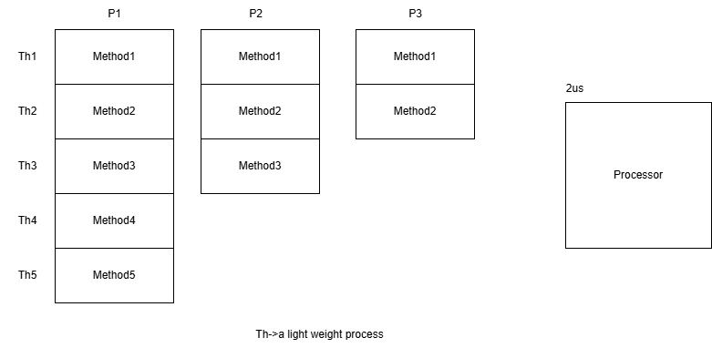

## Object-Oriented Programming using C++
### C++ Notes Day-11 Date: 19-12-2024
#### Lets Revise
- Runtime Type Information(RTTI)
- Advanced Type Casting Operators
    - static_cast operator
    - dynamic_cast operator
    - const_cast operator
    - reinterpret_cast operator
    [](Employee &o1, Employee &o2){return o1.EmpId<o2.EmpId};
- Example:
```C++
#include <iostream>
#include <typeinfo>
using namespace std;
class Test
{
public:
	int Num1;
	int Num2;
	Test()
	{
		this->Num1=0;
		this->Num2=0;
	}
	Test(int Num1, int Num2)
	{
		this->Num1=Num1;
		this->Num2=Num2;
	}
	virtual void Method1()
	{

	}
	void Display()
	{
		cout<<"Num1:	"<<this->Num1<<endl;
		cout<<"Num2:	"<<this->Num2<<endl;
	}
	/*const Test *const this*/
	void ShowData()const
	{
		cout<<"Num1:	"<<this->Num1<<endl;
		cout<<"Num2:	"<<this->Num2<<endl;

		Test *const ptr=(Test *const)this;		//C Style
		Test *const pt=const_cast<Test *const>(this);
		pt->Display();
	}
};
class TestTwo:public Test
{
public:
	void Method1()
	{
		cout<<"Am Method1 of Test2"<<endl;
	}
};
int main()
{
	Test *ptr=new TestTwo();		//Up-casting

	cout<<"Type of ptr:	"<<typeid(ptr).name()<<endl;

	const type_info &t=typeid(*ptr);
	cout<<"Type of object to which ptr is pointing:	"<<t.name()<<endl;


	return 0;
}
int main2()
{
	const Test t1(100,200);
	t1.ShowData();			//const object can only call const member function
	//t1.Display();			//const object can not call non-member function
	return 0;
}
int main1()
{
	Test *ptr=new Test(10,30);

	//int *pt=(int*)ptr;		//C Style Conversion

	int *pt=reinterpret_cast<int*>(ptr);

	*pt=500;
	pt=pt+1;
	*pt=600;
	ptr->Display();
	return 0;
}
```
- STL in C++: vector<>
#### STL in C++
- vector<>
- list<>
- stack<>
- queue<>
- set<>
- dequeue<>
#### map<K,V>
- A map in C++ STL is an associative container that stores key-value pairs, where each key is unique, and keys are automatically sorted in ascending order by default.
- The map is implemented as a self-balancing binary search tree (e.g., Red-Black Tree), making key-based operations efficient.
- It provides efficient lookup, insertion, and deletion, typically with a time complexity of O(log n).
- Syntax: Declaration
```C++
#include <map>
using namespace std;
map<KeyType, ValueType> mapName;
```
- Example with Student and Address:
```C++
map<Student, Address> StudentAddressMap;
```
- Implementation of map<Student,Address>
    - Classes: Student and Address
        - Define a Student class with data members: RollNo, Name, Fees, and Age.
        - Define an Address class with data members: City and Country.
```C++
#include <iostream>
#include <map>
#include <string>
using namespace std;

class Student {
public:
    int RollNo;
    string Name;
    double Fees;
    int Age;
    Student(int RollNo, string Name, double Fees, int Age) {
        this->RollNo = RollNo;
        this->Name = Name;
        this->Fees = Fees;
        this->Age = Age;
    }
    void Display() {
        cout << "RollNo: " << RollNo << ", Name: " << Name << ", Fees: " << Fees << ", Age: " << Age<<endl;
    }
    bool operator<(const Student& s) const {
        return RollNo < s.RollNo;               // Compare by RollNo
    }
};
class Address {
public:
    string City;
    string Country;
    Address(string City, string Country) {
        this->City = City;
        this->Country = Country;
    }
    void Display() {
        cout << ", City: " << City << ", Country: " << Country << endl;
    }
};
```
- Operations on Map
    - Insertion of Records
        - Use the insert() or [] operator to add key-value pairs to the map.
        - Example:
            ```C++
                map<Student, Address> StudentAddressMap;

                // Insert using `insert` method
                StudentAddressMap.insert({Student(101, "Malkeet", 1500.50, 20), Address("Delhi", "India")});
                StudentAddressMap.insert({Student(102, "Saket", 1600.75, 21), Address("Mumbai", "India")});

                // Insert using `[]` operator
                StudentAddressMap[Student(103, "Johnson", 1700.80, 22)] = Address("Berlin", "Germany");

                // Display all records
                cout << "Student-Address Map After Insertion:"<<endl;
                for (auto& pair : StudentAddressMap) {
                    pair.first.Display();
                    pair.second.Display();
                }
            ```
- Searching for a Record
    - Use the find() method to search for a record based on the key.
    - Example:
        ```C++
            Student searchStudent(102, "Saket", 1600.75, 21); // Same key details must match
            auto it = StudentAddressMap.find(searchStudent);
            if (it != StudentAddressMap.end()) {
                cout << "Record Found:\n";
                it->first.Display();
                it->second.Display();
            } else {
                cout << "Record not found.\n";
            }
        ```
- Sorting Records
    - Maps automatically sort their keys. To customize sorting, use a comparator function.
    - Example: Sorting by Age
        ```C++
            struct CompareByAge {
                bool operator()(const Student& a, const Student& b) {
                    return a.Age < b.Age; // Sort by Age
                }
            };
            // Declare map with custom comparator
            map<Student, Address, CompareByAge> sortedByAgeMap;
            sortedByAgeMap[Student(101, "Malkeet", 1500.50, 20)] = Address("Delhi", "India");
            sortedByAgeMap[Student(102, "Saket", 1600.75, 21)] = Address("Mumbai", "India");
            // Display records
            cout << "Map Sorted by Age:\n";
            for (auto& pair : sortedByAgeMap) {
                pair.first.Display();
                pair.second.Display();
            }
        ```
- Updating a Record
    - To update a record, use the [] operator or modify the value directly.
    - Example: Update Address for a Student
    ```C++
        Student updateStudent(103, "Johnson", 1700.80, 22);
        auto it = StudentAddressMap.find(updateStudent);
        if (it != StudentAddressMap.end()) {
            it->second = Address("Paris", "France"); // Update Address
            cout << "Record Updated:\n";
            it->first.Display();
            it->second.Display();
        }
    ```
- Deleting a Record
    - Use the erase() method to remove a record based on the key.
    - Example:
    ```C++
        Student deleteStudent(101, "Malkeet", 1500.50, 20);
        StudentAddressMap.erase(deleteStudent); // Erase by key
        cout << "Map After Deletion:"<<endl;
        for (auto& pair : StudentAddressMap) {
            pair.first.Display();
            pair.second.Display();
        }
    ```
- Advantages of Using Map
    - Key-Based Access: Maps provide efficient lookups, insertions, and deletions using keys.
    - Automatic Sorting: Keys are always sorted, which simplifies operations like range queries.
    - Custom Comparators: Maps allow custom sorting using comparator functions.
    - Iterators: Stable iterators allow easy traversal of elements.
- Limitations of Using Map
    - Slower than Unordered Map: Maps have O(log n) complexity due to tree-based implementation, whereas unordered maps offer O(1) average-case complexity.
    - Key Duplication Not Allowed: Each key in a map must be unique.
    - Memory Overhead: Maps require extra memory for maintaining tree structures.
- Example: map<Student,Address>
```C++
#include <iostream>
#include <map>
#include <string>
using namespace std;
class Student {
public:
    int RollNo;
    string Name;
    double Fees;
    int Age;

    Student(int RollNo, string Name, double Fees, int Age) {
        this->RollNo = RollNo;
        this->Name = Name;
        this->Fees = Fees;
        this->Age = Age;
    }

    void Display() {
        cout << "RollNo: " << RollNo << ", Name: " << Name << ", Fees: " << Fees << ", Age: " << Age<<endl;
    }

    bool operator<(const Student& s) const {
        return RollNo < s.RollNo; // Compare by RollNo
    }
};

class Address {
public:
    string City;
    string Country;

    Address(string City, string Country) {
        this->City = City;
        this->Country = Country;
    }

    void Display() {
        cout << ", City: " << City << ", Country: " << Country << endl;
    }
};

int main() {
    map<Student, Address> StudentAddressMap;

    // Insertion
    StudentAddressMap[Student(101, "Malkeet", 1500.50, 20)] = Address("Delhi", "India");
    StudentAddressMap[Student(102, "Saket", 1600.75, 21)] = Address("Mumbai", "India");

    // Display
    cout << "Initial Records:"<<endl;
    for (auto& pair : StudentAddressMap) {
        pair.first.Display();
        pair.second.Display();
    }

    // Searching
    Student searchStudent(102, "Saket", 1600.75, 21);
    auto it = StudentAddressMap.find(searchStudent);
    if (it != StudentAddressMap.end()) {
        cout << "Record Found:"<<endl;
        it->first.Display();
        it->second.Display();
    }

    // Updating
    Student updateStudent(101, "Malkeet", 1700.80, 22);
    auto updateIt = StudentAddressMap.find(updateStudent);
    if (updateIt != StudentAddressMap.end()) {
        updateIt->second = Address("Paris", "France");
        cout << "Updated Record:"<<endl;
        updateIt->first.Display();
        updateIt->second.Display();
    }

    // Deleting
    StudentAddressMap.erase(Student(101, "Malkeet", 1700.80, 22));
    cout << "Records After Deletion:"<<endl;
    for (auto& pair : StudentAddressMap) {
        pair.first.Display();
        pair.second.Display();
    }
    return 0;
}
```
#### Multi-Threaing in C++
- What is Multithreading?
    - Multithreading allows a program to run multiple parts (called threads) at the same time. This helps make the best use of the CPU. Each thread acts like a small, lightweight process within the main program.

- Multithreading in C++
    - Before C++11, we used libraries like POSIX threads (<pthread>). However, these were not standard, leading to compatibility issues.
    - With C++11, the std::thread library was introduced, making multithreading easier and portable.
- What is std::thread?
    - std::thread is a class that represents a single thread in C++.
    - You can create and start a thread by passing a task to a thread object.
- Syntax to Create a Thread
```C++
std::thread ThreadName(CallableObject:FunctionPointer/Function/Lambda/ClassObject);
```
- Here, ThreadName is the name of the thread, and CallableObject is the code the thread will execute.
- What Can Be Passed as CallableObject?
    - A callable is the task the thread will run. It can be one of the following:
        - A Function Pointer: A normal function.
        - A Lambda Expression: A small, inline function written using [ ].
        - A Function Object: An object with an overloaded operator().
        - A Non-Static Member Function: A member function of a class, called on an object.
        - A Static Member Function: A class-level function that does not need an object.
- How to Start a Thread?
    - Define the callable.
    - Example:
        ```C++
        void MyFunction()
        {
            for(int i=0;i<5;i++)
            {
                cout<<"Value is:   "<<i<<endl;
            }
        }
        ```
    - Pass the callable to the thread object's constructor.
    - Example:
        ```C++
        thread Th1(MyFunction);     //Creating Thread by creating object of thread class
        ```
    - The thread will automatically start running once the object is created.
    - Example:
    ```C++
        #include <iostream>
        #include <thread>
        using namespace std;

        // function to be used in callable
        void MyFun(int N)
        {
            for (int i = 0; i < N; i++) {
            cout <<i<<" by Thread"<<this_thread::get_id()<<endl;
            }
        }
        int main()
        {
            thread th(MyFun,5);     //First Thread will execute MyFun Function
            
            //Creating a lambda Function
            auto MyFun1=[](int X)
            {
                for (int i = 0; i < X; i++) 
                {
                cout <<i<<" by Thread"<<this_thread::get_id()<<endl;
                }
            };

            thread th2(MyFun1,5);   //Assigning lambda to Thread th2

            for(int i=0;i<5;i++)
            {
                cout <<i<<" by Thread"<<this_thread::get_id()<<endl;
            }
            return 0;
        }
    ```
- Benefits of Multithreading
    - Executes multiple tasks at the same time.
    - Makes programs faster and more efficient by using the CPU fully.
- Examples:
```C++
#include <iostream>
#include <thread>
#include <chrono>
using namespace std;

void MyFun1(int X)
{
    for(int i=0;i<X;i++)
    {
        cout<<i<<" By: "<<this_thread::get_id()<<endl;
    }
}
void MyFun(int X)
{
    for(int i=0;i<X;i++)
    {
        cout<<i<<" By: "<<this_thread::get_id()<<endl;
        //this_thread::sleep_for(chrono::milliseconds=200);
    }
}
class Test
{
public:

    void operator()(int X)
    {
        for(int i=0;i<X;i++)
        {
            cout<<i<<" By"<<this_thread::get_id()<<endl;
            this_thread::sleep_for(chrono::milliseconds(300));
        }
    }
};
int main()
{
    Test t;

    thread th(t,10);
    th.join();
    return 0;
}
int main2()
{
    auto MyFun=[](int X){

        for(int i=0;i<X;i++)
        {
            cout<<i<<" By"<<this_thread::get_id()<<endl;
            this_thread::sleep_for(chrono::milliseconds(300));
        }
    };
    thread th(MyFun,10);        //Creating and starting of thread th
    th.join();                  //Here Main will be wait be for the execution of th thread
    return 0;
}
int main1()
{

    thread th1(MyFun,10);
    thread th2(MyFun1,10);
    cout<<"Am in Main"<<this_thread::get_id()<<endl;
    return 0;
}
```