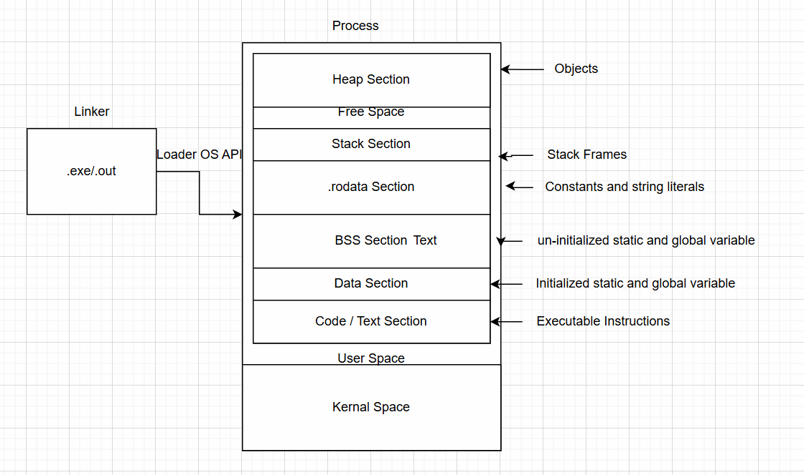
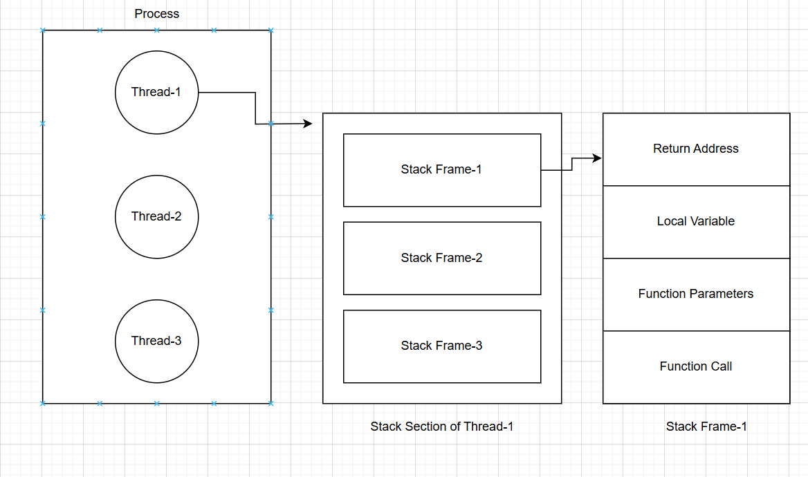
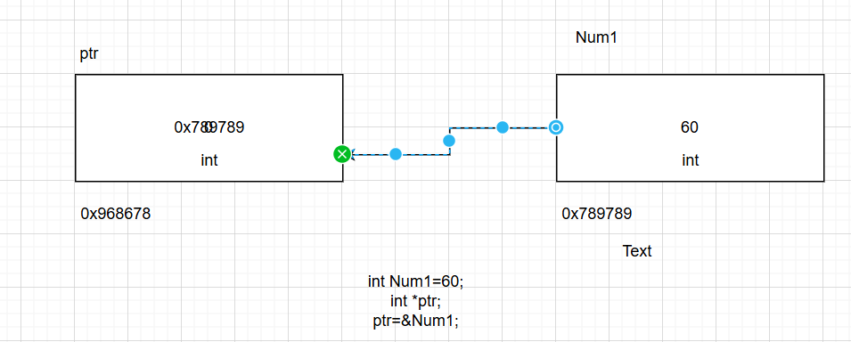

## Object-Oriented Programming using C++
### C++ Notes Day-2 Date: 10-12-2024
#### Introduction to C/C++
- signed vs unsigned
- use of 'typedef'
- use of 'sizeof' operator and size_t typedef
- use of '&' operator to get address of the variable
- Function arguments vs Function parameters
```C
#include<cstdio>  //C style Header File
using namespace std;
void Add(int, int);	//Function Prototype
int main()
{
	int Num1=100;
	printf("Value of Num1:%d\n",Num1);
	printf("Address of Num1:%p\n",&Num1);
	Add(100,200);	//Here 100 and 200 are arguments
	return 0;
}
void Add(int x, int y)	//Here X and Y are Parameters
{
	int res=x+y;
	printf("The Sum of X and Y:%d\n",res);

```
- Declaration and Definition + Initialization and Assignment of variables
```C
#include<cstdio>  //C style Header File
using namespace std;
int main()
{
	int Num1;	//Declaration + Definition
	printf("Value of Num1:%d\n",Num1);
	printf("Size of Num1:%d\n",sizeof(Num1));
	printf("Address of Num1:%p\n",&Num1);

	int Num2=90;	//Declaration + Definition + Initialization
	Num2=100;		//We can do assignment multiple time
	Num2=89;

	return 0;
}
```
- Memory structure of C/C++ program

- Function Activation Record (Stack Frames)

- Pointer
   - Concept: Pointer is a variable which is used to store the address of other variable. With the help of pointer variable we can not only save address of the other variable, we can also access and manupulate value saved at given memory address

   - Declaration
      - Syntax: datatype *variableName.
      - Example: int *ptr, here ptr is pointer variable of type int
      - Example-1:
         ```C
         int* ptr;   //OK
         ```
      - Example-2:
         ```C
         int * ptr;   //OK
         ```
      - Example-3:
         ```C
         int *ptr;   //OK
         ```
- Pointer Example: Initialization and Assignment
```C
int main1()
{
	//Num1 is a variable of type int
	int Num1=60;  //Every defined variable has a memory address
	printf("Value of Num1:%d\n",Num1);
	printf("Address of Num1:%p\n",&Num1);
	printf("Size of Num1:%d\n",sizeof(Num1));

	int *ptr;	//ptr is pointer variable of type int

	ptr=&Num1;  //Assignment of the address of Num1 to the pointer variable ptr

	printf("Value of ptr:%p\n",ptr);
	printf("Address of ptr:%p\n",&ptr);
	printf("Size of ptr:%d\n",sizeof(ptr));

	printf("Value of Num1 using ptr variable:%d\n",*ptr);  //Dereferencing

	*ptr=100; //Dereferencing
	printf("Value of Num1:%d\n",Num1);
	return 0;
}
```
   - Size of the Pointer
   	- 16-bit: 2 Byte
	- 32-bit: 4 Byte
	- 64-bit: 8 Byte
   - Wild pointer: Un-Initialized pointer variable is known as Wild Pointer
		```C
		int main()
		{

			int *ptr;	//Un-inialized pointer variable is known as wild-pointer, becouse it will pointing to a any memory address

			printf("Value of ptr:%p\n",ptr);		//Value of ptr is always a address of the memory
			printf("Address of ptr:%p\n",&ptr);

			//printf("Value by using ptr:%d\n",*ptr);

			return 0;
		}
		```
   - NULL and Null Pointer
	- Null is a macro whose value is 0.
	- If we assign NULL to a pointer while declaring it, then the pointer is know as Null-Pointer
   - Dereferencing in using pointer variable
	- If we assign a memory address to a pointer variable and we are accessing the value of the given memory address by using pointer variable name prefixing it with * this is know as Dereferencing
		```C
		int main()
		{
			int Num1=90;
			int *ptrNum1;

			int* ptr;	//OK
			int * ptr1;	//OK
			//int ptr*;  //Not OK

			ptrNum1=&Num1;

			printf("%d\n",Num1);	//90
			printf("%p\n",&Num1);	//Address of Num1
			printf("%p\n",ptrNum1);		//Value of ptrNum1 which is actually address of Num1
			printf("%p\n",&ptrNum1);	//Address of ptrNum1 variable
			printf("%d\n",*ptrNum1);	//90, value at the memory whose address is stored inside ptrNum1 (Dereferencing)
			return 0;
		}
		```
- const qualifier
	- const is keyword in C/C++ and its is known as const/type qualifier.
	- If we do not want to change xthe value of the particuler varibale then we should use const qualifier.
		```C
		int X=90;	//X is avraible whose value can be changed at any point of time
		print(X);
		X=890;	//OK
		print(X);

		const int Y=100;
		print(Y);
		Y=560; //NOT OK, as Y is decalared using const qualifier so its value can not be changed/modified
		```
	- variable decalared using const keyword its also known as read-only variable
	- constant variable should be assigned value at the time of declaration of the variable
- Constant and Pointer Combination
   - int *ptrNum
	- ptrNum is non-constant local pointer variable who can store the address of non-contant integer variable
	- Non-constant pointer variable can not store the address of contant variable.
		```C
		int main1()
		{
			int Num1=100;		//Num1 is non-constant local variable
			int Num2=200;
			int *ptrNum;	//ptrNum1 is non-constant local pointer variable which is ready to store address of non-constant integer variable

			ptrNum=&Num1;
			printf("Value of ptrNum:%p\n",ptrNum);

			ptrNum=&Num2;
			printf("Value of ptrNum:%p\n",ptrNum);

			return 0;
		}
		```
   - const int *ptrNum / int const *ptrNum / const int const *ptrNum
		```C
		int main()
		{
			const int Num1=100;		//Num1 is non-constant local variable
			const int Num2=200;
			const int *ptrNum;	//ptrNum1 is non-constant local pointer variable which is ready to store address of constant integer variable

			int const *ptrNum1;
			//const int const *ptrNum2;   //Not Valid

			ptrNum=&Num1;
			printf("Value of ptrNum:%p\n",ptrNum);

			ptrNum=&Num2;
			printf("Value of ptrNum:%p\n",ptrNum);

			return 0;
		}
		```
   - int *const ptrNum
		```C
		int main()
		{
			int Num1=100;		//Num1 is non-constant local variable
			int Num2=200;
			int *const ptrNum=&Num1;	//ptrNum is constant local pointer variable which is ready to store address of non-constant integer variable

			//ptrNum=&Num2;	//NOT OK, becouse ptrNum is constant pointer variable to whom address can be assigned only once

			printf("Address of Num1:%p\n",&Num1);
			printf("Address of Num1:%p\n",ptrNum);


			return 0;
		}
		```
		```C
		int main()
		{
			int Num1=100;		//Num1 is non-constant local variable
			const int Num2=200;

			//int *const ptrNum=&Num1;	//ptrNum is constant local pointer variable which is ready to store address of non-constant integer variable

			int *const ptrNum=&Num2;	//NOT OK, ptrNum is constant pointer variable which is ready to take address of non-constant integer variable only

			printf("Address of Num2:%p\n",&Num2);
			printf("Address of Num2:%p\n",ptrNum);


			return 0;
		}
		```
	- int *ptrNum const: NOT Valid
   	- const int *const ptrNum / int const *const ptrNum
		- Here ptrNum is constant pointer variable and ready to store the address of constant integer variable
		```C
		int main()
		{
			const int Num1=890;		//OK

			const int *const ptrNum=&Num1;	//Here ptrNum is constant pointer variable which is ready to store the address of constant integer variable

			//ptrNum=&Num1;	//NOT OK

			printf("Value of Num1 using Dereferencing:%d\n",*ptrNum);

			return 0;
		}
		```
#### To be disscussed tomorrow (11-12-2024)
- Some other examples in const and pointer combination
- Structure in C
- Limitations of C
- Introduction to C++
	- History
	- Data Types
	- Type Modifiers
	- Type Qualifiers
	- Execution Flow
	- Access Specifiers
- Structure in C++
	- Data Member
	- Member Function
	- Objects
- Class in C++
	- Data Member
	- Member Function
	- Objects
	- Message Passing
- Header Guard
- #include<abc.h> versus #include"abc.h"
- storage classes C++
- scope in C++
- Namespace in C++