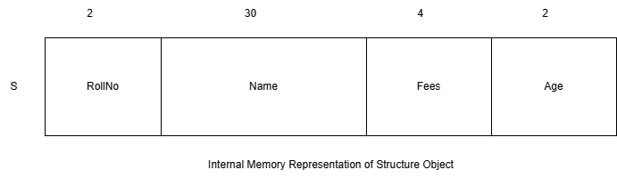

## Object-Oriented Programming using C++
### C++ Notes Day-3 Date: 11-12-2024
#### Pointers in C/C++
- Some other examples in const and pointer combination
	- Chaning the value of constant variable using non-constant pointer
		```C
		int main1()
		{
			int Num1=100;	//Num1 is non-constant method local variable

			int *ptrNum=&Num1;	//ptrNum is non-constant local pointer variable

			*ptrNum=200;	//OK

			printf("Value of Num1:%d\n",Num1);		//200
			printf("Value of Num1 using Dref:%d\n",*ptrNum);	//200


			const int *ptrNum2=&Num1;	//Num1 is read-only variable for ptrNum2
			//*ptrNum2=400;	//NOT OK

			printf("Value of Num1:%d\n",Num1);		//200
			printf("Value of Num1 using Dref:%d\n",*ptrNum2);	//200

			return 0;
		}
		```
	- Type Casting in pointers
		```C
		int main()
		{

			const int Num1=100;
			const int *ptrNum1=&Num1;

			//*ptrNum1=300;	//NOT OK

			printf("Value of Num1:%d\n",Num1);		//100
			printf("Value of Num1 using Dref:%d\n",*ptrNum1);	//100

			int *ptrNum2=(int*)&Num1;
			*ptrNum2=400;	//OK
			printf("Value of Num1:%d\n",Num1);		//100
			printf("Value of Num1 using Dref:%d\n",*ptrNum2);	//400   //Un-Expected Behavior

			return 0;
		}
		```
- Ref: https://en.cppreference.com/w/c/language/pointer
- Structure in C
	- If i need 100 variables what should i Do?
		- Num1, Num2, Num3, Num4....100.
		- Array of Numbers (100).
	- AccountNo-int, CustomerName-char, Age-int, Balance-float: BankAccunt
	- EmpId-int, EmpName-char,EmpSalary-float,EmpDesignation-char: Employee
	- Structure is derived data type in C/C++. SO in general it is known as user defined data type.
	- Structure is group different data type variable.
	- Syntax:struct NameOfStructure{};
		- Example:
			```c
			struct Employee
			{
							//
			};			
			```
	- struct is keyword in C/C++ to declare the structure.
	- We can declare structure inside a method or scope it is known as Local Structure.
	- In case of local structure we can't define its object globally.
	- Data Member
		```C
			int main()
			{
			//Local Structure
			struct Student		//Student is the Name of The Structure
			{
				int RollNo;		//Data Member of Structure
				char Name[30];	//Data Member of Structure
				float Fees;		//Data Member of Structure
				int Age;		//Data Member of Structure
			};
			printf("Enter RollNo :		");
			Student S;		//Object of the Structure

			printf("Enter RollNo :		");
			scanf("%d",&S.RollNo);
			printf("Enter Name :		");
			scanf("%s",S.Name);
			printf("Enter Fees :		");
			scanf("%f",&S.Fees);
			printf("Enter Age :		");
			scanf("%d",&S.Age);

			printf("RollNo :		%d\n",S.RollNo);
			printf("Name :		%s\n",S.Name);
			printf("RollNo :		%f\n",S.Fees);
			printf("RollNo :		%d\n",S.Age);
				return 0;
			}
		```

- Data members of the structure gets space inside the structure object.
- To access data members of the structure with object we use Member Selection operator (.).
- We can also declare pointer variable of the structure. To access structure data members with pointer variable we must use (->) arrow.
- passing structure object as Value and Address
	```C
		#include<cstdio>
		using namespace std;
		//Global Structure
			struct Student		//Student is the Name of The Structure
			{
				int RollNo;		//Data Member of Structure
				char Name[30];	//Data Member of Structure
				float Fees;		//Data Member of Structure
				int Age;		//Data Member of Structure
			};
		void GetData(Student*);
		void ShowData(Student*);

		int main()		//Calling Method
		{


			Student S;		//Object of the Structure

			GetData(&S);		//Passing address of Student S to global method SetData
			ShowData(&S);
			return 0;
		}
		//Global Method
		void GetData(Student *ptrStudent)	//Called Method
		{
			printf("Enter RollNo :		");
			scanf("%d",&ptrStudent->RollNo);
			printf("Enter Name :		");
			scanf("%s",ptrStudent->Name);
			printf("Enter Fees :		");
			scanf("%f",&ptrStudent->Fees);
			printf("Enter Age :		");
			scanf("%d",&ptrStudent->Age);
		}
		//Global Method
		void ShowData(Student *ptrStudent)		//Called Method
		{
			printf("RollNo :		%d\n",ptrStudent->RollNo);
			printf("Name :		%s\n",ptrStudent->Name);
			printf("RollNo :		%f\n",ptrStudent->Fees);
			printf("RollNo :		%d\n",ptrStudent->Age);
		}
	```
- Limitations of C
	- In C data is manupulated by using global functions, any global function can access any global data. Hence data security is difficult to achieve.
	- There is no string  data type in C.
	- Various global functions makes the program little difficult to understand.
- Introduction to C++
	- History
		- Inventor: Bjarne Stroustrup
		- Year: 1979
		- Where: At L&AT Bell Lab
		- Initial Name: C with classes
		- Renamed in 1983 by ANSI: C++
		- Standerzation of C++: ISO Working group
		- Standerds of C++
			- C++98
			- C++03
			- C++11
			- C++14
			- C++17
			- C++20
			- C++23
			- C++26
		- C++ is Object Oriented Programming language
		- C++ is developed from C and Simula 67
		- C++ having all the features of C, hence it is also known as Hybrid Programming Language
		- Like C, C++ is also statically type check as well as strongly type check programming language
	- Data Types
		- Basic / Fundamental Data Types
			- int
			- char
			- float
			- double
			- bool
			- void
			- wchar_t(typedef unsigned short wchar_t)
		- Derived Data Types
			- Arrays
			- Pointers
			- Functions
			- References 
		- User-Defined Data Types
			- Structure
			- Union
			- Classes
	- Type Modifiers
		- short
		- long
		- signed
		- unsigned
	- Type Qualifiers
		- const
		- volatile
	- Execution Flow
		- Bjarne Stroustrup developed an interpreter named as 'cfront' which was used to convert/translate the c++ code to c.
	- Access Specifiers
		- Access Modifiers are used to maintain the access/visiablity of data.
			- public
			- private
			- protected
- Structure in C++
	- We can define Member Function in structure.
	- To create object of the structure 'struct' keyword is optional.
	- By default structure data members are public.
	- Data Member
		- variables declared inside the structure are known as Data Members.
		- These are also known Fields, properties, attributes
	```c
	struct Student
	{
	int RollNo;		//Data Member/Field/Property of structure
	char Name[30];	//Data Member of structure
	float Fees;		//Data Member of structure
	};
	```
	- Member Function
		- A Function defined inside the structure body is known as Member Function of the structure.
		- Member Function also know as method / procedure / behavior / messages.
		- A method which does not have body it is known abstract method.
		- A method which have body is known Concrete Method.
	```c
		struct Student
		{

			int RollNo;		//Data Member/Field/Property of structure
			char Name[30];	//Data Member of structure
			float Fees;		//Data Member of structure

			void SetData()	//Member Function/Method/Procedure
			{
				printf("Enter RollNo : 	");
				fflush(stdout);
				scanf("%d",&RollNo);
				printf("Enter Name : 	");
				fflush(stdout);
				scanf("%s",Name);
				printf("Enter Fees : 	");
				fflush(stdout);
				scanf("%f",&Fees);
			}

			void ShowData()
			{
				printf("Roll No:	%d\n",RollNo);
				printf("Name:	%s\n",Name);
				printf("Fees:	%f\n",Fees);
			}
		};
	```
	- use of typedef in structure
		- To give alias name to the structure defined.
	```c
		struct Employee
		{
			int EmpId;
			char Name[30];
			void Show()
			{
				printf("Am Show of Employee");
			}
		}emp1, emp2, emp3;	//Here emp1, emp2, emp3 will be the objects of structure Employee

		typedef struct Fruit
		{
			char Name[30];
			void Show()
			{
				printf("Am Show of Fruit");
			}
		}fruit_t;			//Here fruit_t is typedef for structure Fruit


		int main()
		{
			emp1.EmpId=101;		//OK

			Fruit f1;		//OK

			fruit_t f2;		//OK

			emp1.Show();	//Message Passing
			f2.Show();
			return 0;
		}
	```
	- statically defined and dynamically defined objects
	```C
		#include<cstdio>
		#include<cstdlib>

		struct Student
		{

			int RollNo;		//Data Member/Field/Property of structure
			char Name[30];	//Data Member of structure
			float Fees;		//Data Member of structure

			void SetData()	//Member Function/Method/Procedure
			{
				printf("Enter RollNo : 	");
				fflush(stdout);
				scanf("%d",&RollNo);
				printf("Enter Name : 	");
				fflush(stdout);
				scanf("%s",Name);
				printf("Enter Fees : 	");
				fflush(stdout);
				scanf("%f",&Fees);
			}

			void ShowData()
			{
				printf("Roll No:	%d\n",RollNo);
				printf("Name:	%s\n",Name);
				printf("Fees:	%f\n",Fees);
			}

		};

		int main()
		{
			Student s1;		//Here s1 is object of structure Student which is statically defined
			s1.SetData();
			s1.ShowData();

			Student *ptrStudent=(Student*)malloc(sizeof(Student));		//Here object of the structure student will gets memory dynamically

			ptrStudent->SetData();
			ptrStudent->ShowData();

			free(ptrStudent);
			return 0;
		}
	```
	- array of objects in structure
	```c
		#include<cstdio>
		#include<cstdlib>

		struct Student
		{

			int RollNo;		//Data Member/Field/Property of structure
			char Name[30];	//Data Member of structure
			float Fees;		//Data Member of structure

			void SetData()	//Member Function/Method/Procedure
			{
				printf("Enter RollNo : 	");
				fflush(stdout);
				scanf("%d",&RollNo);
				printf("Enter Name : 	");
				fflush(stdout);
				scanf("%s",Name);
				printf("Enter Fees : 	");
				fflush(stdout);
				scanf("%f",&Fees);
			}

			void ShowData()
			{
				printf("Roll No:	%d\n",RollNo);
				printf("Name:	%s\n",Name);
				printf("Fees:	%f\n",Fees);
			}

		};

		int main()
		{
			Student Arr[100]; 	//Here arr is array of objects of Student structure

			for(int i=0;i<5;i++)
			{
				Arr[i].SetData();
			}
			for(int i=0;i<5;i++)
			{
				Arr[i].ShowData();
			}
			return 0;
		}
	```
	- passing structure object as Value and Address: See program 3.5
		- Demostrate call by value by yourself
	- procedure-oriented and object-oriented approach while using structure
- Class in C++
	- It is a blueprint of a real wolrd entity known as Object. It describe attribute and behavior of the object.
	- attribute defined using variables and behavior defined using functions / methods
	- variables defined inside the class are known data members and functions / methods defined inside the class are known as Member Functions.
	- Data Members and Members Functions can be categeroized into static and non-static.
	- We can define the following into the class:
		- Data Members
			- static
			- non-static
		- Member Functions
			- static
			- non-static
				- const
				- virtual
		- Constructor
		- Destructor
	- Class, Structure, Enum, Union: Ntested Types
	- A class for which we can create objects is known as Concrete class.
	- A class for which we  can not create objects is known as Abstract class
- Object
	- variable of the class the is known as object.
	- Object is also known as instance.
	- Syntax: class ClassName ObjectName;
	```c
		Student S1;			//OK
		class Student S2;	//OK
	```
#### Will be discussed tomorrow(12-12-2024)
- Message Passing
	- calling Member Function using dot/Member Selection (.) operator
	- calling Member Function using scope resolution (::) operator
- Header Guard
- #include<abc.h> versus #include"abc.h"
- storage classes C++
- scope in C++
- Namespace in C++