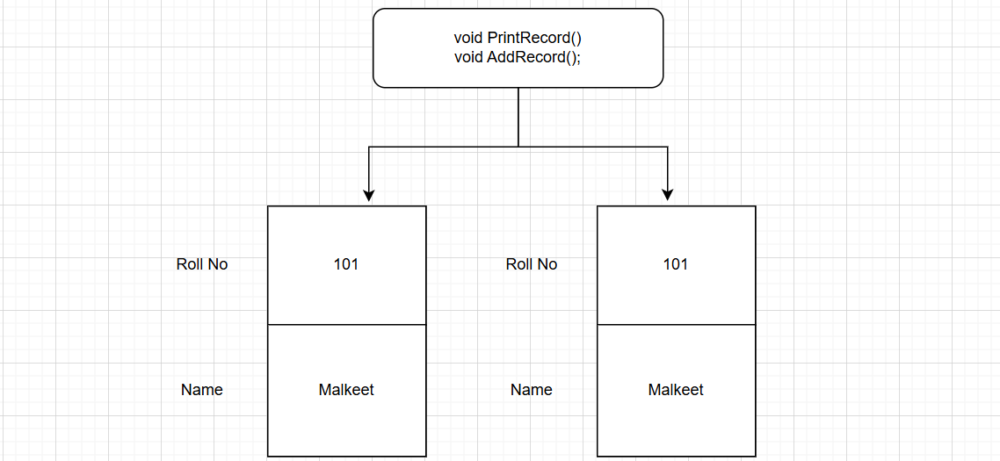

## Object-Oriented Programming using C++
### C++ Notes Day-4 Date: 12-12-2024
### Class and Object in C++
- Class in C++
	- It is a blueprint of a real wolrd entity known as Object. It describe attribute and behavior of the object.
	- attribute defined using variables and behavior defined using functions / methods
	- variables defined inside the class are known data members and functions / methods defined inside the class are known as Member Functions.
	- Data Members and Members Functions can be categeroized into static and non-static.
	- We can define the following into the class:
		- Data Members
			- static
			- non-static
		- Member Functions
			- static
			- non-static
				- const
				- virtual
		- Constructor
		- Destructor
	- Class, Structure, Enum, Union: Ntested Types
	- A class for which we can create objects is known as Concrete class.
	- A class for which we  can not create objects is known as Abstract class
- Object
	- variable of the class the is known as object.
	- Object is also known as instance.
	- Syntax: class ClassName ObjectName;
	```c
		Student S1;			//OK
		class Student S2;	//OK
	```
- Message Passing
	- calling Member Function using dot/Member Selection (.) operator
	```C++
	#include <iostream>
	#include <string.h>
	using namespace std;

	class Student
	{
	public:
		int RollNo;
		char Name[30];
		void AddRecord();
		void PrintRecord();
		void SetRecord(int RollNo, char Name[30])
		{
			this->RollNo=RollNo;
			//this->Name=Name;
			strcpy(this->Name, Name);
		}
	};
	void Student:: AddRecord(/*const Student *this*/)
		{
			cout<<"Enter Roll No:	"<<endl;
			cin>>RollNo;
			cout<<"Enter Name:	"<<endl;
			cin>>Name;
		}
		void Student:: PrintRecord()
		{
			cout<<"Roll No:		"<<RollNo<<"  Name:		"<<Name<<endl;
		}
	int main()
	{
		Student S1;
		Student S2;
		//Member Function call using Dot (.) Operator
		S1.AddRecord();		//S1.AddRecord(&S1); calling AddRecord Member Function on S1
		S1.PrintRecord();	//S1.PrintRecord(&S1);

		S2.SetRecord(102, "Mahesh");
		S2.PrintRecord();
		return 0;
	}
	```
	- calling Member Function using scope resolution (::) operator
	```C++
	#include <iostream>
	#include <string.h>
	using namespace std;

	class Student
	{
	public:
		int RollNo;
		char Name[30];
		void AddRecord();
		void PrintRecord();
		void SetRecord(int RollNo, char Name[30])
		{
			this->RollNo=RollNo;
			//this->Name=Name;
			strcpy(this->Name, Name);
		}
	};
	void Student:: AddRecord(/*const Student *this*/)
		{
			cout<<"Enter Roll No:	"<<endl;
			cin>>RollNo;
			cout<<"Enter Name:	"<<endl;
			cin>>Name;
		}
		void Student:: PrintRecord()
		{
			cout<<"Roll No:		"<<RollNo<<"  Name:		"<<Name<<endl;
		}
	int main()
	{
		Student S1;
		Student S2;
		//Member Function call using Scope Resolution :: Operator
		S1.Student::AddRecord();		
		S1.Student::PrintRecord();	//S1.PrintRecord(&S1);

		S2.SetRecord(102, "Mahesh");
		S2.PrintRecord();
		return 0;
	}
	```
### Custom Header File and Header Guard
- #include<abc.h> versus #include"abc.h"
	- Standard directory for standard header file : C:\MicGW\include
	- If we include header file in angular bracket( < > ) then preprocessor try to locate that file inside standard directory only.
	- Example: #include<stdio.h>
	- If we include header file in double quotes( " " ) then preprocessor first try to locate that file inside current project directory. If not found then it will try to locate it from standard directory.
	- Example:
		- #include<stdio.h>
		- #include"stdio.h"
- Importance of Header Guard
	- If we want to expand contents of header file only once then we should use Header Guard inside header file.
	```C++
	#ifndef STUDENT_H_
	#define STUDENT_H_
	//Declarations
	#endif /* STUDENT_H_ */
	```
### Storage Classes C/C++
- There are four type of storage classes in C/C++
	- auto
	- extern
	- static
	- register
- storage classes describe scope and lifetime of the variable.
- non-static vs static global variable
	- We can access non static global variable inside same file where it is declared as well as inside diffrent file using extern keyword.
	- We can access static global variable inside same file where it is declared. But we can not access it inside diffrent file. We will get linker error.
	```C++
	#include <cstdio>
	int main()
	{
		extern int Num1;	//Here extern will look for Num1 which is declared globally
		printf("Global Num1:	%d\n",Num1);
		//extern int Num2;	//NOT OK, static and extern can't be used together
		//printf("Static Global Num1:	%d\n",Num2);
		return 0;
	}
	int Num1=100;			//Non-Static Global Variable
	static int Num2=200;	//Static Global Variable
	```
#### Scope in C/C++
- There are four type of scope in C:
	- Block Scope
	- Function Scope
	- File Scope
	- Function Prototype Scope
```C
#include <cstdio>
static int Num3=400;	//File Scope
int Num1=200;		//Program Scope
int Add(int X, int Y)	//Function Prototype Scope
{

}
int main()
{
	int Num2=100;	//Function Scope
	for(int i=0;i<5;i++)	//Block Scope
	{
	}
	return 0;
}
```
- Ref: https://en.cppreference.com/w/c/language/scope
- Scope in C++
	- Block Scope
	- Function Scope
	- File Scope
	- Function Prototype Scope
	- Class Scope
	- Enumuration Scope
	- Program Scope
	- Namespace Scope
- Lifetime of the variables
	- Lifetime describes time i.e how long object will be exist inside memory.
	- Lifetime in C/C++
		- Automatic Lifetime
			- All the local variables are having automatic lifetime.
		- Static Lifetime
			- All the static and global variables are having static lifetime
		- Dynamic Lifetime
			- All the dynamic objects are having dynamic lifetime.
### Namespace in C++
- We can not give same name to the multiple variables inside same scope.
- We can give same name to the local variable as well as global variable.
- If name of the local variable and global variable are same then preference will be given to the local variable. 
- Example:
```C++
int num1 = 10; //Global Variable
int main( void ){
 int num1 = 20; //Local variable
 //int num1 = 20; //error: redefinition of 'num1'
 printf("Num1 : %d\n", num1); //20
 return 0;
}
```
- Using scope resolution operator, we can use value of global variable inside program.
```C++
int num1 = 10; //Global Variable
int main( void ){
 int num1 = 20; //Local variable
 printf("Num1 : %d\n", ::num1); //10
 printf("Num1 : %d\n", num1); //20
 return 0;
}
```
- Example:
```C++
int num1 = 10; //Global Variable
int main( void ){
 int num1 = 20; //Local variable
 printf("Num1 : %d\n", ::num1); //10
 printf("Num1 : %d\n", num1); //20
 {//Start of block
 int num1 = 30;
 printf("Num1 : %d\n", ::num1); //10
 printf("Num1 : %d\n", num1); //30
 }
 return 0;
}
```
- We can use scope resolution operator with function too.
```C++
void Show( ){
 printf("Hello C++\n");
}
int main( void ){
 Show( ); //OK
 ::Show( ); //OK
 return 0;
}
```
- Why namespaces?
- Example:
```C++
int num1 = 10; //OK
int num1 = 20; //error: redefinition of 'num1'
int main( void ){
 int num2 = 30; //OK
 //int num2 = 40; //error: redefinition of 'num2'
 return 0;
}
```
- Namespace is a C++ feature which is designed:
	- to avoid name clashing / conflict / collision / ambiguity.
	- to group/organize functionally equivalent / related types together.
- namespace is a keyword in C++.
- Example 1:
```C++
namespace na{
 int num1 = 10;
}
int main( void ){
 printf("Num1 : %d\n", na::num1); //OK: 10
 return 0;
}
```
- Example 2:
```C++
namespace na{
 int num1 = 10;
}
namespace nb{
 int num1 = 20;
}
int main( void ){
 printf("Num1 : %d\n", na::num1); //OK: 10
 printf("Num1 : %d\n", nb::num1); //OK: 20
 return 0;
}
```
- Example 3:
```C++
namespace na{
 int num1 = 10;
}
namespace na{
 int num2 = 20;
}
int main( void ){
 printf("Num1 : %d\n", na::num1); //OK: 10
 printf("Num1 : %d\n", na::num2); //OK: 20
 return 0;
}
```
- Example 4:
```C++
namespace na{
 int num1 = 10;
 int num2 = 20;
}
namespace nb{
 int num1 = 30;
 int num3 = 40;
}
int main( void ){
 printf("Num1 : %d\n", na::num1); //OK: 10
 printf("Num2 : %d\n", na::num2); //OK: 20
 printf("Num1 : %d\n", nb::num1); //OK: 30
 printf("Num3 : %d\n", nb::num3); //OK: 40
 return 0;
}
```
- Example 5:
```C++
namespace na{
 int num1 = 10;
 int num2 = 20;
}
namespace na{
 //int num1 = 30; //error: redefinition of 'num1'
 int num3 = 30;
}
int main( void ){
 printf("Num1 : %d\n", na::num1); //OK: 10
 printf("Num2 : %d\n", na::num2); //OK: 20
 printf("Num3 : %d\n", na::num3); //OK: 30
 return 0;
}
```
- We can not define namespace inside block scope / function scope or class scope. Namespace definition must appear in either namespace scope or file/program scope.
```C++
int main( void ){
 namespace na{ //error: namespaces can only be defined in global or
namespace scope
 int num1 = 10;
 }
 return 0;
}
```
- Example 6:
```C++
int num1 = 10;
//File Scope
namespace na{
 int num2 = 20;
 //Namespace scope
 namespace nb{ //Nested namespace
 int num3 = 30;
 }
}
int main( void ){
 printf("Num1 : %d\n", ::num1); //10
 printf("Num2 : %d\n", na::num2); //20
 printf("Num3 : %d\n", na::nb::num3); //30
 return 0;
}
```
- If we define variable/function/class without namespace globally then it is considered as a member of global namespace.
- If we dont want to use namespace name and :: operator every time then we should use using directive.
- Example 7:
```C++
namespace na{
 int num1 = 10;
}
int main( void ){
 using namespace na;
 printf("Num1 : %d\n", num1 );
 return 0;
}
```
- Example 8:
```C++
namespace na{
 int num1 = 10;
}
int main( void ){
 int num1 = 20;
 using namespace na;
 printf("Num1 : %d\n", num1 ); //20
 printf("Num1 : %d\n", na::num1 ); //10
 return 0;
}
```
- Example 9:
```C++
namespace na{
 int num1 = 10;
}
namespace nb{
 int num1 = 20;
}
int main( void ){
 using namespace na;
 printf("Num1 : %d\n", num1 ); //10
 using namespace nb;
 //printf("Num1 : %d\n", num1 ); //error: reference to 'num1' is ambiguous
 printf("Num1 : %d\n", nb::num1 ); //10
 return 0;
}
```
- xample 10:
```C++
namespace na{
 int num1 = 10;
}
void show_record( ){
 printf("Num1 : %d\n", na::num1);
}
void print_record( ){
 printf("Num1 : %d\n", na::num1);
}
void display_record( ){
 printf("Num1 : %d\n", na::num1);
}
int main( void ){
 ::show_record( );
 ::print_record( );
 ::display_record( );
 return 0;
}
```
- Example 11:
```C++
namespace na{
 int num1 = 10;
}
using namespace na;
void show_record( ){
 printf("Num1 : %d\n", num1);
}
void print_record( ){
 printf("Num1 : %d\n", num1);
}
void display_record( ){
 printf("Num1 : %d\n", num1);
}
int main( void ){
 ::show_record( );
 ::print_record( );
 ::display_record( );
 return 0;
}
```
- Except main function, we can declare any member inside namespace.
- Example 12:
```C++
namespace na{
int num1 = 10;
}
using namespace na;
namespace nb{
 void show_record( ){
 printf("Num1 : %d\n", num1);
 }
 void print_record( ){
 printf("Num1 : %d\n", num1);
 }
 void display_record( ){
 printf("Num1 : %d\n", num1);
 }
}
int main( void ){
 nb::show_record( );
 nb::print_record( );
 nb::display_record( );
 return 0;
}
```
- Example 13:
```C++
namespace na{
 int num1 = 10;
}
int main( void ){
 printf("Num1 : %d\n", na::num1);
 namespace nb = na; //Alias
 printf("Num1 : %d\n", nb::num1);
 return 0;
}
```
### Stream concept
- Variable is a container which is used to store data in RAM.
- File is a container which is used to store data in HDD.
- Stream is an abstraction(object), which either produce( write) or consume(read) inform from source to destination.
- Console is also called as terminal = Keyboard + Monitor / Printer.
- Standered stream objects in C
	- stdin
		- standerd input stream associated with keyboard to read the data from keyboard.
		```c
		scanf("%d",&Num1);
		//fscanf(stdin,"%d",&Num1);
		```
	- stdout
		- standerd output stream associated with monitor to write the data.
		```c
		printf("%d",Num1);
		//fprintf(stdout,"%d",Num1);
		```
	- stderr
		- standerd output stream associated with monitor to write the error.
- Standard stream objects in C++ associated with console (Keyboard + Monitor).
	- cin, 
	- cout, 
	- cerr
	- clog objects
	- Above listed stream objects are decalred in std namesapces in iostream header file.
		- cin (Character Input): Keyboard
		- cout (Character Output): Monitor
		- cerr + clog (Character Error + Chracter Log): Monitor
	- cin, cout, cerr and clog are external objects declared in std namespace. Hence to use it we should use std::cin, std::cout, std::cerr, std::clog.
#### Character Output( cout )
```C++
	typedef basic_ostream<char> ostream;
```
- As shown above, ostream is alias / another name given to the basic_ostream class.
- cout is object of ostream class. It is external object declared in std namespace.
- It represents monitor which is used to write data on monitor.
- Example 1:
```C++
#include<cstdio>
#include<iostream>
int main( void ){
 printf("Hello World\n");
 std::cout << "Hello World\n";
 return 0;
}
```
- "<<" operator is called as insertion operator.
- In C language, escape sequence is a character which is used to format the output.
	- Example: '\n', '\t', '\r' etc.
- In C++ language, manipulator is a function which is used to format the output.
	- Example: endl, setw, fixed,scientific, dec, oct, hex etc.
- Example 2:
```C++
#include<iostream>
int main( void ){
 std::cout << "Hello World" << std::endl;
 //or
 using namespace std;
 cout << "Hello World" <<endl;
 return 0;
}
```
- Example 3:
```C++
#include<iostream>
int main( void ){
int num1 = 10;
int num2 = 20;
using namespace std;
cout << num1 << num2 << endl;
return 0;
}
```
- Example 4:
```C++
#include<iostream>
int main( void ){
 int num1 = 10;
 int num2 = 20;
 using namespace std;
 cout << num1 << endl;
 cout << num2 << endl;
 return 0;
}
```
- Example 5:
```C++
#include<iostream>
int main( void ){
 int num1 = 10;
 int num2 = 20;
 using namespace std;
 cout << "Num1 : " << num1 << endl;
 cout << "Num2 : " << num2 << endl;
 return 0;
}
```
#### Character Input( cin )
```C++
	typedef basic_istream<char> istream;
```
- As shown above, istream is another name given to the basic_istream class.
- cin is object of istream class. It is external object declared in std namespace.
- It represents keyboard which is used to read data from keyboard.
- Example 1:
```C++
#include<cstdio>
#include<iostream>
int main( void ){
 int num1;
 //In C programming language
 printf("Num1 : ");
 scanf("%d", &num1 );
 //In C++ programming language
 std::cout << "Num1 : ";
 std::cin >> num1;
 return 0;
}
```
- ">>" operator is called as extraction operator.
- Example 2:
```C++
#include<iostream>
int main( void ){
 int num1;
 std::cout << "Num1 : ";
 std::cin >> num1;
 //or
 using namespace std;
 cout << "Num1 : ";
 cin >> num1;
 return 0;
}
```
- Example 3:
```C++
#include<iostream>
int main( void ){
 int num1, num2;
 using namespace std;
 cin >> num1 >> num2;
 cout << num1 << num2 << endl;
 return 0;
}
```
- Example 4:
```C++
#include<iostream>
int main( void ){
 using namespace std;
 int num1;
 cout << "Num1 : ";
 cin >> num1;
 int num2;
 cout << "Num2 : ";
 cin >> num2;
 cout << "Num1 : " << num1 << endl;
 cout << "Num2 : " << num2 << endl;
 return 0;
}
```
#### Character Error( cerr ) and Character Log( clog )
- Consider below program:
```C++
#include<iostream>
#include<iomanip>
int main( void ){
using namespace std;
int num1;
cout << "Num1 : ";
cin >> num1;
clog << "Numerator is accepted" <<endl;
int num2;
cout << "Num1 : ";
cin >> num2;
clog << "Denominator is accepted" <<endl;
if( num2 == 0 ){
cerr << "Value of denominator is 0" <<endl;
clog << "Can not calculate Result because value of denominator is
0." <<endl;
}else{
int result = num1 / num2;
clog << "Result is calculated" <<endl;
cout<< "Result : "<< result << endl;
clog << "Result is printed" <<endl;
}
return 0;
}
```
#### Object oriented concepts
- Only data members get space inside object. Member function do not get space inside object.
- Data members of the class get space once per object according their order of declaration inside class.
- Member function do not get space inside object, rather all the objects of same class share single copy of it.

- Size of object depdends on size of all the data members declared inside class.
- Characteristics of Object
	- State:
		- Value stored inside object is called as state of the object.
		- Value of the data member represents state of the object.
	- Behavior
		- Set of operations which are allowed to perform on object is called behavior of the object.
		- Member function defined inside class represents behavior of the object.
	- Idenitity
		- Value of any data member, which is used to identify object uniquely, is called as identity of the object.
		- When state of objects are same then its address can be considered as its identity.
- Lets revise Class & Object
	- Class Definition:
		- Class is collection of data members and member function.
		- Structure and behaviour of the object depends on class. Hence class is considered as a template / model / blueprint for object.
		- Class represents, group of objects which is having common structure and common behavior.
		- Class is an imaginary / logical entity.
		- Example: Book, Laptop, Mobile Phone, Car.
	- Object Definition:
		- Object is instance/variable of a class.
		- An entity which is having physical existance is called as object.
		- An entity, which is having state, behavior and identity is called as object.
		- Object is real time / physical entity.
		- Example: "More Effective C++", "MacBook Air", "iPhone 15", "Skoda Kushaq".
#### Empty class
- A class which do not contain any member is called as empty class.
```C++
Consider example:
class Student{
};
```
- Size of the object depends on data members declared inside class.
- According to above definition, size of object of empty class should be zero.
- According to oops concept, class is imaginary/logica term/entity and object is real time / physical term/entity. It means that object must get some space inside memory.
- According to Bjarne Stroustrup, size of object of empty class should be non zero.
- Due to compiler optimization, object of empty class get one byte space.
#### Function Overloading
- In C programming language, we can not give same name to the multiple functions in same project.
- In C++, we can give same name to the multiple functions.
- If implementation of functions are logically same / equivalent then we should give same name to the function.
- If we want to give same name to the function then we must follow some rules:
- Rule 1:
	- If we want to give same name to the function and if type of all the parameters are same then number of parameters passed to the function must be different.
	```C++
	void sum( int num1, int num2 ){
	int result = num1 + num2;
	cout<<"Result : "<<result<<endl;
	}
	void sum( int num1, int num2, int num3 ){
	int result = num1 + num2 + num3;
	cout<<"Result : "<<result<<endl;
	}
	int main( void ){
	sum( 10, 20 );
	sum( 10, 20, 30 );
	return 0;
	}
	```
- Rule 2:
	- If we want to give same name to the function and if number of parameters are same then type of at least one parameter must be different.
	```C++
	void sum( int num1, int num2 ){
	int result = num1 + num2;
	cout<<"Result : "<<result<<endl;
	}
	void sum( int num1, double num2 ){
	double result = num1 + num2 ;
	cout<<"Result : "<<result<<endl;
	}
	int main( void ){
	sum( 10, 20 );
	sum( 10, 20.5 );
	return 0;
	}
	```
- Rule 3:
	- If we want to give same name to the function and if number of parameters are same then order of type of parameters must be different.
	```C++
	void sum( int num1, float num2 ){
	float result = num1 + num2;
	cout<<"Result : "<<result<<endl;
	}
	void sum( float num1, int num2 ){
	float result = num1 + num2 ;
	cout<<"Result : "<<result<<endl;
	}
	int main( void ){
	sum( 10, 20.2f );
	sum( 10.1f, 20 );
	return 0;
	}
	```
- Rule 4
	- Only on the basis of different return type, we can not give same name to the function.
	```C++
	int sum( int num1, int num2 ){
	int result = num1 + num2;
	return result;
	}
	void sum( int num1, int num2 ){ //Error: Function definition is
	not allowed
	int result = num1 + num2;
	}
	int main( void ){
	return 0;
	}
	```
- Definition of Function Overloading
	- When we define multiple functions with the help of above 4 rules then process is called as function overloading.
	- Process of defining functions with same name and different signature is called as function overloading.
	- Functions which take part into overloading are called as overloaded functions.
	- If implementation of functions are logically same / equivalent then we should overload function.
	- In C++ we can overload:
		- global function
		- member function
		- constructor
		- static member function
		- constant member function
		- virtual member function
	- In C++ we can not overload:
		- main function
		- destructor
	- Per project, we can define only one main function. Hence we can not overload main function in C++.
	- Since destructor do not take any parameter, we can not overload destructor.
#### Why retrun type is not considered in function overloading?
- Since catching value from function is optional, return type is not considered in function overloading.
#### Name mangling and Mangled name
- nm is a tool which is used to print symbol table. We can used it to see mangled name.
- if we define function in C++, then compiler generate unique name for each function by looking toward name of the function and type of parameter passed to the function. Such name is called as mangled name.
```C++
void Add(int num1)		//_Z3Addi, Mangled Name
{
	cout<<"Am Sum";
}
void Add(int num1, int num2)	//_Z3Addii
{
	cout<<"Am Sum";
}
void Add(float num1, int num2)	//_Z3Addfi
{
	cout<<"Am Sum";
}
void Add(int num1, float num2)	//_Z3Addif
{
	cout<<"Am Sum";
}
int main()
{
	return 0;
}
```
- Process or algorithm which generates mangled name is called as name mangling.
- ISO has not defined any specification on mangled name hence it may vary from compiler to compiler
### To be discussed tomorrow (13-12-2024)
- default argument
- extern "C"
- enum demo
- Getter and Setter function
- Constructor and its type
- Constructor member initializer list
- Aggregate Type and aggregate initialization
- Array of objects
- Constant variable, data member and member function
- mutable data member.
- Reference
- Call by value vs call by address vs call by reference
- Difference between pointer and reference
- Exception handling in C++