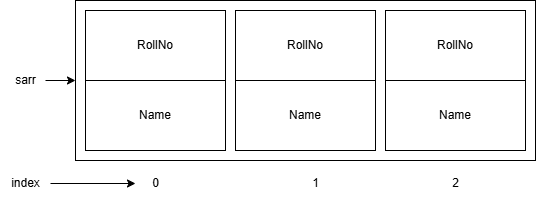

## Object-Oriented Programming using C++
### C++ Notes Day-5 Date: 13-12-2024
### Polymorphism in C++
- Default Argument in C++
- Example:
```C++
 #include<iostream>
 using namespace std;
 void sum( int num1, int num2 ){
 int result = num1 + num2;
 cout << "Result : " << result << endl;
 }
 void sum( int num1, int num2, int num3 ){
 int result = num1 + num2 + num3;
 cout << "Result : " << result << endl;
 }
 void sum( int num1, int num2, int num3, int num4 ){
 int result = num1 + num2 + num3 + num4;
 cout << "Result : " << result << endl;
 }
 void sum( int num1, int num2, int num3, int num4, int num5 ){
 int result = num1 + num2 + num3 + num4 + num5;
 cout << "Result : " << result << endl;
 }
 int main( void ){
 sum( 10, 20 );
 sum( 10, 20, 30 );
 sum( 10, 20, 30, 40 );
 sum( 10, 20, 30, 40, 50);
 return 0;
 }
```
- In C++, we can assign default value to the parameter of function. It is called as default argument.
- Using default argument, we can reduce developers effort.
- Default value can be:
	- constant
	- variable
	- macro
- Example-1:
```C++
void sum( int num1, int num2, int num3 = 0, int num4 = 0, int num5 = 0){
 int result = num1 + num2 + num3 + num4 + num5;
 cout << "Result : " << result << endl;
}
int main( void ){
 sum( 10, 20 );
 sum( 10, 20, 30 );
 sum( 10, 20, 30, 40 );
 sum( 10, 20, 30, 40, 50);
 return 0;
}
```
- Example-2:
```C++
int defaultArgument = 0;
void sum( int num1, int num2, int num3 = defaultArgument, int num4 =
defaultArgument, int num5 = defaultArgument ){
 int result = num1 + num2 + num3 + num4 + num5;
 cout << "Result : " << result << endl;
}
int main( void ){
 sum( 10, 20 );
 sum( 10, 20, 30 );
 sum( 10, 20, 30, 40 );
 sum( 10, 20, 30, 40, 50);
 return 0;
}
```
- Example-3:
```C++
 #define DEFAULT_VALUE 0
 void sum( int num1, int num2, int num3 = DEFAULT_VALUE, int num4 =
DEFAULT_VALUE, int num5 = DEFAULT_VALUE ){
 int result = num1 + num2 + num3 + num4 + num5;
 cout << "Result : " << result << endl;
 }
 int main( void ){
 sum( 10, 20 );
 sum( 10, 20, 30 );
 sum( 10, 20, 30, 40 );
 sum( 10, 20, 30, 40, 50);
 return 0;
```
- Default arguments are always given from right to left direction.
- We can assign, default argument to the parameters of member function as well as global function.
- When we separate , function declaration and definition then default argument must appear in declaration part:
```C++
 #include<iostream>
 using namespace std;
 #define DEFAULT_VALUE 0
 void sum( int num1, int num2, int num3 = DEFAULT_VALUE, int num4 = DEFAULT_VALUE, int num5 = DEFAULT_VALUE );
 int main(){
 sum( 10, 20 );
 sum( 10, 20, 30 );
 sum( 10, 20, 30, 40 );
 sum( 10, 20, 30, 40, 50);
 return 0;
 }
 void sum( int num1, int num2, int num3, int num4, int num5 ){
 int result = num1 + num2 + num3 + num4 + num5;
 cout << "Result : " << result << endl;
 }
```
#### 'extern' keyword in C++
- Using extern "C", we can invoke, C language function into C++ source code.
- If we declared any function using exten "C" then compiler do not generate mangled name for it.
- Consider the following MyFunctions.h Header file:
```C++
#ifndef MYFUNCTIONS_H_
#define MYFUNCTIONS_H_
extern "C"
{
int Method1();
int Method2();
int Method3();
int Method4();
}
#endif /* MYFUNCTIONS_H_ */
```
- Consider the MyFunctions.c file:
```C
int Method1()
{
	return 100;
}
int Method2()
{
	return 200;
}
int Method3()
{
	return 300;
}
int Method4()
{
	return 400;
}
```
- Consider the Demo.cpp file:
```C++
#include <iostream>
#include "../MyHeaderFiles/MyFunctions.h"
using namespace std;
int main()
{
	cout<<"Value return by Method1:	"<<Method1()<<endl;
	cout<<"Value return by Method2:	"<<Method2()<<endl;
	cout<<"Value return by Method3:	"<<Method3()<<endl;
	cout<<"Value return by Method4:	"<<Method4()<<endl;
	return 0;
}
```
#### 'this' Pointer
- As we know to process/manupulate state of the object we should call and define member function.
- If we call member function on object then compiler implicitly pass, address of current/ calling object as a argument to the member function. To catch/accpet address, compiler implicitly declare/create one paramater inside member function. Such parameter is called as this pointer.
- this is a keyword in C++.
- Parameter do not get space inside object. Since this pointer is a function parameter, it doesnt get space inside object.
- this pointer get space once per function call on stack section / segment.
- this pointer is a constant pointer. General type of this pointer is:
```C++
	ClassName *const this;
```
- To access members of the class, use of this keyword is optional. If we do not use this then compiler implicitly use this keyword.
- Using this pointer, data member and member function can communicate with each other.
- Hence this pointer is considered as a link / connection between them.
- Following functions do not get this pointer:
	- Global function
	- Static member function
	- Friend function
- this pointer is considered as first parameter of the member function.
- Example:
```C++
class Test{
private:
 int Num1;
 int Num2;
public:
 void SetData( /* Test *const this, */ int n1, int n1 ){
 cout << "Enter Num1 : ";
 cin >> this->Num1;
 cout << "Enter Num2 : ";
 cin >> this->Num2;
 }
};
int main( void ){
 Test t1;
 t1.SetData( 10, 20 ); //t1.SetData( &t1, 10, 20 );
 return 0;
}
```
- Definition:
	- this pointer is implicit pointer, which is available in every non static member function of the class and which is used to store address of current / calling object.
	- If name of data member and local variable / function parameter is same then preference will be given to local variable. In this case we should use this pointer before data members.
- Example:
```C++
class Test{
private:
 int Num1;
 int Num2;
public:
 void SetData( /* Test *const this, */ int Num1, int Num2 ){
 this->Num1=Num1;
 this->Num2=Num2;
 }
};
int main( void ){
 Test t1;
 t1.SetData( 10, 20 ); //t1.SetData( &t1, 10, 20 );
 return 0;
}
```
#### Getter and Setter methods in C++
- A member function of class, which is used to read state of the object is called as inspector / selector / getter function.
- A member function of class, which is used to modify state of the object is called as mutator / modifier / setter function.
- Example:
```C++
#include <iostream>
using namespace std;
class Test
{
private:
	int Num1;
	int Num2;
public:
	int getNum1() const {
		return Num1;
	}

	void setNum1(int num1) {
		Num1 = num1;
	}

	int getNum2() const {
		return Num2;
	}

	void setNum2(int num2) {
		Num2 = num2;
	}
};
int main()
{
	Test t1;
	//t1.Num1=100;	//NOT OK, Num1 is not visible
	//t1.Num2=100;	//NOT OK, Num2 is not visible

	t1.setNum1(10);	//OK
	t1.setNum2(20);	//OK

	cout<<"value of Num1:	"<<t1.getNum1();
	cout<<"value of Num2:	"<<t1.getNum2();
}
```
#### Constructor and its type in C++
- Member function of a class which is used to initialize the object is called as constructor.
- Note: Constructor do not create object rather it initializes object.
- Due to below reasons constructor is considered as special function of the class:
	- Its name is always same as class name.
	- It does not have any return type
	- It is designed to call implicitly
	- It gets called once per instance.
- We can not call constructor on object, pointer or reference explicitly.
- Example 1:
```C++
Test t1;
t1.Test( ); //Not OK
```
- Example 2:
```C++
Test t1;
Test *ptr = &t1; //ptr is pointer
ptr->Test( ); //Not OK
```
- Example 3:
```C++
Test t1;
Test &t2 = t1; //t2 is reference
t2.Test( ); //Not OK
```
- We can use any access specifier on constrctor:
- If constructor is public then we can create object inside member function of the class as non member function of the class.
- If constructor is private then we can create object inside member function of the class only.
- We can not declare constructor static, constant, volatile or virtual but we can declare constructor inline.
- Types of constructor:
	- Parameterless constructor
	- Parameterized constructor
	- Default constructor.
- Parameterless constructor:
	- It is also called as zero argument constructor or user defined default constructor.
	- Constructor of the class which do not take any parameter is called as parameterless constructor.
- Example:
	```C++
	Test( void ){
	this->Num1 = 0;
	this->Num2 = 0;
	}
	```
	- If we create object without passing argument, then compile invoke parameterless constrctor.
- Example:
	```C++
	Test t1; //Here on t1 parameterless constructor will call.
	```
- Parameterized constructor
	- Constructor of the class which is having parameter(s) is called as parameterized constructor.
- Example:
	```C++
	Test( int value ){ //Single parameter constructor
	this->Num1 = value;
	this->Num2 = value;
	}
	Test( int Num1, int Num2 ){ // 2 parameter constructor
	this->Num1 = Num1;
	this->Num2 = Num2;
	}
	```
	- If we create object by passing arguments then parameterized constructor gets called.
	- Example:
	```C++
	Test t1( 10, 20 );
	Test t2( 30 );
	```
- We can overload constructor. Consider below code:
```C++
class Test{
private:
 int Num1;
 int Num2;
public:
 Test( ){ //Parameterless constructor
 this->Num1 = 0;
 this->Num2 = 0;
 }
 Test( int Num1, int Num2 ){ //Parameterized constructor
 this->Num2 = Num1;
 this->Num2 = Num2;
 }
};
```
- Constructor calling sequence depends on order of object declaration:
- Example:
```C++
Test t1(10,20), t2;
//First, parameterized constructor on t1 will call
//Then parameterless constructor on t2 will call
```
- Default constructor
	- If we do not define constructor inside class then compiler generate constructor for the class. Such constructor is called as default constructor.
	- Compiler never generate parameterized constructor. In other words, compiler generated constructor is zero argument / parameterless constructor.
	- Example:
	```C++
	class Test{
	};
	int main( void ){
	Test t1; //On t1 Default constructor will call
	Test t2( 10, 20 ); //Compiler error
	return 0;
	}
	```
#### Aggregate Type and Aggregate initialization
- In C, below types are aggregate types whose object can be initialize using initializer list.
	- Array
	- Structure
	- Union
- Example:
```C++
 int arr[ 2 ] = { 100,200};
 struct Student s1 = { 101, "Malkeet", 446.89f };
```
- Aggregate class class following properties:
	- It does not contain private or protected non static data member.
	- It does not contain any user defined constructor.
	- It does not have base class
	- It does not contain virtual function
- Aggregate initialization:
- Example-1:
```C++
class Test{
public:
 int Num1;
 int Num2;
public:
 void printRecord( void ){
 cout << "Num1 Number : " << this->Num1 << endl;
 cout << "Num2 Number : " << this->Num2 << endl;
 }
};
int main( void ){
 Test t1{ 10, 20 }; //Aggregate initialization
 return 0;
}
```
- Example-2:
```C++
struct Employee
{
	int EmpId;
	string Name;
	void PrintRecord()
	{
		cout<<"EmpId:	"<<this->EmpId<<" Name:	"<<this->Name<<endl;
	}
};
int main()
{
	//Aggregate Type (Array, Structure, Union), Aggregate Initialization, Initializer List
	int Num1=90;
	int Num2=100;
	int Arr[10]={10,20,30,40};		//Valid, OK :Aggregate Initialization
	Employee emp={101,"Malkeet"};
	emp.PrintRecord();		//emp.PrintRecord(&emp);
	return 0;
}
```
- More example of Constructors of the class:
```C++
class Test{
private:
 int Num1;
 int Num2;
public:
 Test( void ){
 this->Num1 = 0;
 this->Num2 = 0;
 }
 Test( int value ){
 this->Num1 = value;
 this->Num2 = value;
 }
 Test( int Num1, int Num2 ){
 this->Num1 = Num1;
 this->Num2 = Num2;
 }
 void printRecord( void ){
 cout << "Num1 Number : " << this->Num1 << endl;
 cout << "Num2 Number : " << this->Num2 << endl;
 }
};
```
- Test t1;
	- Here on t1 object, parameterless constructor will call.
- Test t2( 10 );
	- Here on t2 object, single parameter constructor will call.
- Test t3( 10, 20 );
	- Here on t3 object, 2 parameter constructor will call.
- Test t4( );
	- It is declaration of t4 function which do not take any parameter and return object or Test type.
	- Constructor will not call here.
- Test t5 = 30;
	- It is same as Test t5( 30 ).
	- Hence on t5, single parameter constructor will call.
- Test( 40, 50 );
	- It is anonymous object.
	- On object, 2 parameter constructor will call.
- Test t6 = 60, 70;
	- Compiler error.
#### Array of objects
- In C++ we can create array of objects aparts from creating the objects of the class one by one.
- We can process the objects as we process the elements of an array.
- Example:
```C++
Student sarr[3];	//Here, sarr is an array of the obects of class Student
```

- Example:
```C++
#include <iostream>
#include <string.h>
using namespace std;
class Student
{
private:			//Data Hiding
	int RollNo;		//Data Member
	string Name;

public:
	Student()
	{
		this->Name="No Name";
		this->RollNo=1234;
	}
	Student(int RollNo, string Name)
	{
		this->Name=Name;
		this->RollNo=RollNo;
	}
	void AddRecord(/*Student *const this*/)
	{
		cout<<"Enter Roll No:	"<<endl;
		cin>>this->RollNo;
		cout<<"Enter Name:	"<<endl;
		cin>>this->Name;
	}
	void PrintRecord(/*Student *const this*/)
	{
		cout<<"Roll No:	"<<this->RollNo<<" Name:	"<<this->Name<<endl;
	}

	string getName(/*Student *const this*/){
		return this->Name;
	}

	void setName(/*Student *const this*/string Name) {
		this->Name = Name;
	}

	int getRollNo(/*Student *const this*/) {
		return this->RollNo;
	}

	void setRollNo(/*Student *const this*/int RollNo) {
		this->RollNo = RollNo;
	}
};
int main()
{
Student sarr[3];	//sarr is array of the objects of Student class

//Adding data in three objects
for(Student s:sarr)
{
	s.AddRecord();
}
//Print data of three objects
for(Student s:sarr)
{
	s.PrintRecord();
}
}
```
#### To be discussed tomorrow (14-12-2024)
- Constant variable, data member, member function and object
- mutable data member.
- Reference
- Call by value vs call by address vs call by reference
- Difference between pointer and reference
- Exception handling in C++