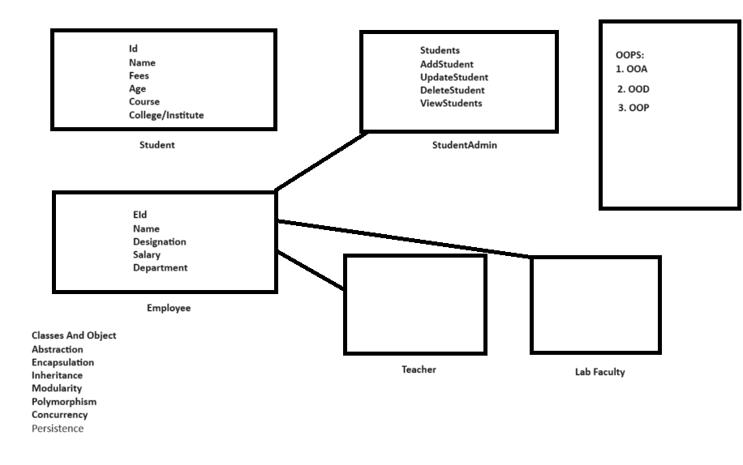
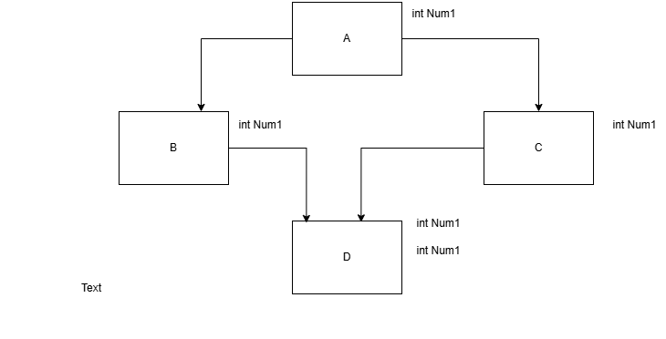

## Object-Oriented Programming using C++
### C++ Notes Day-6 Date: 14-12-2024
### Constant (const) keyword in C++
#### Constant variable
- const and volatile are type qualifiers in C/C++.
- Once a variable initialized, if we dont want to modify state/value of the variable then we should use const qualifier.
- In C++, we can not modify value of the variable using pointer. Hence initialization of constant variable is mandatory.
- Example:
```C++
const int num1; //Not OK
const int num2 = 10; //OK
```
#### Constant data member
- Once a class data member initialized, if we dont want to modify value of the data member inside any member function of
the class including constructor body then we should declare data member constant.
- We can initialize non constant data member using constructor member initializer list or constructor body but we must initialize constant data member using constructor member initializer list.
- Example: Non-Constant data member
```C++
 #include<iostream>
 using namespace std;
 class Test{
 private:
 int Num1;
 public:
 Test( void ){
 this->Num1 = 0;
 this->Num1 = this->Num1 + 10; //OK
 }
 void showRecord( void ){
 this->Num1 = this->Num1 + 2; //OK
 cout << "Num1 : " << this->Num1 << endl;
 }
 void printRecord( void ){
 this->Num1 = this->Num1 + 3; //OK
 cout << "Num1 : " << this->Num1 << endl;
 }
 };
 int main( void ){
 Test t;
 t.showRecord( ); //12
 t.printRecord( ); //15
 t.printRecord( ); //18
 t.showRecord( ); //20
 return 0;
 }
```
- Example: constant data member
```C++
 #include<iostream>
 using namespace std;
 class Test{
 private:
 const int Num1;
 public:
 Test( void ) : Num1( 10 ){
 //this->Num1 = this->Num1 + 10; //Not OK
 }
 void showRecord( void ){
 //this->Num1 = this->Num1 + 2; //Not OK
 cout << "Num1 : " << this->Num1 << endl;
 }
 void printRecord( void ){
 //this->Num1 = this->Num1 + 3; //Not OK
 cout << "Num1 : " << this->Num1 << endl;
 }
 };
 int main( void ){
 Test t;
 t.showRecord( ); //10
 t.printRecord( ); //10
 t.printRecord( ); //10
 t.showRecord( ); //10
 return 0;
 }
```
#### Constant Member Function
- Example-1:
```C++
ClassName *const this;
```
- In above statement, this pointer is constant pointer which can store address of any non constant object.
- It means that this pointer can contain address of only one object but using this pointer we can modify state of the object.
- Example-2:
```C++
const ClassName *const this;
```
- In above statement, this pointer is constant pointer which can store address of any onstantobject.
- It means that this pointer can contain address of only one object and using this pointer we can not modify state of the object.
- If we want to modify state of the non constant object inside member function then type of this pointer should be "ClassName *const this" but If we dont want to modify state of the non constant object inside member function then type of this pointer should be "const ClassName *const this".
- If we dont want to modify state of the only current/calling object inside member function then we should declare member function constant.
- Example:
```C++
 #include<iostream>
 using namespace std;
 class Test{
 private:
 int Num1;
 public:
 //Test *const this
 Test( void ) : Num1( 10 ){
 this->Num1 = this->Num1 + 10; //OK
 }
 //Test *const this
 void showRecord( void ){
 this->Num1 = this->Num1 + 2; //OK
 cout << "Num1 : " << this->Num1 << endl;
 }
 //const Test *const this
 void printRecord( void )const{
 //this->Num1 = this->Num1 + 3; //Not OK
 cout << "Num1 : " << this->Num1 << endl;
 }
 };
 int main( void ){
 Test t;
 t.showRecord( ); //12
 t.printRecord( ); //12
 t.printRecord( ); //12
 t.showRecord( ); //14
 return 0;
 }
```
- Note: Only state of current object will not be changed inside constant member function. Other object can be modifed inside constant member function.
- Example:
```C++
 #include<iostream>
 using namespace std;
 class Test{
 private:
 int Num1;
 public:
 //Test *const this
 Test( void ) : Num1( 10 ){
 this->Num1 = this->Num1 + 10; //OK
 }
 //Test *const this
 void showRecord( void ){
 this->Num1 = this->Num1 + 2; //OK
 cout << "Num1 : " << this->Num1 << endl;
 }
 //const Test *const this
 void printRecord( void )const{
 Test t;
 t.Num1 = 20; //OK
 t.showRecord( ); //It will print 22
 }
 };
 int main( void ){
 Test t;
 t.printRecord( );
 return 0;
 }
```
- On non-constant object, we can call constant member function as well as non constant member function.
- Below functions are not allowed to declare as constant:
    - Global function
    - Static Member Function
    - Constructor
    - Destructor
- Since main function is global function, we can't make it constant.
- Why we can not declare global function constant?
    - According to concept, if we dont want to modify state of the current object inside member function then we should declare member function constant.
    - In other words, constant member function is designed to call on object.
    - Since global function is not designed to call on object, we can not make it constant.
- Use of 'mutable' keyword in C++
    - Exceptionlly, if we want to modify state of non constant data member inside constant member function then we should declare that data member mutable.
- Example:
```C++
 #include<iostream>
 using namespace std;
 class Test{
 private:
 int num1;
 int num2;
 mutable int num3;
 public:
 Test( void ) : num1( 10 ), num2( 20 ), num3( 0 ){
 }
 void printRecord( void )const{
 //this->num1 ++; //Not OK
 cout<< "Num1 : " << this->num1 << endl;
 //this->num2 ++; //Not OK
 cout<< "Num2 : " << this->num2 << endl;
 this->num3 ++; //OK
 cout<< "Num3 : " << this->num3 << endl;
 }
 };
 int main( void ){
 Test t1;
 t1.printRecord( );
 return 0;
 }
```
#### Constant Object
- If we want some objects to be constant and some objects to be non constant then we should use constant keyword.
- Example:
```C++
Test t1, t2; //non constant objects
const Test t2; //constant object
```
- On non-constant object we can call constant as well as non-constant member function.
- On constant object, we can call only constant member function.
```C++
 #include<iostream>
 using namespace std;
 class Test{
 private:
 int Num1;
 public:
 //Test *const this
 Test( ) : Num1( 0 ){
 }
 //Test *const this
 void printRecord( void ){
 cout << "printRecord" <<endl;
 }
 //const Test *const this
 void printRecord( void )const{
 cout << "const printRecord" <<endl;
 }
 };
 int main( void ){
 Test t1;
 t1.printRecord( ); //printRecord
 const Test t2;
 t2.printRecord( ); //const printRecord
 return 0;
 }
```
#### Typedef
- typedef if a keyword in C/C++.
- Using typedef we can not define new Type / new user defined data type.
- If we want to give short and meaningful name then we should use typedef.
- Using typedef we can create alias for Type / class not for object.
- Example 1:
```C++
 typedef unsigned short wchar_t;
```
- Example 2:
```C++
 typedef struct Employee{
 //TODO
 }Employee_t;
```
- Example 3:
```C++
 typedef basic_istream<char> istream;
 typedef basic_ostream<char> ostream;
```
#### Reference
- Example 1:
```C++
int num1 = 10; //Initialization
int num2 = num1; //Initialization
```
- Example 2:
```C++
int num1 = 10; //Initialization
int *num2 = &num1; //Initialization
```
- Example 3:
```C++
int num1 = 10; //Initialization
int &num2 = num1; //Initialization, Here num2 is reference variable and num1 is referent variable.
```
- Reference is an alias or another name given to the existing object.
- Using typedef we can create alias for class and using reference we can create alias for object.
- Example 1:
```C++
int main( void ){
 int num1 = 10;
 int &num2 = num1;
 ++ num1; //11
 ++ num2; //12
 cout<<"Num1 : "<< num1<<endl; //12
 cout<<"Num2 : "<< num2<<endl; //12
 return 0;
}
```
- We can create multiple references to the same memory location. Consider below code:
- Example 2:
```C++
 int main( void ){
 int num1 = 10;
 int &num2 = num1;
 int &num3 = num1;
 ++ num1; //11
 ++ num2; //12
 ++ num3; //13
 cout<<"Num1 : "<< num1<<endl; //13
 cout<<"Num2 : "<< num2<<endl; //13
 cout<<"Num3 : "<< num3<<endl; //13
 return 0;
 }
```
- Example 3:
```C++
 int main( void ){
 int num1 = 10;
 int &num2 = num1; //using num2, we can read/modify value of num1
 const int &num3 = num1; //using num3, we can read value but can not modify value of num1
 ++ num2; //OK: 11
 //++ num3; //Not OK
 cout<<"Num1 : "<< num1<<endl;
 cout<<"Num2 : "<< num2<<endl;
 cout<<"Num3 : "<< num3<<endl;
 return 0;
 }
```
- We can not chnage referent of reference variable.
- Example 4:
```C++
 int main( void ){
 int num1 = 10;
 int num2 = 20;
 int &num3 = num1;
 num3 = num2;
 ++ num3;
 cout<<"Num1 : "<< num1<<endl; //21
 cout<<"Num2 : "<< num2<<endl; //20
 cout<<"Num3 : "<< num3<<endl; //21
 return 0;
 }
```
- We can create pointer to pointer but we can not create reference to reference.
- Example 5:
```C++
 int main( void ){
 int num1 = 10;
 int &num2 = num1;
 int &num3 = num2;
 ++ num1; //11
 ++ num2; //12
 ++ num3; //13
 cout<<"Num1 : "<< num1<<endl;
 cout<<"Num2 : "<< num2<<endl;
 cout<<"Num3 : "<< num3<<endl;
 return 0;
 }
```
- Proecss of accessing value of the variable using pointer is called as dereferencing.
- NULL is macro whose value is 0 address.
```C++
int *ptr = NULL;
```
- Reference is automatically dereferenced constant pointer variable.
```C++
int main( void ){
 int num1 = 10;
 int &num2 = num1;
 //int *const num2 = &num1;
 cout << num2 <<endl;
 //cout << *num2 <<endl;
 return 0;
}
```
- How to check size of reference:
```C++
 class Test{
 private:
 char &ch;
 public:
 Test( char &ch2 ) : ch( ch2 ){
 }
 };
 int main( void ){
 char ch1 = 'A';
 Test t( ch1 );
 size_t size = sizeof( t );
 cout << "Size : " << size << endl;
 return 0;
 }
```
- What is the difference between pointer and reference
    - Initialization:
        - Pointer initialization is not mandatory but reference initialization is mandatory.
    - NULL:
        - We can initialize pointer to NULL but we can not initialize reference to NULL.
    - Pointer to pointer & reference to reference:
        - We can create pointer to pointer but we can not create reference to reference.
    - Array:
        - We can create array of pointers but we can not create array of reference.
    - Dereferencing:
        - To access the value of variable pointer need dereferencing but reference need not to do dereferencing.
- In C++, we can pass argument to the function by value, by address as well as by reference.
    - Passing argument by value
    ```C++
    void swap_number( int x, int y ){
    int temp = x;
    x = y;
    y = temp;
    }
    int main( void ){
    int a = 10;
    int b = 20;
    swap_number( a, b ); //a , b are arguments; we are passing
    passing it by value to the function
    cout << "a : " << a << endl;
    cout << "b : " << b << endl;
    return 0;
    }
    ```
    - Passing argument by address
    ```C++
    //int *const x = &a;
    //int *const y = &b;
    void swap_number( int *const x, int *const y ){
    int temp = *x;
    *x = *y;
    *y = temp;
    }
    int main( void ){
    int a = 10;
    int b = 20;
    swap_number( &a, &b ); //adress of a , b are arguments; we are
    passing passing it by address to the function
    cout << "a : " << a << endl; //20
    cout << "b : " << b << endl; //10
    return 0;
    }
    ```
    - Passing argument by reference
    ```C++
    //int &x = a; //int *const x = &a;
    //int &y = b; //int *const y = &b;
    void swap_number( int &x, int &y ){
    int temp = x; //int temp = *x;
    x = y; //*x = *y;
    y = temp; //*y = temp;
    }
    int main( void ){
    int a = 10;
    int b = 20;
    swap_number( a, b ); //Function call by reference
    cout << "a : " << a << endl; //20
    cout << "b : " << b << endl; //10
    return 0;
    }
    ```
- See below example:
```C++
#include<iostream>
using namespace std;
void print( int number ){
 cout<<"int : "<<number<<endl;
}
void print( int &number ){
 cout<<"int& : "<<number<<endl;
}
int main( void ){
 print( 10 ); //int : 10
 int value = 10;
 //print( value ); //error: call to 'print' is ambiguous
 return 0;
}
```
- We can not create array of references but we can create reference to array.
- Example:
```C++
 #include<iostream>
 using namespace std;
 int main( void ){
 //int& arr[ 3 ]; //Not OK: Array of references
 int arr1[ 3 ] = { 10, 20, 30 };
 int (&arr2)[ 3 ] = arr1; //arr2 is reference and arr1 is
referent
 for( int index = 0; index < 3; ++ index )
 cout<<arr2[ index ]<<endl;
 return 0;
 }
```
#### Exception Handling
- If we make some syntatical mistake in the code then compiler generates error.
- Example:
```C++
int main( void ){
 return 0 //Error: ; missing
}
```
- Without definition, if we try to access any member then linker generates error.
- Example 1:
```C++
int main( void ){
 extern int number; //OK: Declaration
 cout << "Number : " << number << endl; //Linker Error
 return 0;
}
```
- Example 2:
```C++
void print( ); //Declration
int main( void ){
 print( ); //Linker error
 return 0;
}
```
- Logical error is called bug. In other words, syntacticaly valid but logically invalid statment represents bug.
- Example 1:
```C++
int main( void ){
 int status = 0;
 if( status == 0 )
 cout<<"If"<<endl;
 else;
 cout<<"Else"<<endl;
}
//Output:
//If
//Else
```
- Example 2:
```C++
int main( void ){
 int status = 10;
 if( status = 0 ) //Bug
 cout<<"If"<<endl;
 else
 cout<<"Else"<<endl;
 cout<<"Status : "<<status<<endl; //0
}
//Output: Else
//Status : 0
```
- Example 3:
```C++
int main( void ){
 int count;
 for( count = 1; count <= 10; ++ count );
 cout << "Count : "<< count <<endl //11
}
```
- Runtime error is called as exception
- Exception is an object, which is used to send notification to the end user of the system, if any exceptional situation occurs in the system.
- Below are the operating system resources that we use for the application development
    - Memory
    - File
    - Thread
    - API
    - Socket
    - I/O devices
    - Processor
- Since operating system resources are limited, we should handle it carefully. In other words, we should avoid their leakage.
- If we want handle/manage OS resources carefully then we should use exception handling mechanism in the code.
- In C++, we can handle exception using 3 keywords:
    - try
    - catch
    - throw
- try block
    - try is keyword in C++.
    - try block is also called as try handler.
    - If we want to keep watch of group of statements then we should use try block / try handler.
- Example:
```C++
int num1;
accept_record( num1 );
int num2;
accept_record( num2 );
try{
 int result = num1 / num2;
 print_record( result );
}
```
- We can not define try block after catch block.
- throw
    - throw is a keyword in C++.
    - If we want to generate new exception then we should use throw keyword.
- catch
    - catch is a keyword in C++.
    - catch block is also called as catch handler.
    - To handle execption, we should use catch block/catch handler.
    - Single try block may have multiple catch blocks but it must have at least one catch block.
    - A catch block, which can handle all types of exception is called as generic catch block.
    - We must define generic catch block after all specific catch block.
    - For thrown exception, if we do not define matching catch block then C++ runtime, implicitly give call to the std::terminate() function which implicitly give call to the std::abort function.
- Creating Custom Exception Class
- Example-1:
```C++
 #include<iostream>
 #include<string>
 using namespace std;
 class ArithmeticException{
 private:
 string message;
 int lineNumber;
 string functionName;
 string fileName;
 public:
 ArithmeticException( string message, int lineNumber, string
functionName, string fileName )
 : message( message ), lineNumber( lineNumber ), functionName(
functionName ), fileName( fileName ){
 }
 void printStackTrace( ){
 cout << this->message <<" in " << this->fileName <<":"<< this-
>functionName <<" at line no. "<< this->lineNumber<<endl;
 }
 };
 int calculate( int num1, int num2 ){
 if( num2 == 0 )
 throw ArithmeticException("Divide by zero exception", __LINE__,
__FUNCTION__, __FILE__ );
 return num1 / num2;
 }
 void print_record( int &result ){
 cout << "Result : " << result << endl;
 }
 int main( void ){
 try{
 int num1=10;
 int num2=0;
 int result = calculate( num1, num2 );
 print_record( result );
 }catch( ArithmeticException &ex ){
 ex.printStackTrace();
 }
 return 0;
 }
```
- Exception Specification List:
```C++
int util::calculate( int num1, int num2 )throw( ArithmeticException )
{
 if( num2 == 0 )
 throw ArithmeticException("Divide by zero exception", __LINE__,
__FUNCTION__, __FILE__ );
 return num1 / num2;
}
```
- List of type(s) of exception that we specify after function name using throw keyword is called as exception specification list.
- Its responsibility of C++ developer to specify exception specification list.
- If type of thrown exception is not available in exception specification list then C++ runtime implicitly give call to the std::unexpected function which internally give call to the std::terminate() function.
- If we separate function declaration and definition then we should specify exception specification list in declaration as well as definition.
- Using throw keyword, we can rethrow exception from netsed catch block into outer catch block:
```C++
 #include<iostream>
 #include<string>
 using namespace std;
 int main( void ){
 try{
 try{
 string ex("exception" );
 throw ex;
 }catch( string &ex ){
 cout << "Inside nested catch block" <<endl;
 throw; //Rethrow exception ex
 }
 }catch( string &ex ){
 cout << "Inside outer catch block" <<endl;
 }catch( ... ){
 cout << "Inside outer generic catch block" <<endl;
 }
 return 0;
 }
```
- Outer catch block can handle exception thrown from inner try block. But inner catch block can not handle exception thrown from outer try block.
- OOPS
    - Object oriented programming structure / system
    - It is not a syntax rather it is a object oriented thought process / concept.
    - In object-oriented programming (OOP), there are three fundamental concepts:
        - Object-Oriented Analysis (OOA)
        - Object-Oriented Design (OOD)
        - Object-Oriented Programming (OOP).

- Object-Oriented Analysis (OOA):
    - OOA is the first phase in the OOP process. It focuses on understanding and defining the problem domain, the real-world entities involved, and their relationships.
    - The goal of OOA is to create a conceptual model of the problem domain, often represented using UML (Unified Modeling Language) diagrams, such as class diagrams and use case diagrams.
- Example:
    - Suppose you are developing software for a library management system. During OOA, you identify key entities like "Book," "Library," and "Member." You also define their attributes and relationships.
        - For example:
            - Book class: Attributes - Title, Author, ISBN, Genre; Relationships - Can be borrowed by a Member.
            - Library class: Attributes - Name, Address; Relationships - Contains Books.
            - Member class: Attributes - Name, Member ID; Relationships - Borrows Books.
- Object-Oriented Design (OOD):
    - OOD is the second phase in OOP, where you take the conceptual model created in OOA and refine it into a detailed, implementable design. In this phase, you define the classes, their methods, and the interactions between objects.
    - The goal of OOD is to create a design that is modular, maintainable, and efficient.
- Example:
    - Based on the OOA, during OOD, you design classes like "Book," "LibraryMember," and "LibraryStaff." You define the methods and attributes of each class. For the "Book" class, you might have methods like "checkOut" and "return," and attributes like "title" and "author." You also consider how these classes will interact, such as how a "LibraryStaff" object will call the "checkOut" method on a "Book" object when a  book is borrowed.
```C++
class Book {
private:
    string title;
    string author;
    string ISBN;
    string genre;
public:
    // Constructor, getters and setters and methods like displaying book details
};
// Library class: Manages books
class Library {
private:
    string name;
    string address;
    vector<Book> books; // A library can contain multiple books
public:
    // Constructor, methods to add and remove books, etc.
};
// Member class: Borrows books, issues books, return books
class Member {
private:
    string name;
    int memberID;
    vector<Book> borrowedBooks; // A member can borrow multiple
    books
public:
    // Constructor, methods to borrow and return books, etc.
};
```
- Object-Oriented Programming (OOP):
    - OOP is the final phase where you implement the design created during OOD using a programming language like Java, Python, or C++. In this phase, you write the actual code for the classes, methods, and their interactions based on the design.
- Example:
    - In OOP, you would write code to create instances of the classes like "Book," "LibraryMember," and "LibraryStaff." You would implement methods like "checkOut" and "return" with actual code that performs the desired actions.
```C++
int main() {
    // Create a library
    Library myLibrary("Central Library", "123 Main St");
    // Create books and add them to the library
    Book book1("Introduction to C++", "John Smith", "123456789", "Programming");
    Book book2("The Art of Fiction", "Jane Doe", "987654321", "Fiction");
    myLibrary.addBook(book1);
    myLibrary.addBook(book2);
    // Create members
    Member member1("Alice", 101);
    Member member2("Bob", 102);
    // Members can borrow books
    member1.borrowBook(book1);
    member2.borrowBook(book2);
    // Perform other operations like returning books, displaying
    book details, etc.
    return 0;
}
```
- Important OOPs pillers
    - There are four major pillars of the OOPs:
        - Abstraction
        - Encapsulation
        - Modularity
        - Hierarchy
    - By major, we mean that a language without any one of these element is not object oriented.
    - Apart from major pillers there are 3 minor pillers of the OOps:
        - Typing
        - Concurrency
        - Persistence
    - By minor, we mean that each of these elements is a useful, but not essential.
- Abstraction
    - It is a major pillar of oops.
    - Process of getting essential things from object is called as abstraction.
    - Main goal of abstraction is to achieve simplicity.
    - Abstraction focuses on the essential characteristics of some object, relative to the perspective of the viewer.
- Abstraction in C++:
```C++
int main( void ){
    Test t1;    //Here we are only creating the object, we not know the details of the object
    t1.GetData( );
    t1.ShowData( );
    return 0;
}
```
- Encapsulation
    - It is a major pillar of oops.
    - Definition:
        - Binding of data( data member ) and code( member function ) together is called as encapsulation.
    - Implementation of abstraction is called as encapsulation.
- Encapsulation in C++:
```C++
class Test{
private:
    int Num1;
    int Num2;
public:
    void GetData( void ){
    //Doing some stuff
    }
    void ShowData( void ){
    //Doing some stuff
    }
};
```
- Abstraction focuses on the observable behavior of an object, whereas encapsulation focuses on the implementation that gives rise to this behavior.
- Main goal of encapsulation is to hide the data.
- Process of declaraing data member private is called as data hiding.
- Data hiding is also called as data encapsulation.
- Modularity
    - It is a major pillar of oops.
        - Consider car:
        - Consider car disassembly:
    - Process of developing application with the help of small units/parts/module is called as modularity.
    - Main goal of modularity is to minimize module dependency.
    - In C++, you can achieve modularity through various mechanisms, including:
        - Functions
        - Classes and Objects
        - Namespaces
        - Header Files
- Hierarchy
    - It is a major pillar of oops.
    - Level / order / ranking of abstraction is called as hierarchy.
    - Main goal of hierarchy is to achieve reusability.
    - Benefits of core reusability:
        - To reduce development time
        - To reduce development cost
        - To reduce developers effort
    - Types of hierarchy in oops:
        - HAS-A
            - Also called as parts-of hierarchy.
            - It represents Association
        - IS-A
            - Also called as kind of hierarchy.
            - It represents generalization / inheritance
        - USE-A
            - It represents dependency
        - CREATE-A
            - It represents instantiation
- Typing
    - It is a minor pillar of oops.
    - Typing is also called as polymorphism.
    - Polymorphism definition:
        - An ability of an object to take multiple forms is called as polymorphism.
    - Main goal of typing / polymorphism is to reduce maintenance of the system.
    - Types of polymorphism:
        - Compile time polymorphism
            - Also called as static typing
            - We can achieve it using 3 ways:
                - Function overloading
                - Operator overloding
                - Template
        - Run time polymorphism
            - Also called as dynamic typing
            - We can achieve it using:
                - Function overriding
    - The opposite of polymorphism is monomorphism.
- Concurrency
    - It is a minor pillar of oops.
    - Process of executing multiple task simultaneously is called as concurrency.
    - Main goal of concurrency is utilize H/W resources efficiently.
    - With the help of thread, we can develop concurrent application in C++.
- Persistance.
    - It is a minor pillar of oops.
    - Process of maintaing state of the object on secondary storage( File / HDD ) is called as persitance.
    - For the persitance we can use Database/file.
- Association:
    - Dependency of objects upon each other
    - Consider below examples:
        - Car has a engine
            - Dependent object: Car object
            - Dependency object: Engine object
        - Car has a music system
            - Dependent object: Car object
            - Dependency object: Music system object
        - Room has a wall
            - Dependent object: Room object
            - Dependency object: Wall object
        - Room has a chair
            - Dependent object: Room object
            - Dependency object: chair object
    - If has-a relationship is exist between the objects then we should use association.
    - If object is part of / component of another object then it is called as association.
    - To implement association, we should declare object of a class as a data member inside another class.
- Example: Employee has a join Date
```C++
class Date{
private:
    int day;
    int month;
    int year;
public:
    //TODO: constructor(s)
    //TODO: getters and setters
};
class Employee{
private:
    string name;
    int empid;
    float salary;
    Date joinDate; //Association
public:
    //TODO: constructor(s)
    //TODO: getters and setters
};
int main( void ){
    Employee emp;
    //GetData( );
    //ShowData( );
    return 0;
}
```
- Composition
    - Consider below example:
        - Human has a heart
            - Dependent object: Human object
            - Dependency object: Heart object
    - In case of association, if dependency object do not exist without dependent object then it is called as composition.
```C++
class Heart{
//TODO
};
class Human{
Heart hrt;
};
```
- It represents tight coupling.
- Aggregation
    - Consider below example:
        - Department has a faculty
            - Dependent object: Department object
            - Dependency object: Faculty object
    - In case of association, if dependency object exist without dependent object then it is called as aggregation.
```C++
class Faculty{
//TODO
};
class Department{
Faculty faculty;
};
```
- It represents loose coupling.
#### Inheritance
- Consider below examples:
    - Manager is a Employee
    - Book is a Product
    - Rectangle is a Shape
    - SavingAccount is a Account
    - Car is a Vehicle
- If is a relationship is exist between the types then we should use inheritance.
- Inheritance is also called as generalization.
- Consider below code:
```C++
class Person{ //Parent class / Base class
//TODO
};
class Employee : public Person{ //Child class / Derived class
//TODO
};
// here public is mode of inheritance
```
- In C++, parent class is called as Base class and child class is called as Derived class.
- If we create object of derived class then all the non static data member declared in base class and derived class get space inside it. In other words, non static data member of the base class inherit into derived class.
- Using derived class, we can access static data member declared in base class. In other words, static data member of base class inherit into derived class.
- All the data members( static & non static of any access specifier ) of base class inherit into derived class. But only non static data members get space inside object.
- Data members of drived class, do not inherit into base class hence size of object of base class depends on non static data members declared inside base class only.
- Size of object of derived class = size of all the non static data members declared in base class and derived class.
- NOTE: private/protected/public data members( static & non static ) inherit into derived class.
- We can call, non static member function of base class on object of derived class. In other words, non static member function of base class inherit into derived class.
    - We can call, static member function of base class on derived class name. In other words, static member function of base class inherit into derived class.
- Below functions, do not inherit into derived class:
    - constructor
    - destructor
    - copy constructor
    - assignment operator function
    - friend function
- Except above five functions, all the static and non static member functions of base class inherit into derived class.
- During inheritance, member functions of base class inherit into derived class. Hence using derived class object, we can call member function of base class as well as derived class.
- During inheritance, member functions of derived class do not inherit into base class. Hence using base class object, we can call member function of base class only.
- Nested class of base class inherit into derived class.
- Final Conclusion: Except constructor, destructor, copy constructor, assignment operator function and friend function all the members of base class inherit into derived class.
- Example-1:
```C++
#include <iostream>
using namespace std;
class A  //Parent Class, Super Class, Base Class
{
public:
    int Num1;       //Base class Non-Static Variable
};
//Syntax: ChildClass:Parent Class
class B:A  //Child Class, Sub Class, Derived Class
{
public:
    int Num2;       //Derived class Non-Static Variable
    void ShowData()
    {
    cout<<"Num2:"<<this->Num2<<endl;
    cout<<"Num1:"<<this->Num1<<endl;//only base class Non-Static Variable gets memory in derived class object
    }
};
int main()
{
    B b;            //Derived Class Objec with two variable (Num1 inherited from A, Num2 defined in B)
    b.ShowData();   //Derived Class object calling derived class Function
    return 0;
}
```
- Example-2: (private/protected variable of base class also gets inherited)
```C++
#include <iostream>
using namespace std;
class A
{
private:
    int Num1;
public:
    static int Number;

    void SetNum1(int Num1)
    {
        this->Num1=Num1;
    }
    int GetNum1()
    {
        return this->Num1;
    }
};
int A::Number=300;
//Syntax: ChildClass:Parent Class
class B:public A
{
public:
    int Num2;
    void ShowData()
    {
        cout<<"Num2:	"<<this->Num2<<endl;
        cout<<"Num1:	"<<this->GetNum1()<<endl;
        cout<<"Number:	"<<Number<<endl;  //Static variable of A, get inherited but never get space inside the derived class object

    }
};
int main()
{
    B b;
    b.Num2=200;
    b.SetNum1(100);
    b.ShowData();
    return 0;
}8
```
- If we create object of Base class then only base class constructor gets called.
- If we create object of Derived class, then first base class constructor gets called and the derived class constructor gets called. Destructor calling sequence is exactly opposite of constructor calling sequence.
- From any constructor of deived class, by default, base class's parameterless constructor gets called.
- Using constructor's base initializer list, we can call, any constructor of base class from constructor of derived class.
```C++
Employee( string name, int age, int empid, float salary ) : Person(name, age )
{
cout << "Employee( string name, int age, int empid, float salary)" << endl;
this->empid = empid;
this->salary = salary;
}
```
- How to read below statement:
```C++
class Employee: public Person
```
- Class Person is inherited into class Employee.
- Class Employee is derived from class Person.
- Shadowing
- Example-1:
```C++
int num1 = 10;
int main( void ){
int num1 = 20;
cout << "Num1 : " << num1 << endl; //20
return 0;
}
```
- In above code, local variable is hiding global variable. It is also called as shadowing
- Example-2:
```C++
class Test{
private:
    int num1;
public:
    Test( void ){
    this->num1 = 10;
    }
    void print( void ){
    int num1 = 20;
    cout<<"Num1 : "<< num1 << endl; //20
    }
};
int main( void ){
    Test t;
    t.print( ); //20
    return 0;
}
```
- In above code, local variable is hiding data member. It is also called as shadowing
- Example-3:
```C++
class A{
public:
    int num1;
    public:
    A( void ){
    this->num1 = 10;
    }
};
class B : public A{
public:
    int num1;
    public:
    B( void ){
    this->num1 = 20;
    }
};
int main( void ){
    B b;
    cout << "Num1 : "<< num1 << endl; //20
    return 0;
}
```
- In above code, derived class data member is hiding base class data member. It is also called as shadowing
- According client's requirement, if implementation of base class member function is logically incomplete then we should override/redefine member function inside derived class.
- If name of member function defined in base class & derived class is same and if we call such member function on object of derived class then preference will be given to derived class member function. In this case, derived class member function hides implmentation of base class member function. It is called as shadowing.
- In General, to access any member of base class inside member function of derived class, we should use class name and :: operator.
- Applications of scope resolution operator:
    - To define member function global
    - To access members of namespace
    - To access static members
    - To access members of base class inside member function of derived class.
    - According client's requirement, if implementation of exisiting class is logically incomplete / partially complete then to make it complete we should extend that class in other words we should create its derived class. It means we should use inheritance.
    - Process of reusing members of parent class inside child class is called as inheritance.
- Mode of inheritance
    -When we use private/protected/public keyword to control visibility of members of the class inside class, it is called access specifier. Default access specifier of class is private.
    - When we use private/protected/public keyword to create derived class then it is called mode of inheritance.
- Example-1:
```C++
class Employee : public Person
```
- In above statement, mode of inheritance is public.
- Example-2:
```C++
class Employee : Person
```
- In above statement, mode of inheritance is private. In C++, default mode of inheritance is private.
- If has-a relationship is exisit between the type then either we should use association or private mode of inheritance.

- Example-1: Car has a engine
```C++
class Engine{
//TODO
};
class Car{
Engine e; //Association
};
```
- Example-2:
```C++
class Engine{
//TODO
};
class Car : private Engine{
//TODO
};
```
- If is-a relationship is exisit between the type then we should use public mode of inheritance.
- Example: Tape( CD / DVD / Cassete ) is a Product.
```C++
class Product{
//TODO
};
class Tape : public Product{
//TODO
};
```
- Types of inheritance
    - Single inheritance
    - Multiple inheritance
    - Hierarchical inheritace
    - Multilevel inheritance
- Implementation inheritance
```C++
class A{ //class
//TODO
};
class B : public A{ //class
//TODO
}
```
- During inheritance, if parent type and child type is class then such type of inheritance is called as implementation inheritance.
### Kinldy implements the followings
- Single inheritance
- Multiple inheritance
- Hierarchical inheritace
- Multilevel inheritance
- Diamond Problem
    - In case of hybrid inheritance, if we create object of indirect derived class then data members of indirect base class gets inherited multiple times. Hence it increases size of object.

- In above example the variable int num1 of class A will be inherited twice into class D, hence as a result object of D contains 2 variables:
    - num1 inherited from class B
    - num1 inherited from class C
- In case of hybrid inheritance, member functions of indirect base class gets inherited multiple times. In this case, if we try to call member function of indirect base class on object of indirect derived class then compiler generate ambiguity error.
- If we create object of indirect derived class then constructor and destructor of indirect base gets
called multiple times.
- So if we want that the duplicancy/ambiguity of variable num1 should be not there, so we have to use Virtual Base class or Virtual Inheritnace.
- Diamond Problem solution
    - virtual is a keyword in C++.
    - To avoid diamond problem, we should declare base class virtual.
```C++
virtual class A{ //Not OK
//TODO
};
```
- To declare base class virtual, we should use following syntax:
```C++
class B : virtual public A{ //Virtual inheritance
//TODO
}
class C : virtual public A{ //Virtual inheritance
//TODO
}
```
- Example:
```C++
#include <iostream>
using namespace std;
class Demo1
{
public:
    int Num1;
};
class Demo2: virtual public Demo1
{

public:
    int Num2;

};
class Demo3: virtual public Demo1
{
public:
    int Num3;
};
class Demo4: public Demo2, public Demo3   //Multiple-Inheritance
{
public:
    int Num4;
    void ShowData()
    {
        cout<<"Num1:"<<Num1<<endl;
        cout<<"Num2:"<<Num2<<endl;
        cout<<"Num3:"<<Num3<<endl;
        cout<<"Num4:"<<Num4<<endl;
    }
};
int main()
{
    Demo4 d4;
    d4.Num1=200;
    d4.ShowData();
}
```
- Object slicing
    - If we assign, Derived class object to the Base class Object then compiler copy state of Base class portion from derived class object into base class object. Compiler remove the non-static data member of derived class which is just declared in derived class only. This process is called as Object slicing.
- Example:
```C++
#include <iostream>
using namespace std;
class Demo1
{
public:
    int Num1;
    void ShowData()
    {
        cout<<"Num1:"<<this->Num1<<endl;
    }
};
class Demo2: public Demo1
{

public:
    int Num2;
    void ShowData()
    {
        cout<<"Num1:"<<this->Num1<<endl;
        cout<<"Num2:"<<this->Num2<<endl;
    }

};
int main()
{
    Demo1 d1;  //Num1
    Demo2 d2;	//Num1, Num2

    d2.Num1=100;
    d2.Num2=200;
    //d2.ShowData();

    d1=d2;  //OK, values of Num1 of d2 will be copied to value of Num1 of d1.
            // Num2 will be sliced of because no matching variable present in d1
    d1.ShowData();
}
```
- During inheritance, members of derived class do not inherit into base class. Hence we can not consider object of base class as a object of derived class.
- Since base class object can not be considered as derived class object, we can not assign base class object to the derived class object.
```C++
int main( void ){
    Demo1 d1;  //Num1
    Demo2 d2;	//Num1, Num2

    d2.Num1=100;
    d2.Num2=200;
    d2=d1; //NOT OK, Base class cant be considered as Derived class object
    d1.ShowData();
return 0;
}
```
- Upcasting
    - Process of converting pointer of Derived class into pointer of Base class is called as upcasting.
```C++
```C++
#include <iostream>
using namespace std;
class Demo1
{
public:
    int Num1;
    void ShowData()
    {
        cout<<"Num1:"<<this->Num1<<endl;
    }
};
class Demo2: public Demo1
{
public:
    int Num2;
    void ShowData()
    {
        cout<<"Num1:"<<this->Num1<<endl;
        cout<<"Num2:"<<this->Num2<<endl;
    }

};
int main()
{
    Demo2 *ptr=new Demo();   //Here Base class ptr is assigned to object of derived class, this is Upcasting
    return 0;
}
```
- In case of upcasting, explicit typecasting is optional.
- We can store address of derived class object into pointer of base class. It is also called as upcasting.
- Downcasting
    - process of converting pointer of base class into pointer of derived class is called as downcasting.
```C++
```C++
#include <iostream>
using namespace std;
class Demo1
{
public:
    int Num1;
    void ShowData()
    {
        cout<<"Num1:"<<this->Num1<<endl;
    }
};
class Demo2: public Demo1
{

public:
    int Num2;
    void ShowData()
    {
        cout<<"Num1:"<<this->Num1<<endl;
        cout<<"Num2:"<<this->Num2<<endl;
    }
};
int main()
{
    Demo1 *ptr=new Demo();    //Upcasting

    Demo2 *ptr1=(Demo2*)ptr; //Downcasting

    return 0;
}
```
- Virtual function
    - In case of upcasting, if we want to call member funtion, depending on type of object rather than type of pointer then we should declare member function in base class virtual.
    - If class contains at least one virtual function then such class is called as polymorphic class.
    - If signature of base class member function and derived class member function is same and if function in base class is virtual then derived class member function will be considered as virtual.
    - Process of redefining virtual member function of base, class inside derived class, with same signature is called as function overriding and virtual function redefined in derived class is called as overrided function.
- For function overriding:
    - Function must be exist in base class and derived class
    - Signature of functions ( including return type ) must be same.
    - Function in base class must be virtual
- Definition:
    - In case of upcasting, A member function, which gets called depending on type of object rather that type of pointer is called as virtual funtion.
    - In case of upcasting, A member function of derived class which is deisigned to call using pointer/reference of base class is called as virtual function.
    - It means that virtual functions are not designed to call on object / class rather it is designed to call on base class pointer or base class reference.
- Can we declare static member function virtual?
    - Virtual member function is designed to call on base class pointer / reference.
    - Static member function is designed to call on class name.
    - Since static member function is not designed to call on base class pointer / referece, we can not declare static member function virtual.
    - Since we can not declare static member function virtual, we can not override it inside derived class.
- What is runtime polymorphism:
    - Process of calling member function derived class on pointer / reference of base class is called as runtime polymorphism.
- Early Binding and Late Binding
    - If call to the function gets resolved at compile time then it is called as early binding. In other words,if binding between function and object gets resolved at compile time then it is called as early binding.
    - If call to the function gets resolved at runtime then it is called as late binding. In other words, if binding between function and object gets resolved at run time then it is called as late binding.
    - If we call virtual or non virtual function on object then it is considered as early binding. This call always gets resolved at compile time.
    - If we call non virtual function on pointer/reference then it is considered as early binding. This call always gets resolved at compile time.
    - If we call virtual function on pointer/reference then it is considered as late binding. This call always gets resolved at run time. Consider below code:
- Example:
```C++
#include <iostream>
#include <typeinfo>
using namespace std;
class Demo1
{
public:
    int Num1;
    Demo1()
    {
        this->Num1=10;
    }
    virtual void ShowData()
    {
        cout<<"Num1:"<<this->Num1<<endl;
    }
};
class Demo2: public Demo1
{
public:
    int Num2;
    Demo2()
    {
        this->Num2=20;
    }
    void ShowData()
    {
        cout<<"Num1:"<<this->Num1<<endl;
        cout<<"Num2:"<<this->Num2<<endl;
    }
};
int main()
{
    Demo1 d1;
    d1.ShowData();		//Early Binding

    Demo2 d2;
    d2.ShowData();		//Early Binding

    Demo2 *ptr=new Demo2();  //OK, Early Binding
    ptr->ShowData();

    //Demo2 *ptr1=new Demo1(); //NOT OK
    //ptr1->ShowData();

    Demo1 *ptrBase=new Demo2();	//Up-casting,
    ptrBase->ShowData();		//Early Binding, in case of base class function is not virtual

    //After declaring base class method as virtual
    ptrBase->ShowData();		//Late Binding: Inheritance+FunctionOverriding+Upcasting+BaseClassMethodShouldBeVirtual


    return 0;
}
int main1()
{
    Demo2 d;  //Object of Demo2 (Derived class)

    Demo1 *ptr=new Demo2();  //Up-casting

    //Demo2 *ptr1=new Demo1();   //NOT OK, Becouse your parent class object can not be treated as child class object

    Demo2 *ptrDerived=(Demo2*)ptr;	//Down-Casting

    return 0;
}
```
#### Topic to be discussed tomorrow (15-12-2024)
- Object slicing
- Pure Virtual Function / Abstract class Demo
- Demo of Menu-Driven Student Management Application in C++ using Vector:push_back()