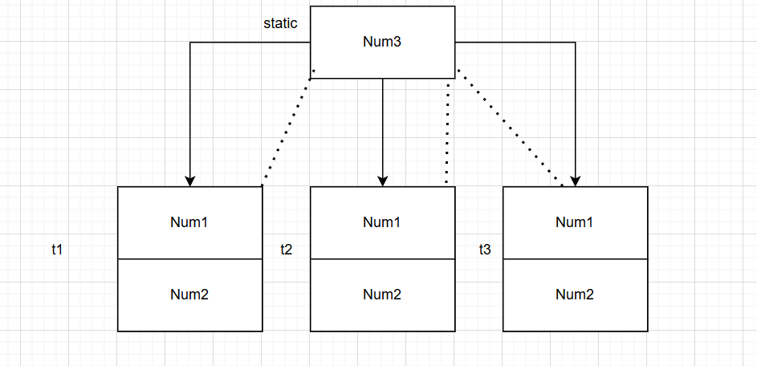

## Object-Oriented Programming using C++
### C++ Notes Day-9 Date: 17-12-2024
#### Lets Revise
- Data Security using Exception Handling
- Dynamic memory management using new and delete
- Difference between malloc and new
- Destructor
- Shallow Copy and Deep Copy
- Copy Constructor
- Friend Function- Friend Class
### Static Member and Static member function
- Static Member
- Static member function
- Anonymous Class
- Operator Overloading
    - Implementation using member function as well as non member function
    - Limitations of operator overloading
    - Relational Operator overloading
    - pre increment and post increment operator overloading
    - Insertion and extraction operator overloading
    - Assignment operator overloading
    - Index operator overloading
    - Function call operator overloading
#### Static Data Member

- If we want to share value of any data member in all the objects of same class then we should declare data member static.
- Static data member get space during program loading once per class on data segment.
- if we create object of the class then only non static data member get space inside it. Hence size of object depends on size of all the data members declared inside class.
- Data member of the class which get space inside object is called as instance variable. In other words non static member is also called as instance variable.
- Instance variable get space once per object.
- To access instance variable either we should use object or pointer/reference to that object.
- Data member of the class which do not get space inside object is called as class level variable. In other words static member is also called as class level variable.
- Class level variable get space once per class.
- To access class level variable we should class name and :: operator.
- Example 1:
```C++
class A{
 int n1;
 int n2;
 static int count;
};
int main( void ){
 A a1,a2,a3;
 return 0
}
```
- Example 2:
```C++
class B{
 int n3;
 int n4;
 static int count;
};
int main( void ){
 B b1,b2,b3;
 return 0
}
```
- Example 3:
```C++
class C{
 int n5;
 int n6;
 static int count;
};
int main( void ){
 C t1,t2,t3;
 return 0
}
```
- if we want to declare data member static then we must provide global definition for it. Otherwise linker will generate error.
```C++
 #include<iostream>
 using namespace std;
 class Test{
 public:
 int num1; //Instance variable
 int num2; //Instance variable
 static int num3; //Class level variable
 public:
 Test( void ){
 this->num1 = 0;
 this->num2 = 0;
 }
 Test( int num1, int num2 ){
 this->num1 = num1;
 this->num2 = num2;
 }
 void printRecord( void ){
 cout << "Num1 : " << this->num1 << endl;
 cout << "Num2 : " << this->num2 << endl;
 cout << "Num3 : " << Test::num3 << endl;
 }
 };
 int Test::num3 = 500; //Global definition
 int main( void ){
 Test t1;
 t1.printRecord( );
 return 0;
 }
```
- We can declare static data member constant. Consider following code:
```C++
 #include<iostream>
 using namespace std;
 class Test{
 public:
 int num1; //Instance variable
 int num2; //Instance variable
 const static int num3; //Class level variable
 public:
 Test( void ){
 this->num1 = 0;
 this->num2 = 0;
 }
 Test( int num1, int num2 ){
 this->num1 = num1;
 this->num2 = num2;
 }
 void printRecord( void ){
 cout << "Num1 : " << this->num1 << endl;
 cout << "Num2 : " << this->num2 << endl;
 cout << "Num3 : " << Test::num3 << endl;
 }
 };
 const int Test::num3 = 500; //Global definition
 int main( void ){
 Test t1;
 t1.printRecord( );
 return 0;
 }
```
#### Static Member Function
- To access non static members of the class, we should define non static member function inside class.
- Non static member functions are designed to call on object. Hence it is also called as instace method.
- Since non static member functions / instance methods are designed to call on object/instance, it gets this pointer. Since non static member function get this pointer, we can access static as well as non
static members inside non static member function.
- To access static member of the class, we should define static member function inside class.
- Static member functions are designed to call on class name. Hence it is also called as class level method.
- Since static member functions / class level methods are designed to call on class name, it doesn't get this pointer. Since static member function doesn't get this pointer, we can access only static
members inside static member function.
- Static member function do not get this pointer but we can create object inside static member function.
- Using object, we can access non static members inside static member function.
- Example 1:
```C++
#include<iostream>
 using namespace std;
 class Test{
 private:
 int num1; //Non static data member / Instance variable
 int num2; //Non static data member / Instance variable
 static int num3; //Static data member / Class level variable
 public:
 Test( void ){
 this->num1 = 0;
 this->num2 = 0;
 }
 void setNum1( int num1 ){
 this->num1 = num1;
 }
 void setNum2( int num2 ){
 this->num2 = num2;
 }
 static void setNum3( int num3 ){
 Test::num3 = num3;
 }
 void printRecord( void ){
 cout << "Num1 : " << this->num1 << endl;
 cout << "Num2 : " << this->num2 << endl;
 cout << "Num3 : " << Test::num3 << endl;
 }
 };
 int Test::num3 = 0; //Global definition
 int main( void ){
 Test t1;
 t1.setNum1( 10 );
 t1.setNum2( 20 );
 Test::setNum3( 30 );
 t1.printRecord( );
 return 0;
 }
 int main( void ){
 Test t1;
 //t1.num1 = 10; //error: 'num1' is a private member of 'Test'
 //t1.num2 = 20; //error: 'num2' is a private member of 'Test'
 //Test::num3 = 30;//error: 'num3' is a private member of 'Test'
 t1.printRecord( );
 return 0;
 }
```
- Example 2:
```C++
class Test{
 private:
 int num1;
 static int num2;
 public:
 Test( void ) : num1( 10 ){
 }
 static void print( void ){
 Test t;
 cout << "Num1 : " << t.num1 << endl;
 cout << "Num2 : " << Test::num2 << endl;
 }
};
int Test::num2 = 20; //Global definition
int main( void ){
 Test::print( );
 return 0;
}
```
- Why static member function do not get this pointer?
    - If we call non static member function on object then non static member function get this pointer.
    - Static member function is designed to call on class name.
    - Since static member function is not designed to call on object, it does not get this pointer.
- Can we declare static member function constant?
    - If we dont want to modify state on only current object inside member function then we should declare that member function constant. In other words, constant member functions are designed to call on
object.
    - Static member function is designed to call on class name.
    - Since static member function is not designed to call on object, we can not declare static member function constant.
Conclusion
    - In C++, we can declare static data member constant but we can not declare static member function constant.
    - If there is need to use this pointer inside member function then it should be non static otherwise it should be static.
- Example:
```C++
 #include<iostream>
 using namespace std;
 class Math{
 public:
 static const double PI;
 public:
 static double pow( double base, int index ){
 double result = 1;
 for( int count = 1; count <= index ; ++ count )
 result = base * result;
 return result;
 }
 };
 const double Math::PI = 3.14;
 int main( void ){
 double result = Math::pow( 2.0, 3 );
 cout << "Result : "<<result <<endl;
 return 0;
 }
```
- We can not declare below functions static:
    - constructor
    - destructor
    - constant member function
    - volatile member function
    - virtual member function
    - main function ( other global functions can be static )
- How will you write code to count number of instances created from class?
```C++
 #include<iostream>
 using namespace std;
 class InstanceCounter{
 private:
 static int count;
 public:
 InstanceCounter( ){
 InstanceCounter::count = InstanceCounter::count + 1;
 }
 static int getCount( void ){
 return InstanceCounter::count;
 }
 ~InstanceCounter( ){
 InstanceCounter::count = InstanceCounter::count - 1;
 }
 };
 int InstanceCounter::count = 0;
 int main( void ){
 InstanceCounter t1, t2, t3;
 cout << "Instance Counter : " << InstanceCounter::getCount( ) <<endl;
 return 0;
 }
```
- Anonymous class: A class defined without name is known as Anonymous class.
```C++
#include<iostream>
using namespace std;
class{ //Anonymous class
public:
 void showRecord( void ){
 cout << "void showRecord( void )" << endl;
 }
 static void displayRecord( void ){
 cout << "static void displayRecord( void )" << endl;
 }
}t1;
int main( void ){
 t1.showRecord( );
 t1.displayRecord( );
 return 0;
}
```
#### Operator Overloading in C++
- Token
    - Token is a basic unit of a program.
    - Classification of tokens:
        - Identifier
        - Keywords
        - Constant
        - Operator
        - Separator / punctuators
    - Classfication of Operators
        - Unary Operators
            - An operator which requires only one operand( e.g sizeof( a ) ) is called as unary operator.
            - Example: sizeof, typeid, ++, --, !( Logical NOT ), ~, +, -, * etc
        - Binary Operators
            - An operator which requires two operands( e.g a + b ) is called as binary operator.
            - Arithmetic operators +, -, *, /, %
            - Relational operators <, <= >, >=, ==, !=
            - Logical operators &&( Logical AND), || ( Logical OR ),
            - Bitwise operators &( Bitwise AND), | ( Bitwies OR), ^( Bitwise XOR), <<, >>
            - Assignment operators =, short hand operators( +=, -=, *= etc ): X+=Y=>X=X+Y
        - Ternary Operators
            - An operator which requires three operands is called as ternary operator.
            - Conditional operator( ? : )
- Example 1: We can use operators with variables of fundamental data types
```C++
int main( void ){
 int num1 = 10;
 int num2 = 20;
 int result = num1 + num2; //OK
 return 0;
}
```
- Example 2: In C, we cannot use operator with objects of user defined type.
```C++
struct Point{
 int xPos;
 int yPos;
};
int main( void ){
 struct Point pt1 = { 10, 20 }; //OK
 struct Point pt2 = { 30, 40 }; //OK
 struct Point pt3; //OK
 pt3.xPos = pt1.xPos + pt2.xPos; //OK
 pt3.yPos = pt1.yPos + pt2.yPos; //OK
 return 0;
}
int main1( void ){
 struct Point pt1 = { 10, 20 }; //OK
 struct Point pt2 = { 30, 40 }; //OK
 struct Point pt3; //OK
 pt3 = pt1 + pt2; //Not OK
 return 0;
}
```
- Consider code in C++ programming language:
- Example 1: In C++, we can use operator with the variables of fundamental types.
```C++
int main( void ){
 int num1 = 10;
 int num2 = 20;
 int result = num1 + num2; //OK
 return 0;
}
```
- Example 2: In C++, we cannot use operator with objects of user defined type directly.
```C++
 #include<iostream>
 using namespace std;
 class Test{
 private:
 int Num1;
 int Num2;
 public:
 Test( void ){
 this->Num1 = 0;
 this->Num2 = 0;
 }
 Test( int Num1, int Num2 ){
 this->Num1 = Num1;
 this->Num2 = Num2;
 }
 void printRecord( void ){
 cout << "Num1 Number : " << this->Num1 <<endl;
 cout << "Num2 Number : " << this->Num2 <<endl;
 }
 };
 int main( void ){
 Test t1( 10, 20 );
 Test t2( 30, 40 );
 Test t3;
 t3 = t1 + t2; //error: invalid operands to binary expression
('Test' and 'Test')
 t2.printRecord( );
 return 0;
 }
```
- If we want to use operator with the objects of user defined type(structure, class etc. ) then we should overload operator.
- To overload operator, we should define operator function.
- operator is keyword in C++ which is used to define operator function.
- We can define operator function using 2 ways:
    - Member function
    - Non member function
- By defining operator function, we are increasing capability of exsiting operators. This process of givining extension to the meaning of the operator is called as operator overloading.
- Example: Addition (+) Operator Overloading using member function
```C++
 #include<iostream>
 using namespace std;
 class Test{
 private:
 int Num1;
 int Num2;
 public:
 Test( void ){
 this->Num1 = 0;
 this->Num2 = 0;
 }
 Test( int Num1, int Num2 ){
 this->Num1 = Num1;
 this->Num2 = Num2;
 }
 //Test other = t2
 //Test *const this = &t1
 Test operator+( Test other ){
 Test result;
 result.Num1 = this->Num1 + other.Num1;
 result.Num2 = this->Num2 + other.Num2;
 return result;
 }
 void printRecord( void ){
 cout << "Num1 Number : " << this->Num1 <<endl;
 cout << "Num2 Number : " << this->Num2 <<endl;
 }
 };
 int main( void ){
 Test t1( 10, 20 );
 Test t2( 30, 40 );
 Test t3;
 t3 = t1 + t2; // t3 = t1.operator+( t2 )
 t3.printRecord( );
 return 0;
 }
```
- Example: Addition (+) Operator Overloading using non member function
```C++
 #include<iostream>
 using namespace std;
 class Test{
 private:
 int Num1;
 int Num2;
 public:
 Test( void ){
 this->Num1 = 0;
 this->Num2 = 0;
 }
 Test( int Num1, int Num2 ){
 this->Num1 = Num1;
 this->Num2 = Num2;
 }
 void printRecord( void ){
 cout << "Num1 Number : " << this->Num1 <<endl;
 cout << "Num2 Number : " << this->Num2 <<endl;
 }
 friend Test operator+( Test t1, Test t2 );
 };
 Test operator+( Test t1, Test t2 ){
 Test result;
 result.Num1 = t1.Num1 + t2.Num1;
 result.Num2 = t1.Num2 + t2.Num2;
 return result;
 }
 int main( void ){
 Test t1( 10, 20 );
 Test t2( 30, 40 );
 Test t3;
 t3 = t1 + t2; // t3 = operator+( t1, t2 )
 t3.printRecord( );
 return 0;
 }
```
- Using operator overloading we can not create user defined operators rather we can increase capability of existing operators.
- Limitations of operator overloading
    - We can not overload below operators using member function as well as non member function
        - dot( .) / meber selection operator
        - .* ( pointer to member selection operator )
        - sizeof operator
        - ::( scope resolution operator )
        - Conditional ( ? : ) / Ternary operator
        - typeid operator
        - static_cast operator
        - dyanmic_cast operator
        - const_cast operator
        - reinterpret_cast operator
    - We can not overload below operators using non member function but we can overload it using member function
        - Assignment operator( = )
        - Index / subscript operator
        - Call / Function call operator[ () ]
        - Arrow( -> ) operator
- using operator overloading, we can change meaning of the operator.
#### Arithmatic Operator Overloading
- Example: Subtraction (-) Operator Overloading using member function
```C
#include<iostream>
 using namespace std;
 class Test{
 private:
 int Num1;
 int Num2;
 public:
 Test( void ){
 this->Num1 = 0;
 this->Num2 = 0;
 }
 Test( int Num1, int Num2 ){
 this->Num1 = Num1;
 this->Num2 = Num2;
 }
 //Test other = t2
 //Test *const this = &t1
 Test operator-( Test other ){
 Test result;
 result.Num1 = this->Num1 - other.Num1;
 result.Num2 = this->Num2 - other.Num2;
 return result;
 }
 void printRecord( void ){
 cout << "Num1 Number : " << this->Num1 <<endl;
 cout << "Num2 Number : " << this->Num2 <<endl;
 }
 };
 int main( void ){
 Test t1( 10, 20 );
 Test t2( 30, 40 );
 Test t3;
 t3 = t1 - t2; // t3 = t1.operator-( t2 )
 t3.printRecord( );
 return 0;
 }
```
- Example: Subtraction (-) Operator Overloading using non member function
```C
 #include<iostream>
 using namespace std;
 class Test{
 private:
 int Num1;
 int Num2;
 public:
 Test( void ){
 this->Num1 = 0;
 this->Num2 = 0;
 }
 Test( int Num1, int Num2 ){
 this->Num1 = Num1;
 this->Num2 = Num2;
 }
 void printRecord( void ){
 cout << "Num1 Number : " << this->Num1 <<endl;
 cout << "Num2 Number : " << this->Num2 <<endl;
 }
 friend Test operator-( Test t1, Test t2 );
 };
 Test operator-( Test t1, Test t2 ){
 Test result;
 result.Num1 = t1.Num1 - t2.Num1;
 result.Num2 = t1.Num2 - t2.Num2;
 return result;
 }
 int main( void ){
 Test t1( 10, 20 );
 Test t2( 30, 40 );
 Test t3;
 t3 = t1 - t2; // t3 = operator-( t1, t2 )
 t3.printRecord( );
 return 0;
 }
```
- Calling Syntax: Arithmetic operator overloading
- Example 1:
```C++
Test t1( 10, 20 );
Test t2( 40, 30 );
Test t3;
t3 = t1 + t2; //t3 = t1.operator+( t2 ); //Using member function
```
- Example 2:
```C++
Test t1( 10, 20 );
Test t2( 40, 30 );
Test t3;
t3 = t1 + t2; //t3 = operator+( t1, t2 ); //Using non member function
```
- Example 3:
```C++
Test t1( 10, 20 );
Test t2( 40, 30 );
Test t3;
t3 = t1 - t2; //t3 = t1.operator-( t2 ); //Using member function
```
- Example 4:
```C++
Test t1( 10, 20 );
Test t2( 40, 30 );
Test t3;
t3 = t1 - t2; //t3 = operator-( t1, t2 ); //Using non member function
```
- Example 5:
```C++
Test t1( 10, 20 );
Test t2( 40, 30 );
Test t3;
t3 = t1 * t2; //t3 = t1.operator*( t2 ); //Using member function
```
- Example 6:
```C++
Test t1( 10, 20 );
Test t2( 40, 30 );
Test t3;
t3 = t1 * t2; //t3 = operator*( t1, t2 ); //Using non member function
```
- Example 7:
```C++
Test t1( 10, 20 );
Test t2( 40, 30 );
Test t3;
t3 = t1 / t2; //t3 = t1.operator/( t2 ); //Using member function
```
- Example 8:
```C++
Test t1( 10, 20 );
Test t2( 40, 30 );
Test t3;
t3 = t1 / t2; //t3 = operator/( t1, t2 ); //Using non member function
```
- Example and Calling Syntax: Relational Operator overloading
- Example-1 (Overloading of == operator)
```C++
#include <iostream>
using namespace std;
class Test
{
public:
	int Num1;
	int Num2;
	Test()
	{

	}
	Test(int Num1, int Num2)
	{
		this->Num1=Num1;
		this->Num2=Num2;
	}
	void ShowData()
	{
		cout<<"Num1:	"<<this->Num1<<" Num2:	"<<this->Num2<<endl;
	}
};

bool operator==(Test obj1, Test obj2)
	{
		if(obj1.Num1==obj2.Num1&&obj1.Num2==obj2.Num2)
		{
			return true;
		}
		return false;
	}
int main()
{
	Test t1(10,20);
	Test t2(10,20);

	bool status=t1==t2;	//OK	

	cout<<status;
	return 0;
}
```
- Example 1:
```C++
Test t1( 10, 20 );
Test t2( 10, 20 );
bool status = t1 == t2; //status = t1.operator==( t2 ); //Using member function
```
- Example 2:
```C++
Test t1( 10, 20 );
Test t2( 10, 20 );
bool status = t1 == t2; //status = operator==( t1, t2 ); //Using non member function
```
- Example 3:
```C++
Test t1( 10, 20 );
Test t2( 10, 20 );
bool status = t1 != t2; //status = t1.operator!=( t2 ); //Using member function
```
- Example 4:
```C++
Test t1( 10, 20 );
Test t2( 10, 20 );
bool status = t1 != t2; //status = operator!=( t1, t2 ); //Using non member function
```
- Example 5:
```C++
Test t1( 10, 20 );
Test t2( 10, 20 );
bool status = t1 < t2; //status = t1.operator<( t2 ); //Using member function
```
- Example 6:
```C++
Test t1( 10, 20 );
Test t2( 10, 20 );
bool status = t1 < t2; //status = operator<( t1, t2 ); //Using non member function
```
- Example 7:
```C++
Test t1( 10, 20 );
Test t2( 10, 20 );
bool status = t1 > t2; //status = t1.operator>( t2 ); //Using member function
```
- Example 8:
```C++
Test t1( 10, 20 );
Test t2( 10, 20 );
bool status = t1 > t2; //status = operator>( t1, t2 ); //Using non member function
```
- Calling Syntax: Unary operator overloading
- Example 1:
```C++
Test t1( 10, 20 );
Test t2 = ++ t1; //t2 = t1.operator++( ); //Using member function
```
- Example 2:
```C++
Test t1( 10, 20 );
Test t2 = ++ t1; //t2 = operator++( t1 ); //Using non member function
```
- Example 3:
```C++
Test t1( 10, 20 );
Test t2 = t1 ++; //t2 = t1.operator++( 0 ); //Using member function
```
- Example 4:
```C++
Test t1( 10, 20 );
Test t2 = t1 ++; //t2 = operator++( t1, 0 ); //Using non member function
```
- Extraction operator overloading
	- cin: character input, which represents keyboard.
	- extraction operator( >> ) is designed to use with cin.
	- If we want to accept state the object from keybaord using cin then we should overload extraction operator.
- Consider call using member function:
```C++
Test t1;
cin >> t1; //cin.operator>>( t1 );
```
- Here to accept record for t1, we should define operator>>() function inside istream class, which is not recommended. So we will not overload it using member function.
- Consider call using non member function:
```C++
Test t1;
cin >> t1; //operator>>( cin, t1 );
```
- Here to accept record for t1, we should define operator>>() function global, which is possible for us. Hence we will overload operator >> using non member function.
- Consider another example:
```C++
Test t1;
Test t2;
cin >> t1 >> t2; //operator>>( operator>>( cin, t1 ), t2 );
```
- General Syntax:
```C++
class ClassName{
friend istream& operator>>( istream &cin, ClassName &other );
};
istream& operator>>( istream &cin, ClassName &other ){
//TODO: accept record using other reference variable
return cin;
}
```
- Insertion operator overloading
	- cout: character output, which represents monitor.
	- insertion operator( << ) is designed to use with cout.
	- If we want to print state the object on monitor using cout then we should overload insertion operator.
- Consider call using member function:
```C++
Test t1(10,20);
cout << t1; //cout.operator<<( t1 );
```
- Here to print record of t1, we should define operator<<() function inside ostream class, which is not recommended. So we will not overload it using member function.
- Consider call using non member function:
```C++
Test t1(10,20);
cout << t1; //operator<<( cout, t1 );
```
- Here to print record of t1, we should define operator<<() function global, which is possible for us. Hence we will overload operator << using non member function.
- Consider another example:
```C++
Test t1( 10, 20 );
Test t2( 30, 40 );
cout << t1 << t2; //operator<<( operator<<( cout, t1 ), t2 );
```
- General Syntax:
```C++
class ClassName{
friend ostream& operator<<( ostream &cout, ClassName &other );
};
ostream& operator<<( ostream &cout, ClassName &other ){
//TODO: print record using other reference variable
return cout;
}
```
```C++
#include <iostream>
using namespace std;
class Test
{
private:
	int Num1;
	int Num2;
public:

	Test()
	{

	}
	Test(int Num1, int Num2)
	{
		this->Num1=Num1;
		this->Num2=Num2;
	}

	void ShowData()
	{
		cout<<"Num1:	"<<this->Num1<<" Num2:	"<<this->Num2<<endl;
	}


	friend ostream& operator<<(ostream& cout, Test &ref);
};

ostream& operator<<(ostream& cout, Test &ref)
{
	cout<<"Num1:	"<<ref.Num1<<endl;
	cout<<"Num2:	"<<ref.Num2<<endl;

	return cout;
}

int main()
{
	Test t1(10,20);
	cout<<t1;
	return 0;
}
```
- Kinldy do it by yourself: Index operator overloading, Function call operator overloading
#### To be discussed tomorrow (18-12-2024)
- Virtual function
- Function overriding
- Early Binding and Late Binding
- Virtual Function Table and Virtual Function Pointer
- Virtual Constructor
- Virtual Destructor
- Function overloading versus Function Overriding
- Runtime Type Information(RTTI)
- Advanced Type Casting Operators