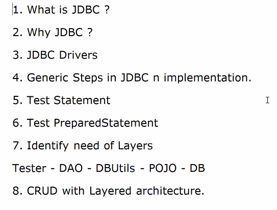

1. What is JDBC ?

- > It's an API ( Java.sql; | javax.sql ) for connecting to Database and perform CRUD operations.

2. Why JDBC ? 

- > It allows developers to build java applications which are 

    - platform independent + DB independent (partial)

    2.1. Whats makes JDBC DB indepedent ?

    1. JDBC driver - its 2 way convertor

    java to db
    <!-- wise - vera -->
    db to java

    2. JDBC API - mainly consists of interfaces ( specification - what is to be done )

        eg - Connection, Statement, PreparedStatement, ResultSet.....

        Implementations ( HOW )of JDBC API - is left to Vendors ( DB vendor or 3rd party vendors ) 

----

- can we use interface reference can refer to implementation class ? = upcasting yes

---

    eg - Connectioni/f (interface) <----
    MySQlConnectionImpl, OracleConnImpl,
    PostgressConnImpl, 

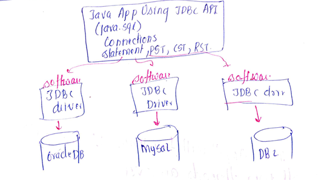

why interfaces so popular / required ?

-   abstract methods : implementation is done in implementation class 
therefore is called loosed coupling

- multiple interfaces

3. JDBC Drivers - Connector / translator

different types of JDBC drivers

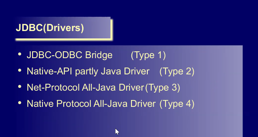

study about it's types

4. Generic development steps in JDBC and implementation

    4.0 In earlier version, it was mandatory to load JDBC drivers first.

    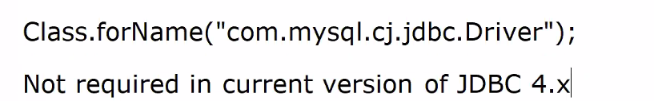

    now it is not required of JDBC 

    4.1 Connect to DB

    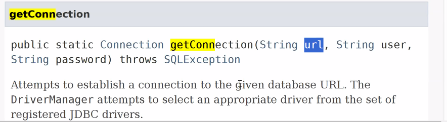

    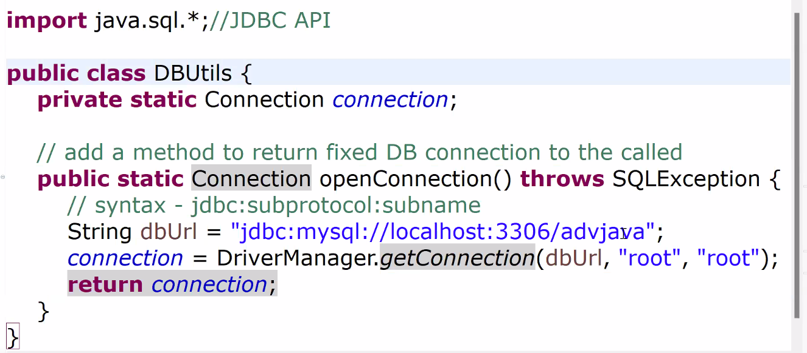

    root is username and password

    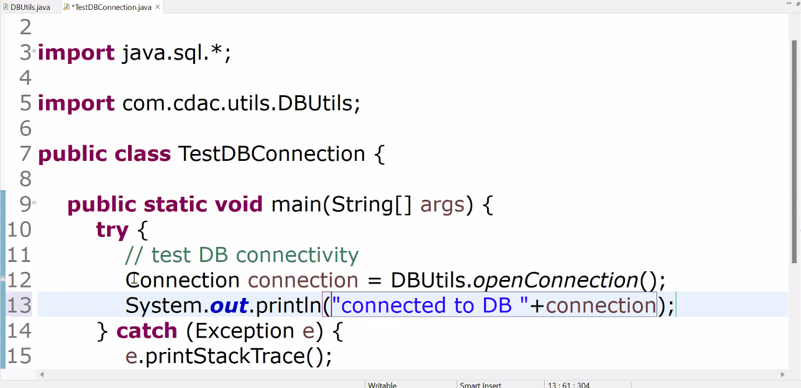

    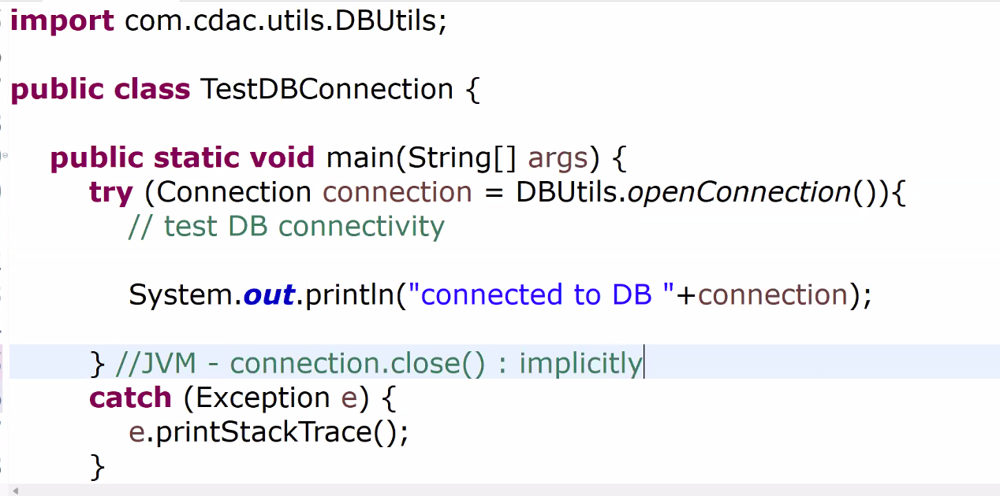

    
    implementation class

    4.2 Fetch users from DB and display the same

    (test statement)

    Dev steps 

    1. Get Connections

    2. Create Statement to hold SQL, from the Connection

    Use Connection i/f method

    public Statement createStatement() throws  SQLException
    
    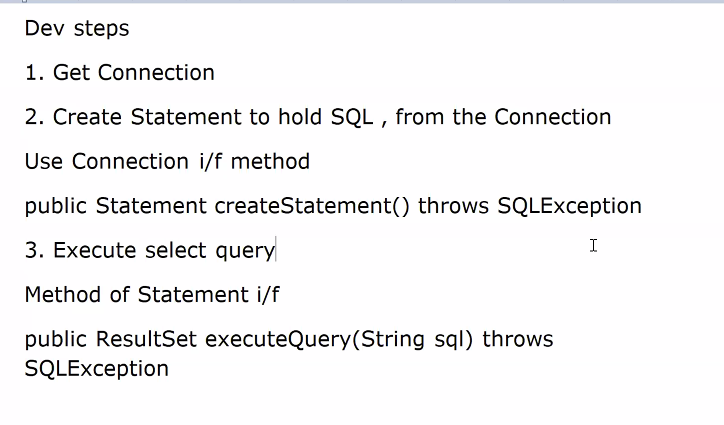

    3. Execute Query

    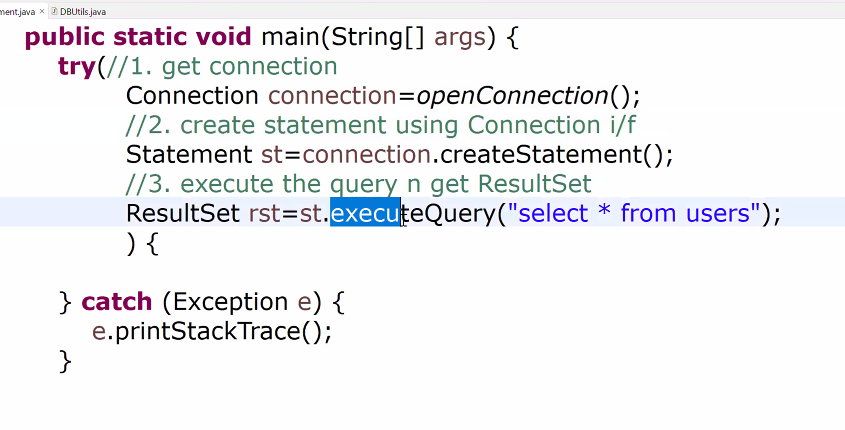

    

    4. ResultSet

    processingSet of ResultSet - before the 1st row

    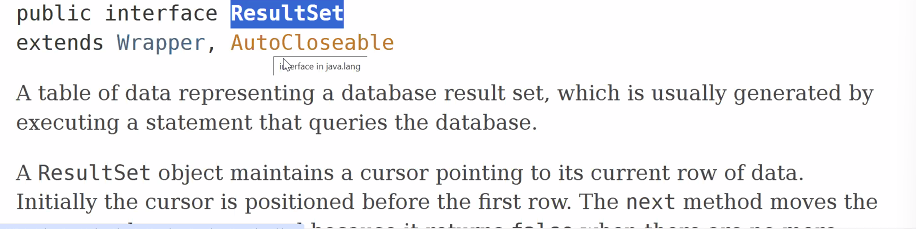

    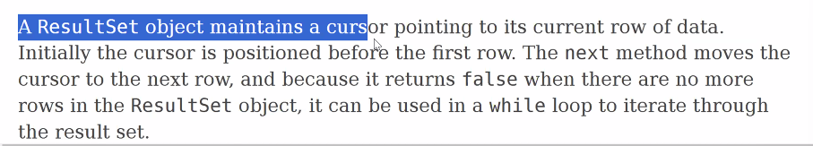

    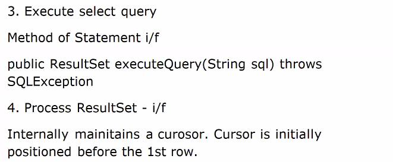

    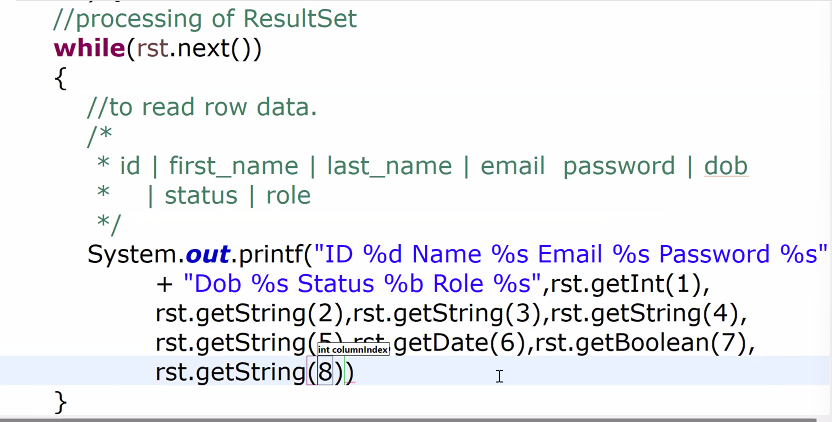

    JVM - rst, st, cn .close() =>  cleaning up of DB resources

    print each record in newline '%n' in query

    o/p
    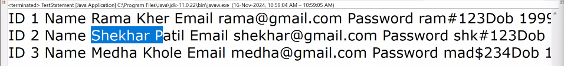

    6. test preparedStatement

    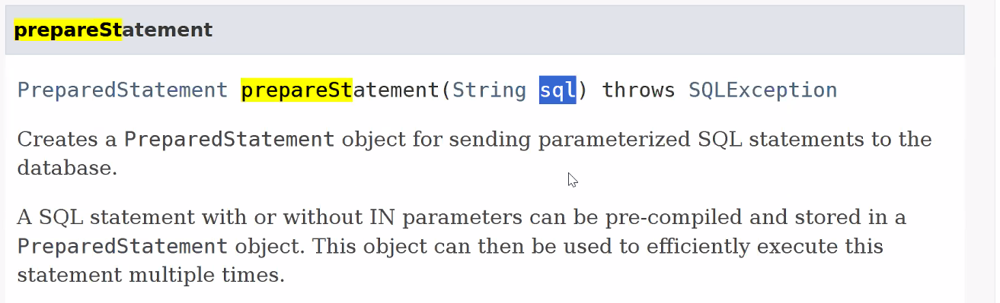

    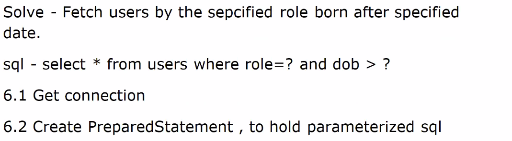

    API of Connection

    public PreparedStatement prepareStatement(String sql)
    throws SQLException

    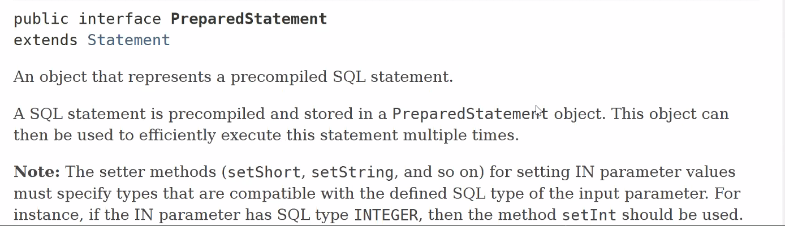

    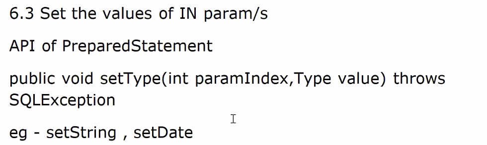

    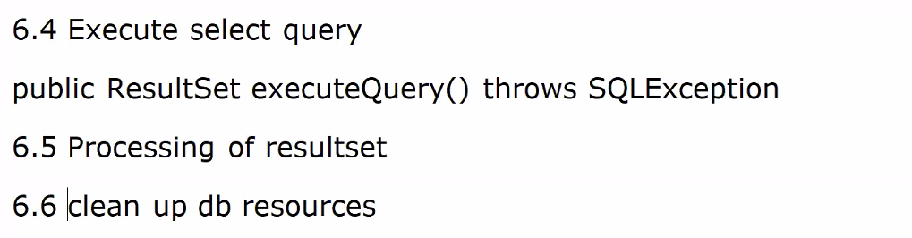

    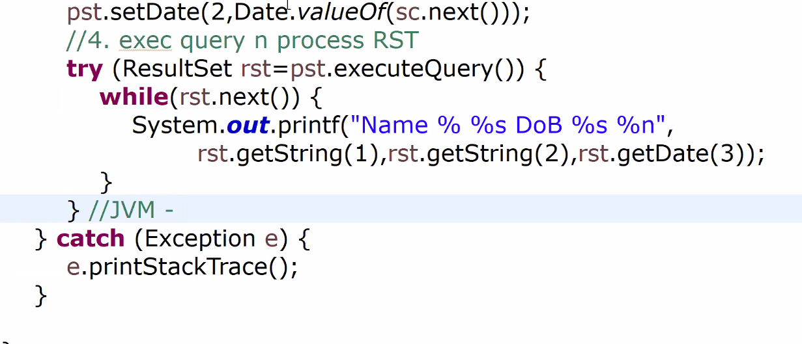    

    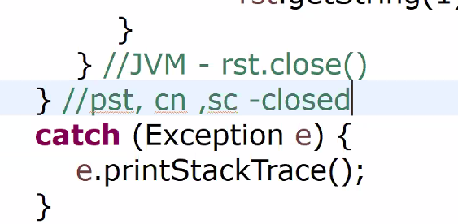

    Madhura mam number : 
    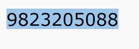

    7. Identify need of layers

    ORM = Object Relational Mapping

    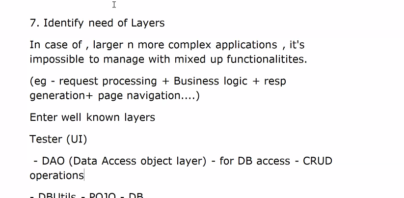

    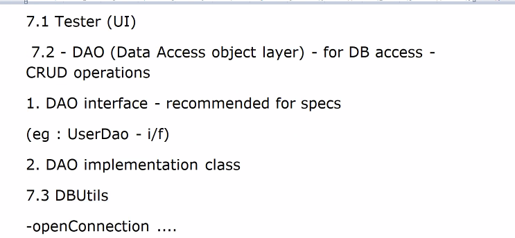

    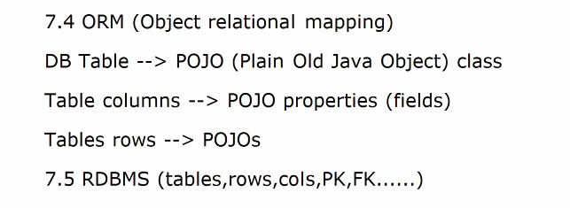    

