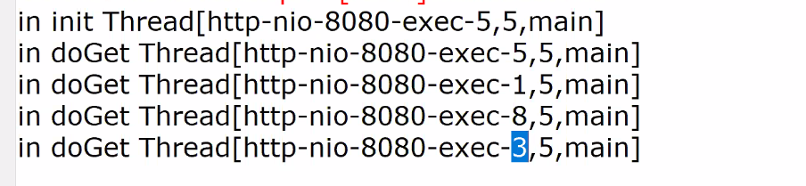
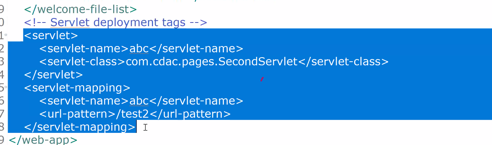
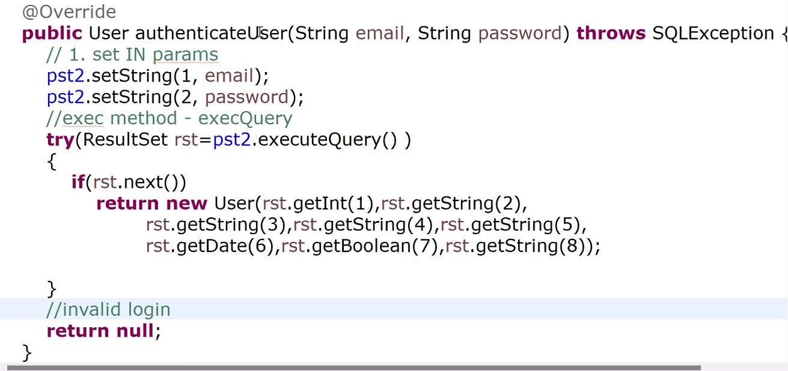
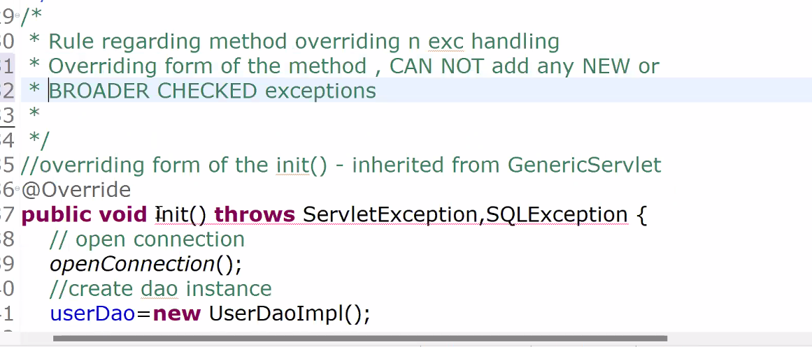
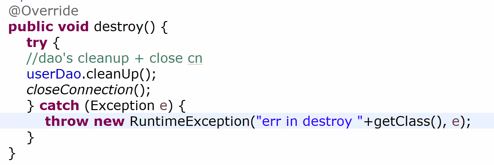
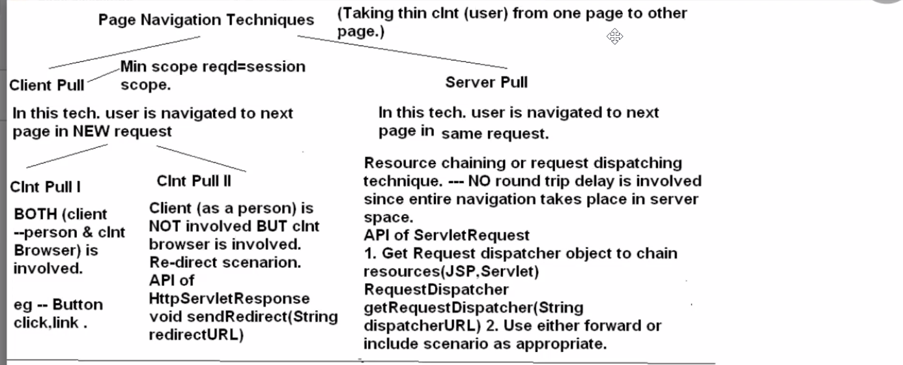
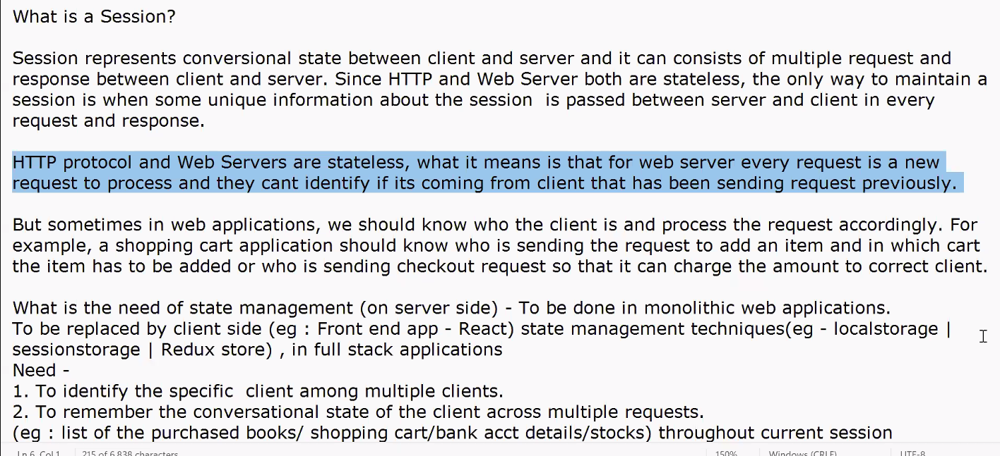
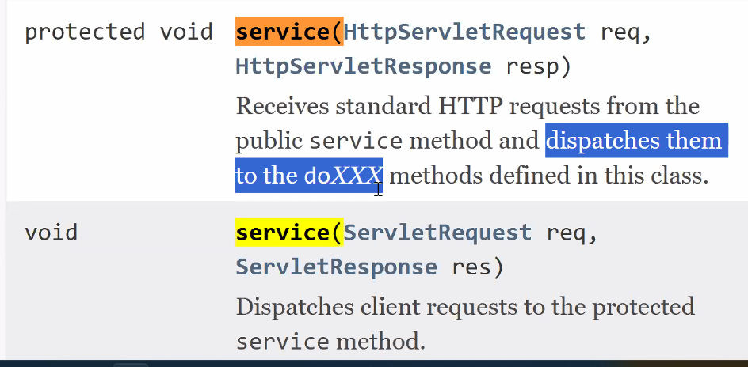

starts

first class if loaded
then singleton object it created 
then init method is called

revise threads ...

mam implemented servlet 
1 -> using annotations
2 -> xml tags

url : /dat3.1/test2
url pattern : /test2

who will read above tags , how many times
-> web container will read only once

what will be key ?
-> /test2

what will be value ?
-> fully qualified class name
-> com.cdac.pages.SecondServlet

where does container give precedence?
-> xml

developer prefers using annotations for using servlet

in xml:
check ....
servlet mapping then servlet name, url pattern
then servlet : with same name and value 

when will be your class loading, singleton instance of the servlet?
for first request/after request

lazy initialization

in which method we should instantiate dao?
in init

read lazy initialization and eager initialization

read loadOnStartup method

init = dao instance
service = logic
destroy = clean up

---

voting

pass = user record
fail =  null

therefore ServletException is thrown

in destroy it is optional but recommended :

---

loadOnStartup default value is 1
which means lazy
client 1st request will suffer
loadOnStartup :
ascending order starts from 1,2,3

