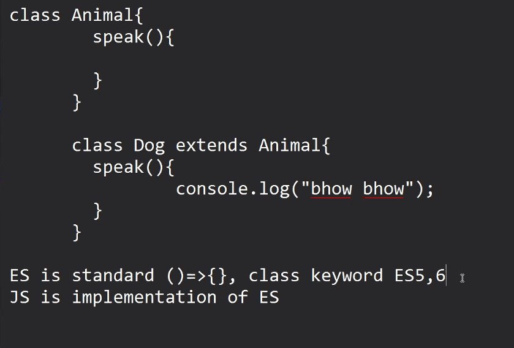
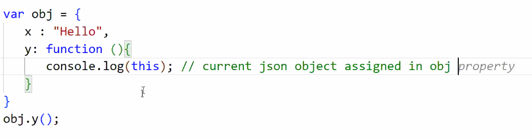

AJAX : Asynchronous Javascript and XML

AJAX is used to send to req on server and get response from it 

AJAX is async that means, it will not block other process

AJAX  will not reload the browser during the req and the resp process

***Definition :***
- AJAX is used to send req on server and get response without blocking the other process and also without reloading the browser

****Steps:****

1.   we have to create an object of *****XMLHttpRequest*****
 
-> var xhr = new XMLHttpRequest();
 

2. We have to initialize/open the request. Mention the url and request method using which res has to be sent.
 

-> 

3. send the request
 
-> xhr.send();

----------

4. Read the response:

- To read the response we need to check the state of the request.
 
During the entire ajax process, browser maintains  an integer flag with each step of ajax, integer flag changes its value readyState is the name of flag

- whenever ready state changes, it will fire an event ( onreadystatechange )

JSON.parse();
- array of JSON objects

API : Application Programming Interface

API is a way to use functionalities/features/services of one app into another app

indigo/air india/lufthansa

they have their own data not other airplanes data but they give their API to Bookmytrip, goibibo...other travel website use their API to display data

***Types of APIs***

1. Standalone APIs : given by native OS

2. Web APIs: running on a server, to access them we need to send request on url and we will get response

diff func and arrow func

arrow func :
- this will not refer to currrent obj
- it will refer to window obj

------

Node JS : 

- not a language, library, framework

- Node js is runtime environment for JS - using NodeJS, we can execute js code as a standalone environment

path in node js

Module : 

bundle that will contain properties, functions, classes, constants

reference with other programming: header file, packages

