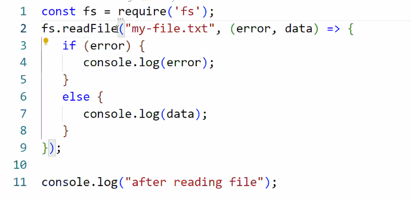

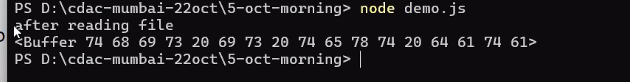

requirement to read file :

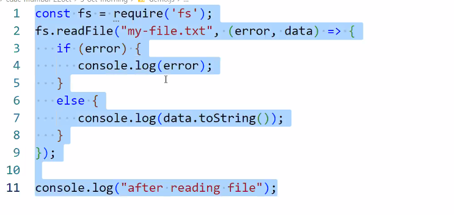

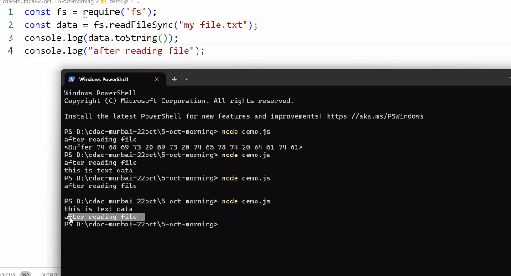

------

utility js id where we write module 

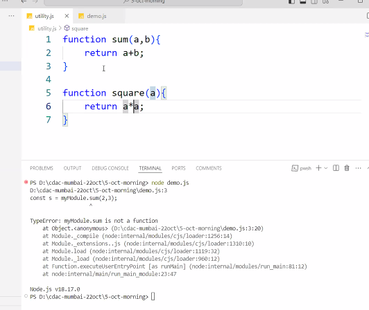

demo.js where we call our module :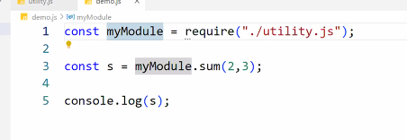

User defined module :

1. create a separate .js file
2. export properties from the same.js file in order to use them outside of the module

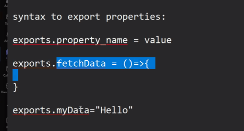

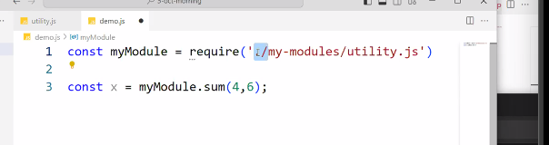

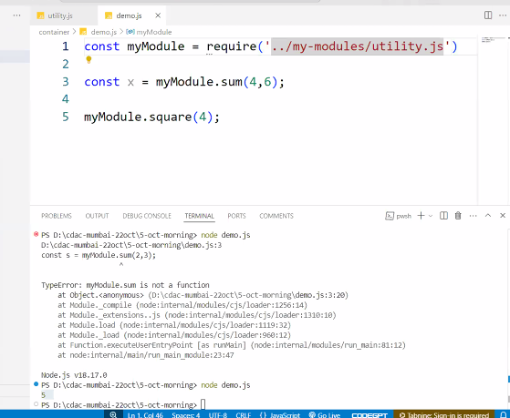

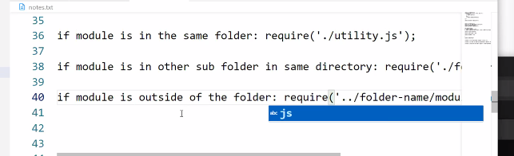

----

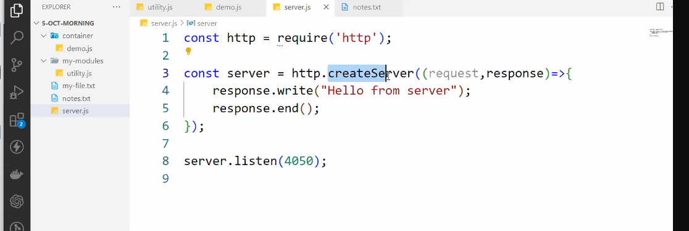

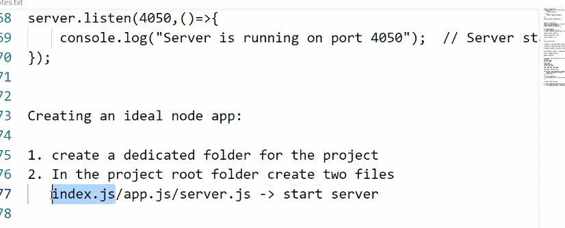

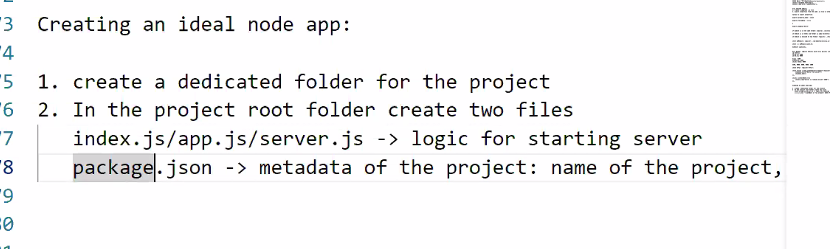

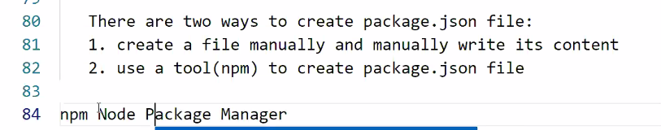

NPM:
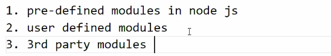

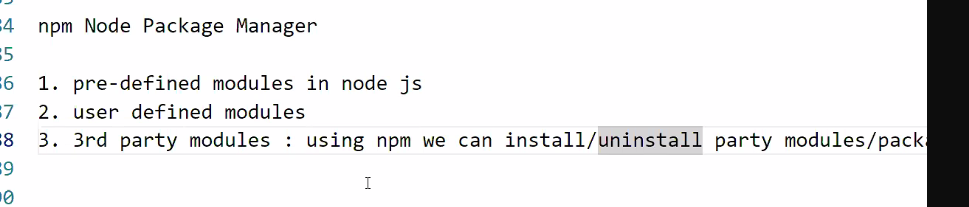

