Express Js

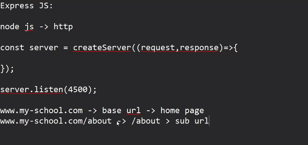

not a good practice
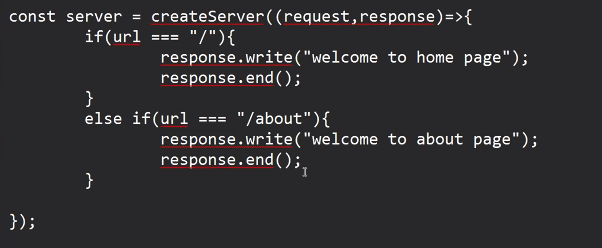

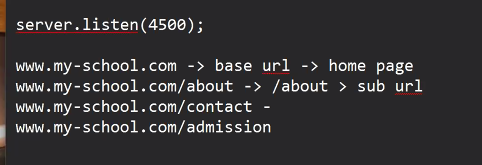

routing :  based on url we have to send different response

Express is a framework using which we can create server easily with the help of predefined functions in express

syntax : 

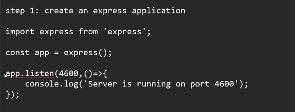

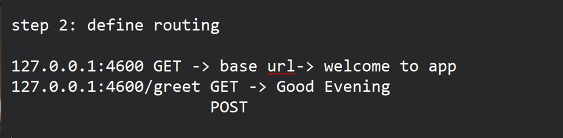

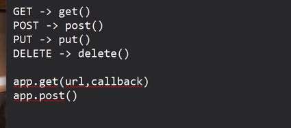

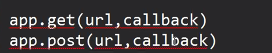

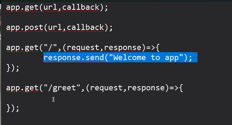

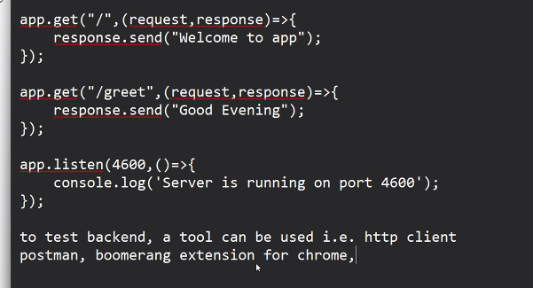

ways to send data input into any api:

1. we can pass data on the url and that data is known as url parameter

    127.0.0.1:4600/sum/5/6

    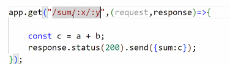

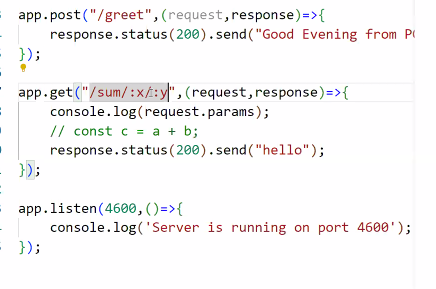

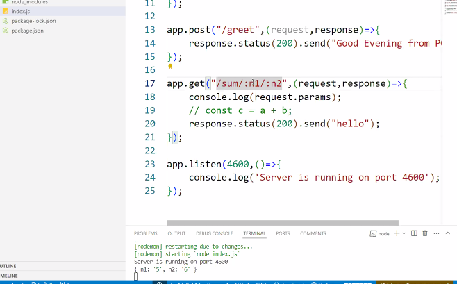

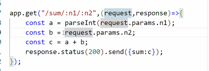

