-> npm init

ask for following inputs
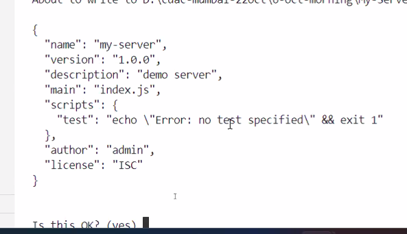

after that it would create a package.json file

ES has introduced a new syntax for requiring any module using import statement

import vs require

There are two conventions/types for writing js code:
1. Common JS
2. ES

import is a convention of ES
require is from common js

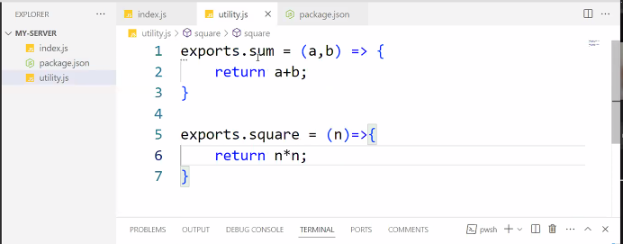

utility.js consists of 2 functions that can be used in index.js

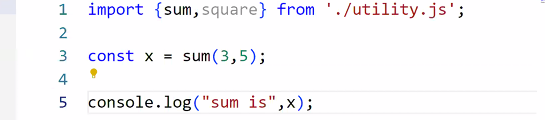

got an error
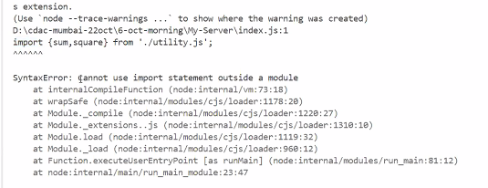

reason read
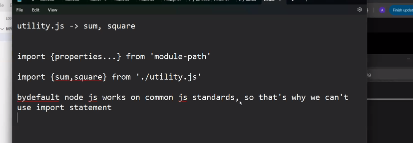

sol type to module in package,json
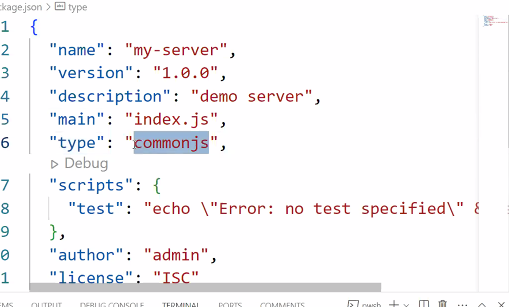

to 

type : module

utility js for aquascript :

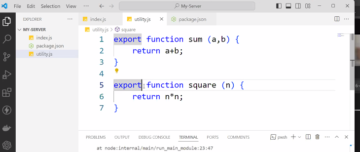

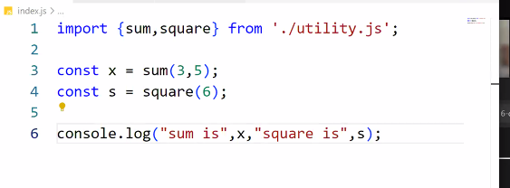

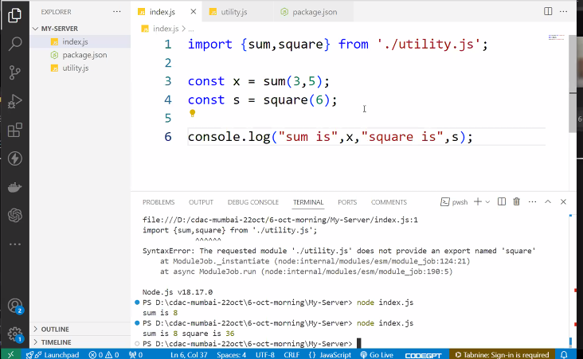

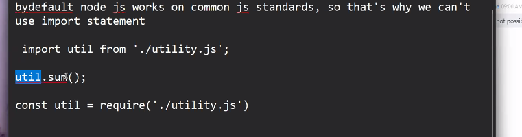

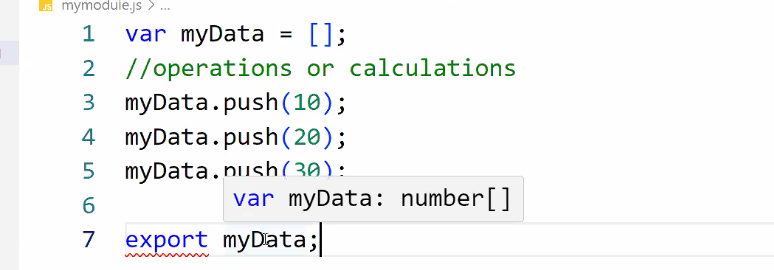
// any module has to export single property and that too after performing certain operations/calculations (not immediately at the time of declaration)
// for the above case we have to use export default 

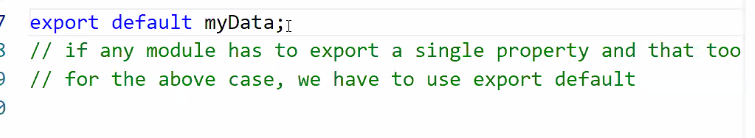

ideally name should be same as export default... only in special cases u can give custom name 
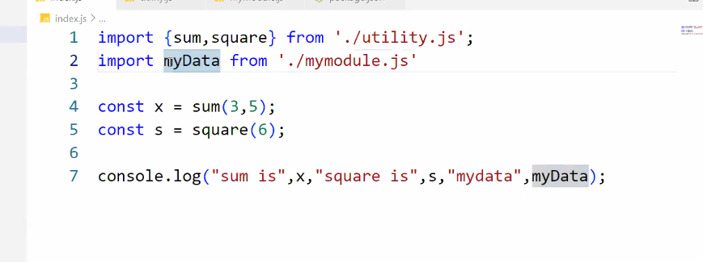

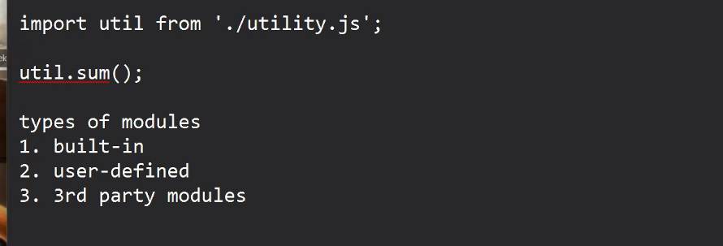

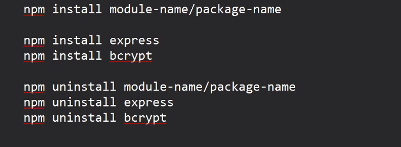

after installing 3rd party module :
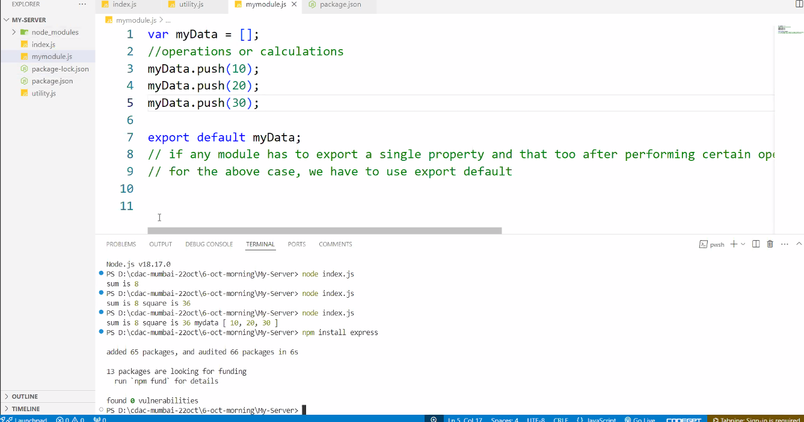

whenever we install any 3rd party module in the project, npm will keep all the files and folders for that newly installed module into node_modules folder and also it will maintain its record into package-lock.json and package.json 

3rd party module are added in dependencies in package.json
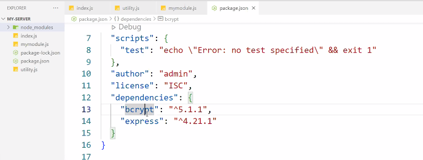

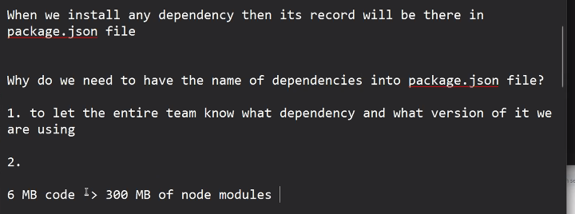

When we install any dependency then its record will be there in
package. json file

Why do we need to have the name of dependencies into package. json file?

1. to let the entire team know what dependency and what version of it we
are using

2. due to longer size if node_modules (files and folders) it is not ideal thing to move the node_modules folder if needed, so instead move/transfer entire project folder other than node_modules.
Now into the new locations/new system, just simply run npm install command and it will look into package.json file and will install all the dependencies mentioned in it 

6 MB code I> 300 MB of node modules

npm i express
npm install express

We have two types of 3rd party modules

1. local module
2. global module

1. built-in
2. user-defined
3. 3rd party module: 

    a. local module: module installed inside of a specific project

        if any module is providing a predefined code base in the form of a functions, classes, constants then we must install it locally
        
        only local module record will be there in package.json file

        only local module can be referred as dependency

     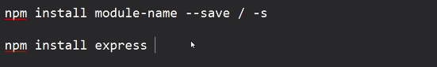

    b. global module : module  globally at the installation location of node js in the system, and we can use it across the projects

if any module is providing a tool then we should install it globally so that will all the projects can utilize it

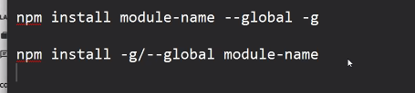

