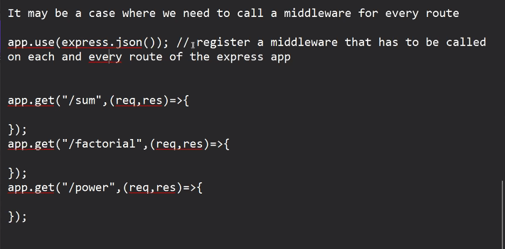
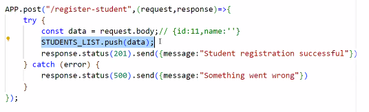

    npm init -y

with -y it will consider the default values suggested by npm init command

    npm i express

to get express configuration

****Middleware :****

Client -> 

request arrival -> Middleware -> request process

it is a function that will be executed before request is getting processed

when request arrives on server, first middleware will be called then after middleware request will be processed

           ( request, Middleware , Response ) 
                |           |           |
                v           v           v
    app.get("/sum", authenticateUser() , (req, res) => {
        
    });

Note: by default express app doesn't process the request body i.e.
express app doesn't know by default that requests may contain the data
into the body

Now its the developers who has to specify that express app should process the request body

so to specify that any url must process the request body, we are getting a middleware defined in express express.json()

            ( request, Middleware , Response ) 
                |           |           |
                v           v           v
    app.get("/sum", express.json() , (req, res) => {
        
    });

with the help of express.json() middleware we are enabling a url to process the request body

if mulitple app.use() are there i.e middleware than all those will be applied to all the pages 

in real time implementation,  only diff will be instead of connecting it with an array we will connect to database

