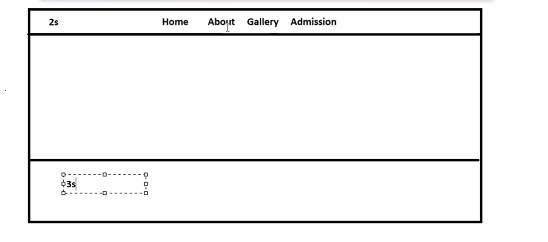

React JS: it is a library using which we can develop frontend of web app

1. HTML code is not reusable  and hence maintenance is costly

2. Browser will load the elements everytime when user clicks on anchor tag

3. App will be multipage, it will reload the browser everytime

-> single page application is better then multi page application

Advantage of using react js

1. we can write SPA easily 
2. we can re-use HTML code
3. Make our web app efficient, and performant

in single page applications, we will have only a suingle html file and based on the url, it will load the different elements

for single page applications, instead of creating multiple html files, we should create components

Component: UI element visible on the screen , it can be atomic and can be consisting of many components

for react js, we don't  have to create folder structure manually
it will generated with the help of a local

create-react-app cli tool
vite  : to generate folder structure for react

when we create a new react application, then always we will get a n already created component i.e app.js

How to create a component in react:

There are two types of component

1. class component : a component for which class has been created

    import { Component } from 'react';

    class NavBar extends Component {

    }

2. function component : a component for which only function has been created

    function NavBar() {

    }

------------

import { Component } from 'react';

class MyComponent extends Component {
    render() {         // used to provide user interface
        return (
            

                <h1>Hello</h1>
                
This is para in MyComponent

            

        )
}

what is jsx ?

react + html

props : attribute into a component