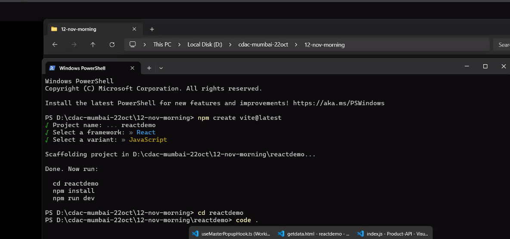
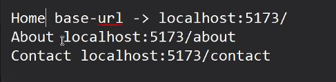
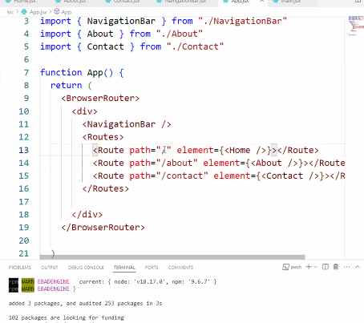

npm i -> to install all other dependencies

----

Mount -> component is going to render on the browser
Unmutated -> component is getting removed from the screen

React js doesn't provides routing
we will use react-router-dom

npm i react-router-dom

<BrowserRouter>  -> to enable the routing within react app, we have wrap all the components inside BrowserRouter
<Routes>    -> It is container for contaiing all the route components
<Route>     -> will contain thenmapping of url with component

