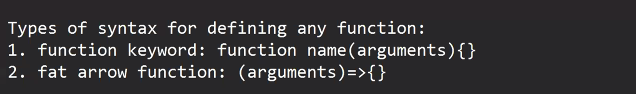

### Global and local variable 

Global

Local:

- here, we declare variable without , var, let, const ; therefore it will be considered as global variable

Note: if any variable is declared without , var, let, const keywords then that variable will always have global scope. Because without var, let, const keywords variables are referred to as global

#### var keywords:
- variables declared using var keyword will get either local or global scope specifically.

here, variables will only be accessible in function scope only, not outside

therefore it will through an error because it is not accessible outside the function

o/p -> 5
8

#### Hoisting

`console.log(a);` -> // undefined bit no error

here, it has read our code , therefore it will not  throw an error

- it will only consider only declaration part only

sir define : 
whenever browser loads the js code so before execution, js engine reads the complete code and will place/move all the variable declarations( not assignments ) and function definitions at the top of the code, this process is known as hoisting

but inside js engine:
var a;
console.log(a); // undefined 

cannot access ley variable before initialization

const keyword:

- exactly same as let keyword
- but 1 diff is there, that we can't change its value

For JS, a function is also an object

'var str = "Hello";'

o/p ->  [Function: show]
function

# IMP from here :-
### Callback function:

o/p -> 5, hello, true

callback function: a function that is passed as an argument

in above code, demo is the callback function

show() will pass demo which is reference of demo() function

and var rx = a(); -> here, it will call demo() and them it returns 5

this a show() is passing  whole demo() 

when we are calling then that time it is returning 5 then 5 will be stored in rs
and we are printing rs in console

arr.filter() -> based on certain conditions it will retrieve elements from an array

sir's definition for filter() -> filter func will filter the given array based on the condition and it will return the filtered array

 converted into

works same 

what taught in this session
- arrow func
- no arraow func
- hoisting
- callback func
- filter()

revise today topics
- read doms
- do 3rd assignment where we have to implement dom 

