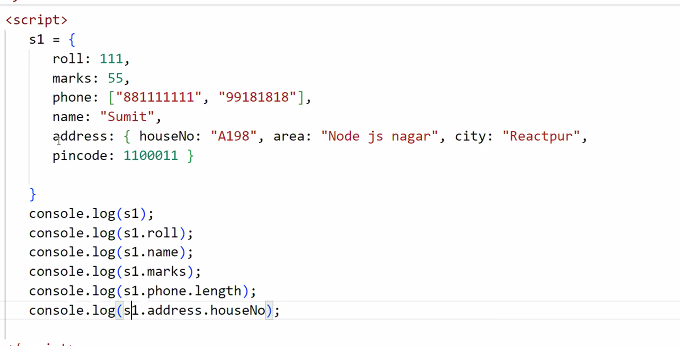
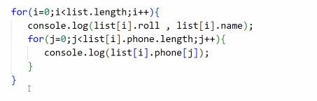

variables
array

store the data for any students:

roll, name, marks, phone

roll = 111
name = "Sumit"
marks = 55
phone = "881111111"

with above approach, there is no single container of data

array:

s1 = [111, "Sumit", 55, "8811111111"]

but values are not having labels, so it will become difficult when we want to process the data  

JSON :  JavaScript Object Notation

obj = {k:v, k:v, k:v, k:v, k:v, k:v}

s1 = {roll:11, name:"Sumit", marks:55, phone="88111111111", name:"Sumit"}

console.log(s1.roll}
console.log(s1.name}
console.log(s1.marks}
console.log(s1.phone}

". " dot is called number access operator

Map

Now a days JSON has become a standard to share data between client and server 

XML : store the data/represent the data
HTML : display

<student>
    <roll>111</roll>
    <name>Mohan</name>
</student>

XML is older way  to store the data ..... before JSON

