### array: 

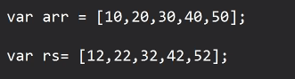

### filter: 
- it will filter the elements based on user defined conditions

### map : 
- if we, want  to get a new array by updating each and every element of the current array 

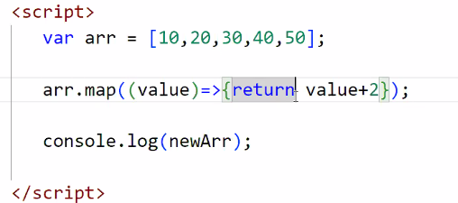

simplified version ->

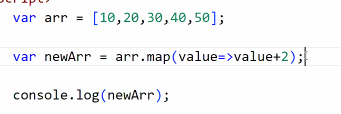

### foreach:

- it will do traversing on the array and in eaxh iteration it will give you each elememt of array one by one

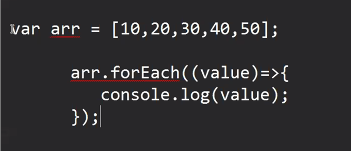

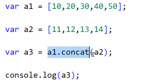

o/p -> [
  10, 20, 30, 40, 50,
  11, 12, 13, 14
]

In  JS on exclusive operator is there i.e 

### spread operator ->

- it is used to spread/unbox the elemtns of an array into another array
- 

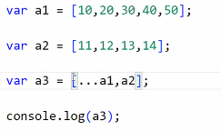

o/p ->

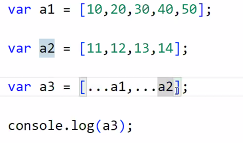

o/p ->  [
  10, 20, 30, 40, 50,
  11, 12, 13, 14
]

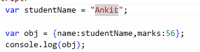

// if we want to consider the variable name as the key

o/p ->  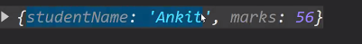

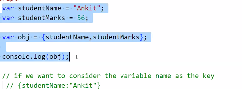

in above case the variable name itself will be treated as key name

JSON spread operator :

`var o2 = {`
   ` email : "suresh@gmail.com",`
   ` phone:"526427627"`
`}`

`var o1 = {`
   ` email : "rakkesg@gmail.com",`
    `phone:"723582368"`
`}`

`var o3 = {o2,o1}`

`console.log(o3);`

o/p -> {
  o2: { email: 'suresh@gmail.com', phone: '526427627' },
  o1: { email: 'rakkesg@gmail.com', phone: '723582368' }
}

`var o3 = {...o2,o1}`

o/p -> {
  email: 'suresh@gmail.com',
  phone: '526427627',
  o1: { email: 'rakkesg@gmail.com', phone: '723582368' }
}

`var o3 = {...o2, ...o1}`

o/p -> { email: 'rakkesg@gmail.com', phone: '723582368' }

Types of process in JS:

1. Synchronous: 

p1 -> will complete it's job then only  execute p2 

p2 -> will complete it's job then only  execute p3

p3

- blocking nature, till the first task is not completed, the next task will not be started

- next/ task has to wait to start its execution

ex : 

power -> 2  
factorial() -> 4 sec  
sum() -> 1 sec

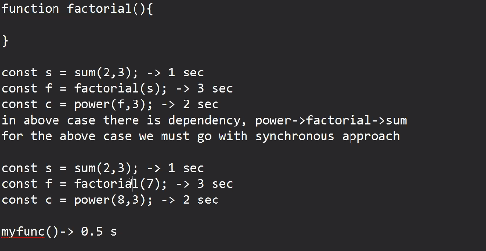

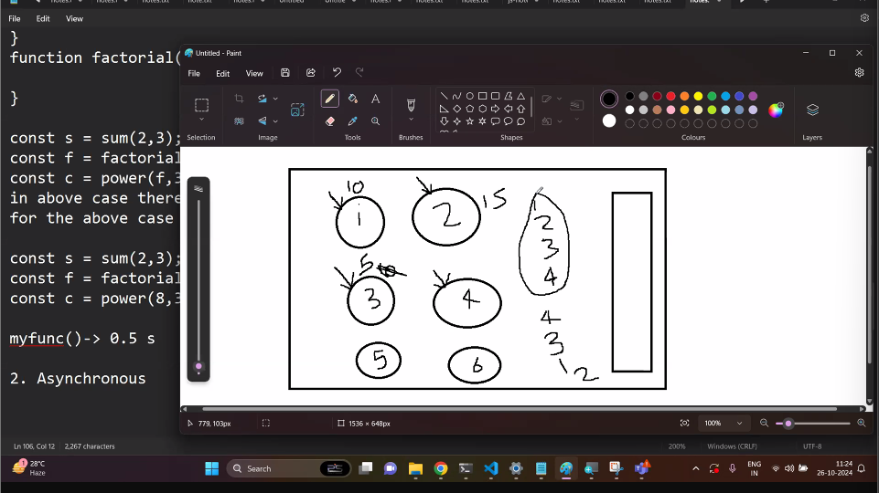

2, Asynchronous

- non blocking nature
- we can achieve Asynchronous using callback function, it make any task Asynchronous

setTimeout();
- this function will delay the execution of any task by mentioned amount of time

- callback functions never getting called immmediately when we pass them into argument

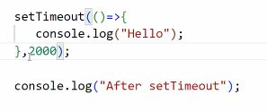

o.p ->  

- it will internally call function after 2 seconds after, till then it will execute console.log message

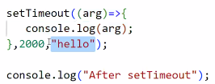

o/p -> 

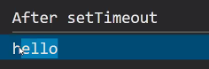

----

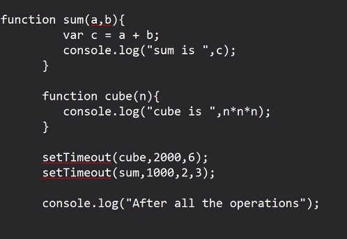

----

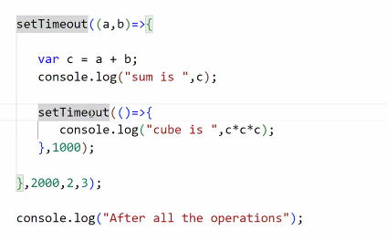

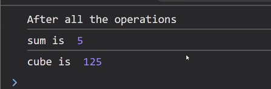

- 1st execute settimeoutI(a,b) 
- then it will get delayed for 2 sec
- till then it will execute concole.log
- after 2 sec it will calculate sum then cube 

use case :
 - if multiple async operations are there, but we want to execute them synchronously
 than 

 server:
 1. send response on the client
 2. write certain data into the db -> 4 seconds

 nesting of callback functions is callback hell

 we should always avoid callback hell
 why ?

 1. bad readability
 2. maintenance of code will become difficult

 Promise: 

 - promise in JS used to work same as of real life

 - for any of the task first create a promise
 
 - then till the task has not executed, we can say promise is neither fulfilled nor rejected but it will remain in the pending state

 - now the promised task will be executed
 - and once the execution has been done, them promise will either filfilled or rejected 
 - in case of successful execution of task : fulfilled
 - in case of failure/error of task : rejected

 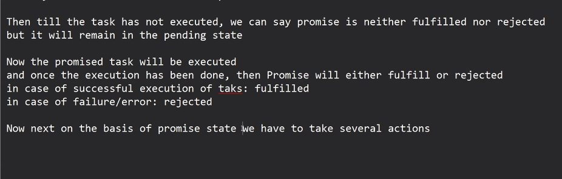