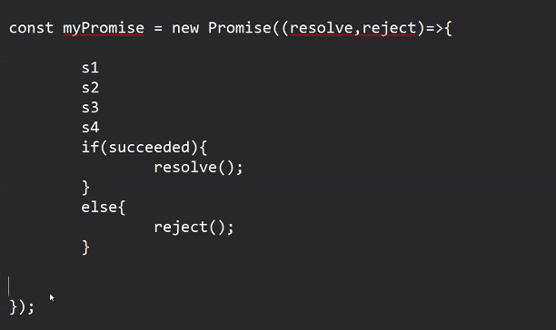
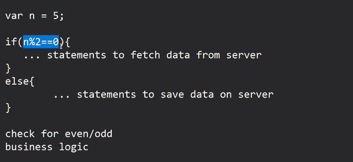
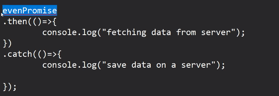

Promise :

Steps for working with Promise:

1. Create a new Promise object, then write logic into it, based on the task we have to resolve or reject the promise and its mandatory because if we don't resolve or reject then promise will remain in pending state

Promise states : 

- Pending
- Resolved / Fulfilled 
- Rejected

2. Execute the promised task
3. Handle the promise : Based on the promised state, we can take certain actions

Syntax: promise

e.g:
- check if any givem number is even or odd
- based on the type of number we have to perform a different 
- if number is even :  fetch data from server
- if number is odd: save data on a server

To handle the promise we should call then & catch functions on Promise object

evenPromise.then().catch();

