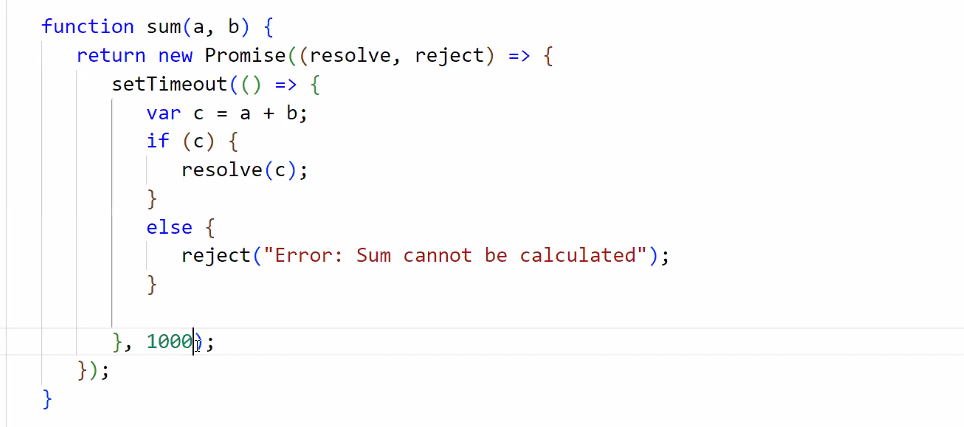
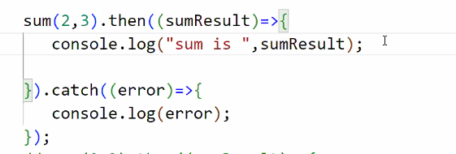
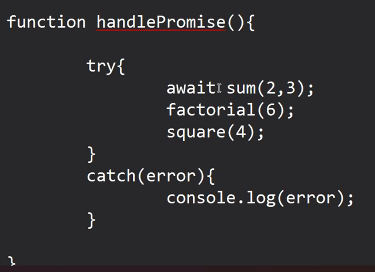
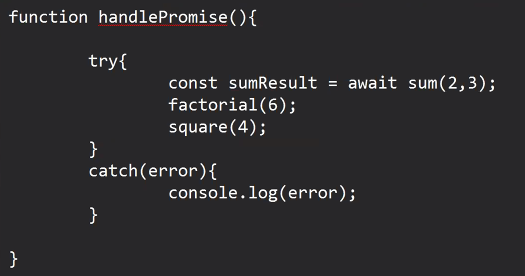
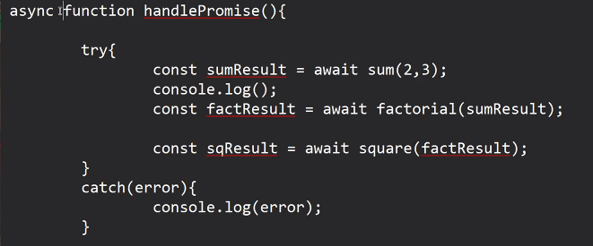

1. fetch user ids from server  101 102 104 104 105 106 -> 3 sec
2. fetch data based on id name age 
3. based on the age, decide if user can vote or not

JS has introduced a new way to handle promises

1. then() catch()
2. Async await keywords

try {

}
catch(error){

}

- for handling of the promise with the help of async & await keyword try catch block is mandatory

-  another rule is, we must write a function to contain the promise handling code with async & await

Await keyword

- make sure that rest if the statements has to wait for current statement to be executed completely
- if promise is getting resolved, then await statement will return resolved value

- aysnc is mandatory keyword becoz await won't work and will throw an error

async :

- if any function definition is having await keyword in its body, then async keyword must be there on its signature

- the function in which we have made the code synchronous with the help of await keyword, so that function itself should be executed  as asynchronous relatively with other function

