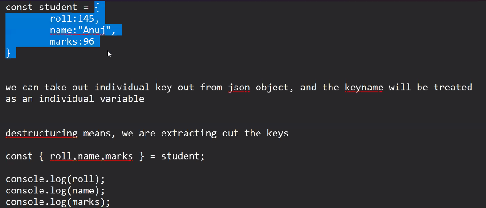

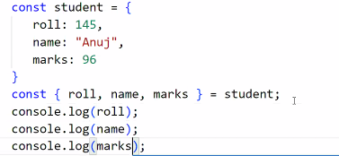

- to have better control over JSON object

------------

DOM Manipulation

DOM ->  Document Object Model 

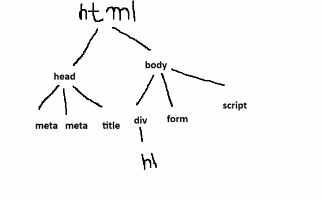

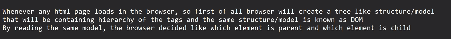

- whenever any html page loads in the browser, so first of all browser will create a tree like structure/model that will be containing hierarchy of the tags and the same structure/model is known as DOM.
- By reading the same model, the browser decided like which element is oarent and which element is child

- Once web page has beem loaded into the browser, so DOM structure will be created already 
- Now is we are modifying the already created DOM then we can say it as DOM Manipulation

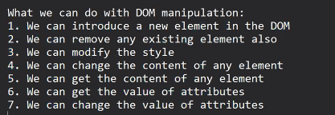

document : this object represents the DOM tree structure

NoteL we need to get the object of the that element on which operation has to be performed

How to get object of html elements in js?

JS has certain predefined functions, which are used to get the object reference of the elements

document.getElementById(id)

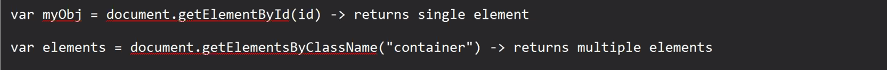

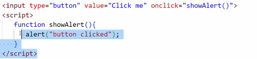

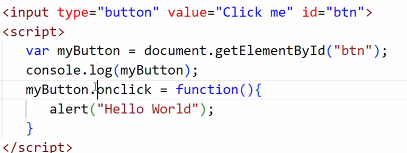

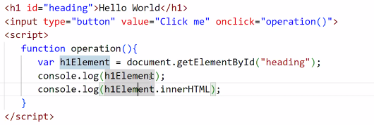

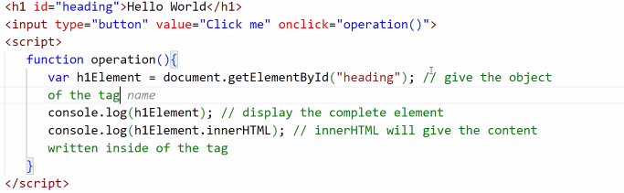

to remove
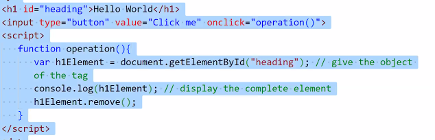

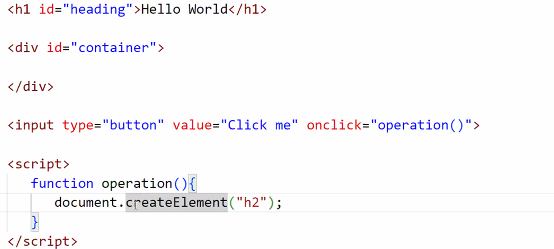

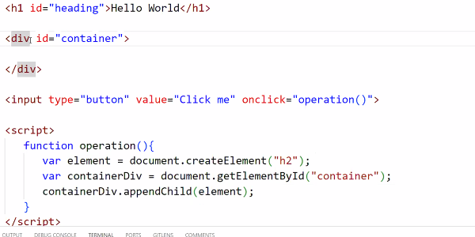

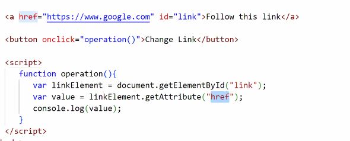

