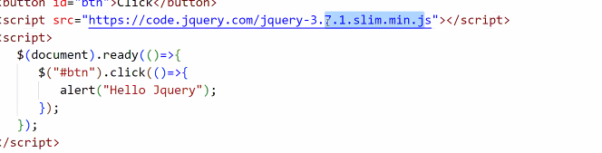
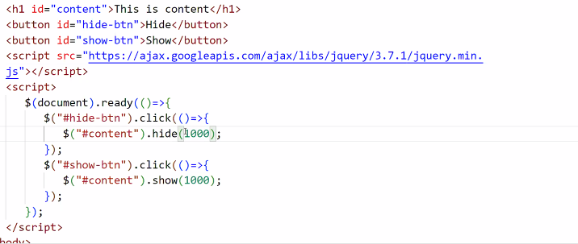

Jquery:

Jquery: it is library built on the top of JS, jquery ease out the js development by providing predefined functions

$("Selector");
var y = $("selector");

onclick -> click()
onkeyup -> keyup()
$("selector").event-name(() => {

});

id = "btn"

$("#btn") .click(() => { 
    alert("Hello");
});

document -> ready event

$(document).ready(() => {

});

javascript and react to focus

read: 

Ajax
Express js
Node js

assignment 

more focus on funcstionality

fexicon
navigation
same navigation in all pages
