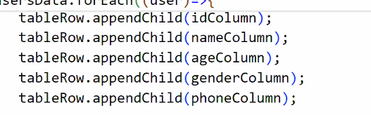

function to populate table

tbody id row-container

## Bootstrap

- UI library that will adjust its layout according to the size of screen

responsive : A page that will adjust its layout according to the size of screen

without bootstrap it is possible to make a page responsive, but for that we need to write a large amount of css media queries

In bootstrap  lots of media query is already written, it also provides few UI components

how bs makes our page responsive?

Bootstrap breaks down the entire width into 12 equal sections/grids/columns GRid system

sections upto 12 - limit the number of sections

width will be adjust based on number of grids you provide

Bootstrap css provides already created class selectors, we just have to apply those classes onto the html element

- whenever you create a div section then you should always create parent div

class "col" will assign equal amount of width to all the divs

col-n
n -> 1 to 12

col-1, col-2 , col-3, col-4

col-4
col-lg-4  -> only on larger screens
col-xl-3 -> extra large devies
col-md-8  -> medium screens
col-sm-12 -> smaller screens

smaller teh screen larger the number of columns

container mt-1    -> margin - top

 
in gutters?

